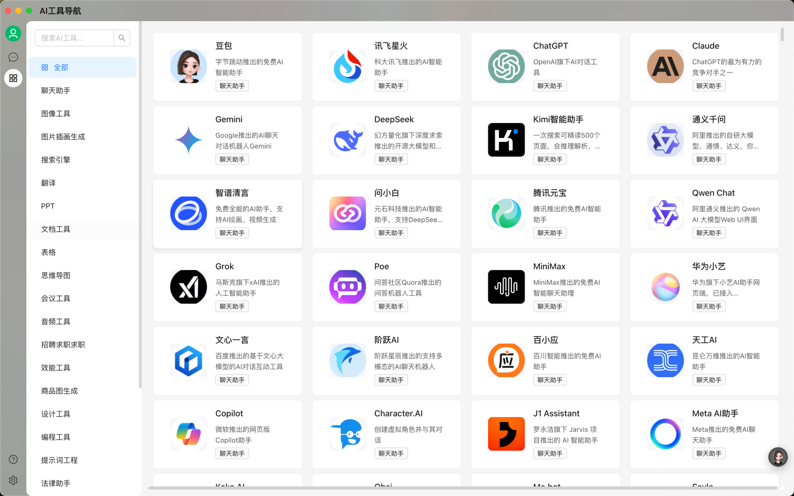

# 🚀 Awesome AI Tools [](https://awesome.re)


> 一个持续更新的AI工具全景图，涵盖大语言模型（LLM）、Agent框架、开发工具等资源

---

## 📖 目录
- [🎯 项目目标](-🎯项目目标)
- [🗂️ 工具分类](-🗂️工具分类)
- [🧭 快速导航](-🧭快速导航)
- [👥 贡献指南](-👥贡献指南)
- [📜 声明](-📜声明)
- [🤝 License](-🤝License)

---

## 🎯 项目目标
提供**一站式检索清单**，帮助开发者/研究者：
- 🔍 快速定位适合的AI工具
- 📊 对比不同工具的特性与协议
- 🌱 跟踪AI领域最新动态

---

## 🗂️ 工具分类

### 1. 聊天助手
| 名称    | 类型 | 描述       | 链接             |
| ------- | ---- | -------- | ---------------- |
| 豆包 | web | 字节跳动推出的免费AI智能助手 | [官网](https://www.doubao.com/chat) |
| 讯飞星火 | web | 科大讯飞推出的AI智能助手 | [官网](https://xinghuo.xfyun.cn/desk) |
| ChatGPT | web | OpenAI旗下AI对话工具 | [官网](https://chat.openai.com) |
| Claude | web | ChatGPT的最为有力的竞争对手之一 | [官网](https://claude.ai) |
| Gemini | web | Google推出的AI聊天对话机器人Gemini | [官网](https://gemini.google.com) |
| DeepSeek | web | 幻方量化旗下深度求索推出的开源大模型和聊天助手 | [官网](https://chat.deepseek.com/) |
| Kimi智能助手 | web | 一次搜索可精读500个页面，会推理解析，能深度思考的AI助手 | [官网](https://kimi.moonshot.cn/) |
| 通义千问 | web | 阿里推出的自研大模型，通情、达义，你的全能AI助手！ | [官网](https://tongyi.aliyun.com/qianwen) |
| 智谱清言 | web | 免费全能的AI助手，支持AI绘画、视频生成 | [官网](https://chatglm.cn) |
| 问小白 | web | 元石科技推出的AI智能助手，支持DeepSeek满血版 | [官网](https://wenxiaobai.paluai.com) |
| 腾讯元宝 | web | 腾讯推出的免费AI智能助手 | [官网](https://yuanbao.tencent.com) |
| Qwen Chat | web | 阿里通义推出的 Qwen AI 大模型Web UI界面 | [官网](https://chat.qwen.ai/) |
| Grok | web | 马斯克旗下xAI推出的人工智能助手 | [官网](https://x.ai/grok) |
| Poe | web | 问答社区Quora推出的问答机器人工具 | [官网](https://poe.com) |
| MiniMax | web | MiniMax推出的免费AI智能聊天助理 | [官网](https://chat.minimaxi.com) |
| 华为小艺 | web | 华为旗下小艺AI助手网页端，已接入DeepSeek-R1 | [官网](https://xiaoyi.huawei.com/chat) |
| 文心一言 | web | 百度推出的基于文心大模型的AI对话互动工具 | [官网](https://yiyan.baidu.com) |
| 阶跃AI | web | 阶跃星辰推出的支持多模态的AI聊天机器人 | [官网](https://yuewen.cn/chats/new) |
| 百小应 | web | 百川智能推出的免费AI助手 | [官网](https://ying.baichuan-ai.com/chat) |
| 天工AI | web | 昆仑万维推出的AI智能助手 | [官网](https://www.tiangong.cn) |
| Copilot | web | 微软推出的网页版Copilot助手 | [官网](https://copilot.microsoft.com/) |
| Character.AI | web | 创建虚拟角色并与其对话 | [官网](https://character.ai) |
| J1 Assistant | web | 罗永浩旗下 Jarvis 项目推出的 AI 智能助手 | [官网](https://matter.ai/) |
| Meta AI助手 | web | Meta推出的免费AI聊天助手 | [官网](https://www.meta.ai) |
| Koko AI | web | Seele公司推出的「AI+3D」情感陪伴产品 | [官网](https://www.seeles.ai) |
| Ohai | web | 月之暗面旗下推出的AI角色扮演虚拟陪伴应用 | [官网](https://beta.ohai.bot/discover) |
| Me.bot | web | 心识宇宙推出的个性化AI伴侣产品 | [官网](https://www.me.bot) |
| Saylo | web | AI驱动的故事角色扮演游戏应用，沉浸式的剧本互动体验 | [官网](https://www.sayloai.com) |
| 通义星尘 | web | 用AI定制属于你自己的IP角色 | [官网](https://tongyi.aliyun.com/xingchen) |
| CueMe | web | 夸克推出的AI智能对话助手，支持2万字长文写作 | [官网](https://cueme.cn) |
| 造梦次元 | web | AI互动内容平台，虚拟角色逗你开心 | [官网](https://ciyuan.ideaflow.pro) |
| Museland | web | 沉浸式AI角色扮演产品 | [官网](https://www.museland.ai) |
| 百度AI助手 | web | 百度推出的多场景AI智能体助手 | [官网](https://chat.baidu.com) |
| 商量SenseChat | web | 商汤科技推出的类ChatGPT的人工智能大语言模型 | [官网](https://chat.sensetime.com) |
| 小悟空 | web | 字节跳动推出的免费AI对话助手和个人助理 | [官网](https://wukong.com/tool) |
| 紫东太初 | web | 中科院与武智院推出的千亿参数全模态大模型和助手 | [官网](https://taichu-web.ia.ac.cn/#/welcome) |
| 小黄蕉 | web | 字节跳动旗下推出的AI虚拟交友聊天平台 | [官网](https://chatwiz.cn/h5/feely) |
| 冒泡鸭 | web | 阶跃星辰推出的AI聊天机器人和智能体平台 | [官网](https://maopaoya.com) |
| Cici | web | 豆包国际版，字节跳动面向海外市场推出的AI助手 | [官网](https://www.cici.com/browser-extension/landing/zh) |
| 百川大模型 | web | 百川智能推出的大模型助手，融合了意图理解、信息检索以及强化学习技术 | [官网](https://chat.baichuan-ai.com) |
| Le Chat | web | Mistral推出的AI对话聊天助手 | [官网](https://chat.mistral.ai) |
| 百度AI伙伴 | web | 百度最新上线的AI搜索对话工具 | [官网](https://chat.baidu.com/) |
| 超级助理 | web | 百度智能云发布的基于文心一言的AI原生应用和Copilot“超级助理” | [官网](https://cloud.baidu.com/product/infoflow.html) |
| 钉钉·个人版 | web | 钉钉推出的个人版办公应用程序，内置AI智能助手，可进行AI创作、AI对话、AI绘画 | [官网](https://workspace.dingtalk.com) |
| Wanderboat | web | 硅谷初创公司UTA AI推出的AI旅行助手 | [官网](https://wanderboat.ai) |
| MChat | web | 基于孟子GPT大模型的AI对话机器人 | [官网](https://www.langboat.com/portal/mengzi-gpt) |
| Luca面壁露卡 | web | 面壁智能推出的千亿多模态大模型免费智能对话助手 | [官网](https://luca-beta.modelbest.cn/) |
| 元象XChat | web | 元象XVERSE大模型驱动的AI聊天助手 | [官网](https://chat.xverse.cn/xchat/index.html) |
| ChitChop | web | 字节旗下面向海外用户推出的免费大模型产品和AI助手工具箱 | [官网](https://www.chitchop.com) |
| 魔搭GPT（ModelScopeGPT） | web | 阿里达摩院推出的大小模型协同的智能助手，具备作诗、绘画、视频生成、语音播放等多模态能力 | [官网](https://www.modelscope.cn/studios/iic/ModelScopeGPT) |
| HuggingChat | web | HuggingFace推出的在线聊天机器人，基于Open Assistant模型 | [官网](https://huggingface.co/chat/) |
| TigerBot | web | 虎博科技推出的AI对话聊天机器人，基于TigerBot开源大模型 | [官网](https://tigerbot.com) |
| Stable Chat | web | Stability AI 最新推出的免费聊天对话网站 | [官网](https://research.stability.ai/chat) |
| ColossalChat | web | Colossal-AI推出的免费开源版ChatGPT聊天机器人替代品 | [官网](https://chat.colossalai.org) |
| Jasper Chat | web | Jasper针对内容创作者出品的AI聊天工具 | [官网](https://www.jasper.ai/chat) |
| ChatSonic | web | WriteSonic出品的ChatGPT竞品 | [官网](https://chat-sonic.ai/#) |
| Replika | web | AI对话陪伴工具 | [官网](https://replika.ai/) |
| Pi | web | DeepMind联创新公司推出的AI聊天机器人 | [官网](https://pi.ai/talk) |
| 360智脑 | web | 360搜索最新推出的AI对话聊天机器人 | [官网](https://ai.360.com) |
| 对话写作猫 | web | 秘塔写作猫推出的AI对话聊天工具 | [官网](https://xiezuocat.com) |
| 海螺AI | web | MiniMax推出的AI对话助理，已免费开放 | [官网](https://hailuoai.com) |

---
### 2. 图像工具
| 名称    | 类型 | 描述       | 链接             |
| ------- | ---- | -------- | ---------------- |
| Stable Chat | web | Stability AI 最新推出的免费聊天对话网站 | [官网](https://research.stability.ai/chat) |
| 绘蛙 | web | AI电商营销工具，免费生成商品图和种草文案 | [官网](https://ihuiwa.paluai.com) |
| 稿定AI | web | 一站式设计工具集，免费AI绘图、图片转AI绘画、AI抠图消除 | [官网](https://www.gaoding.com) |
| 笔魂AI | web | 设计工具，支持AI抠图、消除、无损放大 | [官网](https://ibihun.com) |
| 吐司AI | web | AI绘画模型社区和在线生图平台 | [官网](https://tusiart.com) |
| 美间AI抠图 | web | 美间AI推出的免费智能抠图工具 | [官网](https://www.meijian.com/mj-box/ai-pic-matting-intro) |
| 即梦 | web | 抖音旗下免费AI图片创作工具 | [官网](https://jimeng.jianying.com/ai-tool/home) |
| 阿贝智能 | web | 一站式AI绘本创作平台，副业变现必备 | [官网](https://abeiai.com) |
| Midjourney | web | AI图像和插画生成工具 | [官网](https://www.midjourney.com/home) |
| 炉米Lumi | web | 字节跳动推出的AIGC图像创作平台 | [官网](https://artistrylab.net) |
| Civitai | web | 免费的AI图像绘画作品和模型分享平台和社区 | [官网](https://civitai.com/) |
| 堆友AI反应堆 | web | 阿里旗下堆友推出的多风格AI绘画生成器 | [官网](https://d.design) |
| 通义万相 | web | 阿里最新推出的AI绘画创作模型 | [官网](https://tongyi.aliyun.com/wanxiang) |
| 秒画 | web | 商汤科技推出的免费AI作画和图片生成平台 | [官网](https://miaohua.sensetime.com/inspiration) |
| WHEE | web | 美图推出的AI图片和绘画创作生成平台 | [官网](https://www.whee.com/) |
| LiblibAI·哩布哩布AI | web | 国内领先的AI图像创作平台和模型分享社区 | [官网](https://www.liblib.art) |
| 美图AI文生图 | web | 美图推出的AI文本生成图片的工具 | [官网](https://design.meitu.com/aigc/text-to-image) |
| 奇域AI | web | 中式审美国风AI绘画创作平台 | [官网](https://www.qiyuai.net) |
| 可灵AI | web | 快手推出的AI图像和视频创作平台 | [官网](https://klingai.kuaishou.com) |
| AI改图神器 | web | AI万能图片在线编辑器 | [官网](https://img.logosc.cn) |
| Krea AI | web | 实时AI图像、视频生成和编辑平台 | [官网](https://www.krea.ai) |
| Photoroom | web | 在线AI图片编辑工具 | [官网](https://www.photoroom.com/zh) |
| Ribbet.ai | web | 免费的多功能AI图片处理工具箱 | [官网](https://ribbet.ai/) |
| 万相营造 | web | 阿里旗下推出的多模态AI创意生成平台 | [官网](https://agi.taobao.com) |
| 悟空图像PhotoSir | web | 新一代专业图像处理软件，更智能、更高效、更好用 | [官网](https://www.photosir.com) |
| 360智图 | web | 360推出的AI作图平台，支持智能抠图、智能消除、智能放大、智能配图 | [官网](https://chacha.so.com/home) |
| 像素蛋糕 | web | 像甜科技推出的AI图像后期软件 | [官网](https://www.pixcakeai.com) |
| remove.bg | web | 强大的AI图片背景移除工具 | [官网](https://www.remove.bg/zh) |
| 如果相机 | web | 仅需1张照片，快速生成AI写真照片 | [官网](https://ifshot.com) |
| ARC | web | 腾讯旗下ARC实验室推出的免费AI图片处理工具 | [官网](https://arc.tencent.com/zh/ai-demos/) |
| Cutout.Pro | web | AI在线处理图片 | [官网](https://www.cutout.pro/) |
| MagicStudio | web | 高颜值AI图像处理工具 | [官网](https://magicstudio.com/zh) |
| Booltool | web | 在线AI图像工具箱 | [官网](https://booltool.boolv.tech/home) |
| Faceswapper | web | AI在线换脸工具 | [官网](https://faceswapper.ai) |
| ClipDrop | web | Stability.ai推出的AI图片处理系列工具 | [官网](https://clipdrop.co/) |
| Vmake AI | web | AI在线图像和视频编辑平台，专为电商、设计提供服务 | [官网](https://vmake.ai) |
| Leonardo.ai | web | 免费的AI绘画和图像生成工具和社区 | [官网](https://app.leonardo.ai/auth/login) |
| DeepSwapper | web | 免费的在线AI换脸工具，支持图片、视频多种格式 | [官网](https://www.deepswapper.com) |
| Kacha AI | web | 专业的AI写真工具，媲美专业摄影 | [官网](https://www.kacha.ai/zh) |
| PicTech AI | web | 免费的在线图片翻译工具，支持一键抠图 | [官网](https://www.pictech.cc) |
| Hotpot.ai | web | AI图片图像处理和生成工具 | [官网](https://hotpot.ai) |
| IconGen | web | 免费的icon图标AI生成器 | [官网](https://www.icongen.io) |
| 言之画 | web | AI图像内容创作平台，由出门问问推出 | [官网](https://paint.mobvoi.com) |
| 百度智能云一念 | web | 基于百度文心大模型的多模态内容创作平台 | [官网](https://yinian.cloud.baidu.com/creativity/main/workbench) |
| 艾绘 | web | 一键创作故事、绘画、配音，轻松创建高质量的绘本故事 | [官网](https://www.aiyou.art) |
| Graviti Diffus | web | 开箱即用的 Stable Diffusion WebUI 在线图像生成服务 | [官网](https://www.diffus.graviti.com) |
| 触手AI绘画 | web | 免费专业的AI绘画/模型/分享平台 | [官网](https://acgnai.art) |
| 文心一格 | web | AI艺术和创意辅助平台 | [官网](https://yige.baidu.com/) |
| 造梦日记 | web | AI一下，妙笔生画 | [官网](https://zmrj.art) |
| Canva AI图像生成 | web | 在线设计工具Canva推出的AI图像生成工具 | [官网](https://www.canva.com/ai-assistant/) |
| 超能画布 | web | 百度网盘推出的AI创意图像写真创作平台 | [官网](https://photo.baidu.com/photasy/home) |
| Adobe Firefly | web | Adobe最新推出的AI图片生成工具 | [官网](https://www.adobe.com/products/firefly.html) |
| 简单AI | web | 搜狐最新推出的AI图片生成平台 | [官网](https://ai.sohu.com/search) |
| 摩笔马良 | web | 摩尔线程推出的AI图像绘画创作平台 | [官网](https://maliang.mthreads.com) |
| Exactly.ai | web | 专业的AI绘画和艺术创作平台 | [官网](https://exactly.ai) |
| 画宇宙 | web | 人工智能AI作画网站 | [官网](https://creator.nolibox.com) |
| 6pen Art | web | 面包多团队推出的从文本描述生成绘画艺术作品 | [官网](https://6pen.art) |
| 创客贴AI画匠 | web | 创客贴推出的AI艺术画生成工具 | [官网](https://aiart.chuangkit.com/landingpage) |
| Visual Electric | web | 专业的高质量AI图像创作工具 | [官网](https://visualelectric.com/) |
| 360智绘 | web | 360推出的AI图片和绘画生成工具 | [官网](https://aigc.360.com) |
| 网易AI创意工坊 | web | 网易云课堂推出的AI作画平台，在线使用Stable Diffusion出图 | [官网](https://ke.study.163.com/artWorks/painting) |
| Imagine with Meta | web | Meta最新推出的在线AI图像生成器 | [官网](https://www.meta.com/ja-jp/help/artificial-intelligence) |
| Freepik AI Image Generator | web | Freepik最新推出的AI图片生成工具 | [官网](https://www.freepik.com/ai/image-generator) |
| Stockimg AI | web | AI生成各种类型的图像和插画 | [官网](https://stockimg.ai/) |
| Stable Doodle | web | StabilityAI最新推出的将手绘草图转换成精美图像的工具 | [官网](https://clipdrop.co/stable-doodle) |
| 175FUN | web | 免费AI绘画社区，国货之光 | [官网](https://175.fun) |
| 行者AI美术 | web | AI图片生成和美术创作工具箱 | [官网](https://xingzheai.cn/#create) |
| Skybox AI | web | AI生成和合成360°全景图像插画 | [官网](https://skybox.blockadelabs.com) |
| Facet | web | AI图片修图和优化工具 | [官网](https://facet.ai/) |
| Relight | web | ClipDrop推出的AI图像打光工具 | [官网](https://clipdrop.co/relight) |
| Upscayl | web | 免费开源的AI图片无损放大工具 | [官网](https://www.upscayl.org/) |

---
### 3. 图片插画生成
| 名称    | 类型 | 描述       | 链接             |
| ------- | ---- | -------- | ---------------- |
| Stable Chat | web | Stability AI 最新推出的免费聊天对话网站 | [官网](https://research.stability.ai/chat) |
| 包图网AI素材库 | web | 包图网提供的特色图库服务 | [官网](https://ibaotu.com/tupian/shuziyishu.html) |
| 吐司AI | web | AI绘画模型社区和在线生图平台 | [官网](https://tusiart.com) |
| 美间AI抠图 | web | 美间AI推出的免费智能抠图工具 | [官网](https://www.meijian.com/mj-box/ai-pic-matting-intro) |
| 即梦 | web | 抖音旗下免费AI图片创作工具 | [官网](https://jimeng.jianying.com/ai-tool/home) |
| Midjourney | web | AI图像和插画生成工具 | [官网](https://www.midjourney.com/home) |
| Civitai | web | 免费的AI图像绘画作品和模型分享平台和社区 | [官网](https://civitai.com/) |
| 堆友AI反应堆 | web | 阿里旗下堆友推出的多风格AI绘画生成器 | [官网](https://d.design) |
| 通义万相 | web | 阿里最新推出的AI绘画创作模型 | [官网](https://tongyi.aliyun.com/wanxiang) |
| 秒画 | web | 商汤科技推出的免费AI作画和图片生成平台 | [官网](https://miaohua.sensetime.com/inspiration) |
| WHEE | web | 美图推出的AI图片和绘画创作生成平台 | [官网](https://www.whee.com/) |
| LiblibAI·哩布哩布AI | web | 国内领先的AI图像创作平台和模型分享社区 | [官网](https://www.liblib.art) |
| 美图AI文生图 | web | 美图推出的AI文本生成图片的工具 | [官网](https://design.meitu.com/aigc/text-to-image) |
| 奇域AI | web | 中式审美国风AI绘画创作平台 | [官网](https://www.qiyuai.net) |
| remove.bg | web | 强大的AI图片背景移除工具 | [官网](https://www.remove.bg/zh) |
| 触手AI绘画 | web | 免费专业的AI绘画/模型/分享平台 | [官网](https://acgnai.art) |
| 文心一格 | web | AI艺术和创意辅助平台 | [官网](https://yige.baidu.com/) |
| 造梦日记 | web | AI一下，妙笔生画 | [官网](https://zmrj.art) |
| Canva AI图像生成 | web | 在线设计工具Canva推出的AI图像生成工具 | [官网](https://www.canva.com/ai-assistant/) |
| 超能画布 | web | 百度网盘推出的AI创意图像写真创作平台 | [官网](https://photo.baidu.com/photasy/home) |
| Adobe Firefly | web | Adobe最新推出的AI图片生成工具 | [官网](https://www.adobe.com/products/firefly.html) |
| 简单AI | web | 搜狐最新推出的AI图片生成平台 | [官网](https://ai.sohu.com/search) |
| 摩笔马良 | web | 摩尔线程推出的AI图像绘画创作平台 | [官网](https://maliang.mthreads.com) |
| Exactly.ai | web | 专业的AI绘画和艺术创作平台 | [官网](https://exactly.ai) |
| 画宇宙 | web | 人工智能AI作画网站 | [官网](https://creator.nolibox.com) |
| 6pen Art | web | 面包多团队推出的从文本描述生成绘画艺术作品 | [官网](https://6pen.art) |
| 创客贴AI画匠 | web | 创客贴推出的AI艺术画生成工具 | [官网](https://aiart.chuangkit.com/landingpage) |
| Visual Electric | web | 专业的高质量AI图像创作工具 | [官网](https://visualelectric.com/) |
| 360智绘 | web | 360推出的AI图片和绘画生成工具 | [官网](https://aigc.360.com) |
| 网易AI创意工坊 | web | 网易云课堂推出的AI作画平台，在线使用Stable Diffusion出图 | [官网](https://ke.study.163.com/artWorks/painting) |
| Imagine with Meta | web | Meta最新推出的在线AI图像生成器 | [官网](https://www.meta.com/ja-jp/help/artificial-intelligence) |
| Freepik AI Image Generator | web | Freepik最新推出的AI图片生成工具 | [官网](https://www.freepik.com/ai/image-generator) |
| Stockimg AI | web | AI生成各种类型的图像和插画 | [官网](https://stockimg.ai/) |
| Stable Doodle | web | StabilityAI最新推出的将手绘草图转换成精美图像的工具 | [官网](https://clipdrop.co/stable-doodle) |
| 175FUN | web | 免费AI绘画社区，国货之光 | [官网](https://175.fun) |
| 行者AI美术 | web | AI图片生成和美术创作工具箱 | [官网](https://xingzheai.cn/#create) |
| Skybox AI | web | AI生成和合成360°全景图像插画 | [官网](https://skybox.blockadelabs.com) |
| 千鹿AI | web | AI设计助手，每日可免费生成300张图像 | [官网](https://qianlu.cc) |
| 星流AI | web | LiblibAI推出的一站式AI图像生成平台 | [官网](https://www.xingliu.art) |
| 悠船 | web | Midjourney官方推出的中文版AI图像生成工具 | [官网](https://www.youchuan.cn) |
| 神采 | web | 让创意照进现实， AI生成创意插画 | [官网](https://www.ishencai.com) |
| 天工巧绘SkyPaint | web | 免费的AI插画绘制工具，由昆仑万维与奇点智源合作推出 | [官网](https://sky-paint.singularity-ai.com/index.html#/) |
| FlagStudio | web | 智源研究院推出的AI文本图像绘画生成工具 | [官网](https://flagstudio.baai.ac.cn/) |
| NightCafe | web | AI艺术插画在线生成 | [官网](https://nightcafe.studio/collections) |
| niji・journey | web | 魔法般的二次元绘画生成 | [官网](https://nijijourney.com) |
| Deep Dream Generator | web | AI创建生成梦幻般的插画图片，刻画你的梦中场景 | [官网](https://deepdreamgenerator.com/) |
| 无限画 | web | 千库网推出的AI图片插画生成工具 | [官网](https://588ku.com/ai/wuxianhua/Home) |
| BlueWillow | web | 免费的AI图像艺术画生成工具 | [官网](https://www.bluewillow.ai/) |
| Waifu Labs | web | 免费在线AI生成二次元动漫头像 | [官网](https://waifulabs.com/) |
| dreamlike.art | web | 免费在线插画生成工具 | [官网](https://dreamlike.art/) |
| Artbreeder | web | 创建令人惊叹的插画和艺术 | [官网](https://www.artbreeder.com/) |
| Tiamat | web | 国内团队推出的AI艺术画生成工具 | [官网](https://www.tiamat.world) |
| Vega AI | web | 在线免费AI插画创作平台，支持文生图，图生图，条件生图等多种绘画模式 | [官网](https://vegaai.net/) |
| Craiyon | web | 免费在线文本到图像生成 | [官网](https://deepgram.com/ai-apps/craiyon) |
| 万兴爱画 | web | 万兴科技推出的AI生成高品质艺术画工具 | [官网](https://aigc.wondershare.cn/) |
| Photosonic | web | Writesonic推出的AI艺术插画生成工具 | [官网](https://photosonic.pro/) |
| Astria | web | 可定制的人工智能图像生成 | [官网](https://astria.us.com/) |
| getimg.ai | web | 在线AI图像和插画创作工具 | [官网](https://getimg.ai/) |
| DreamUp | web | DeviantArt推出的AI插画生成工具 | [官网](https://www.dreamup.com) |
| Scribble Diffusion | web | 将草图转变为精美的插画 | [官网](https://scribblediffusion.net/) |
| Lexica | web | 基于Stable Diffusion的在线插画生成 | [官网](https://lexica.art/) |
| Picsart AI | web | Picsart推出的AI图片生成器 | [官网](https://picsart.com/ai-image-generator/) |
| neural.love | web | AI艺术图片生成 | [官网](https://completeaitraining.com/ai-tools/neural-love/) |
| starryai | web | AI艺术图片生成 | [官网](https://faq.starryai.com) |
| Artssy | web | AI图像生成 | [官网](https://www.artsy.net/) |
| Playform | web | 专业的高质量AI艺术画生成平台 | [官网](https://www.playform.io/) |
| Photo Booth by Magic Studio | web | AI创建个人资料图片 | [官网](https://cn.bing.com/images/search?q=photo+booth+by+magic+studio&qpvt=Photo+Booth+by+Magic+Studio&FORM=IGRE) |
| Supermeme | web | AI MEME梗图生成器 | [官网](https://supermeme.ai/) |
| Fotor | web | Fotor推出的在线AI图片生成工具 | [官网](https://www.fotor.com/features/ai-image-generator/) |
| Dream.ai | web | WOMBO推出的AI艺术画生成工具 | [官网](https://help.dream.ai/hc/en-us) |
| 无界AI | web | AI生成艺术插画和二次元人物 | [官网](https://www.wujieai.com) |
| 站酷梦笔 | web | 国内知名设计社区站酷推出的人工智能插画生成工具 | [官网](https://www.zcool.com.cn/ailab) |
| 改图鸭AI图片生成 | web | 改图鸭AI图片生成 | [官网](https://www.gaituya.com/aiimg/) |
| Prodia | web | AI艺术画生成工具 | [官网](https://prodia.com/) |
| Lucidpic | web | AI生成高质量人像照片 | [官网](https://lucidpic.com/ai-stock-photo-generator) |

---
### 4. 搜索引擎
| 名称    | 类型 | 描述       | 链接             |
| ------- | ---- | -------- | ---------------- |
| 夸克AI | app | 集AI搜索、网盘、文档、创作等功能于一体的应用 | [官网](https://b.quark.cn/apps/qkhomepage_twofoufeb/routes/model) |
| 心流 | web | 阿里旗下推出的AI搜索助手 | [官网](https://iflow.cn) |
| 秘塔AI搜索 | web | 最好用的AI搜索工具，没有广告，直达结果 | [官网](https://metaso.cn) |
| Perplexity | web | 强大的对话式搜索引擎 | [官网](https://www.perplexity.ai) |
| SearchGPT | web | OpenAI最新推出的搜索引擎，内测开放 | [官网](https://chatgpt.com/) |
| Flowith | web | 节点交互式AI搜索和对话工具 | [官网](https://flowith.net/blank) |
| Genspark | web | 基于智能体的搜索引擎 | [官网](https://www.genspark.ai) |
| Devv | web | 面向程序员的新一代搜索引擎 | [官网](https://devv.ai/zh) |
| 知乎直答 | web | 知乎推出的搜索引擎，直达问题答案 | [官网](https://zhida.zhihu.com) |
| 纳米搜索 | web | 360公司推出的AI搜索应用，一切皆可生成视频 | [官网](https://www.n.cn) |
| 百度AI探索版 | web | 百度推出的深度搜索引擎 | [官网](https://chat.baidu.com/search) |
| Felo | web | 免费AI智能搜索引擎，支持社交联网搜索和多语种问答结果 | [官网](https://felo.ai/search) |
| AMiner | web | 智谱AI推出的大模型学术平台 | [官网](https://www.aminer.cn/) |
| 天工AI搜索 | web | 昆仑万维最新推出的结合大模型的搜索引擎 | [官网](https://tiangong.cn) |
| 清言插件 | plugin | 智谱推出的浏览器AI插件，支持AutoGLM、站内高级检索 | [官网](https://new-front.chatglm.cn/webagent/landing/index.html) |
| Exa AI | web | 专门为AI模型设计的搜索引擎平台 | [官网](https://dashboard.exa.ai/playground) |
| Reddo | web | 全球产品信息搜索引擎，能语义化搜索任何公开的产品与公司 | [官网](https://www.reddo.cloud/search_home) |
| 博查AI搜索 | web | 支持多模型的搜索引擎 | [官网](https://bochaai.com/) |
| 链企AI | web | 链企智能推出的AI商业搜索工具 | [官网](https://www.lianqiai.cn) |
| 问问小宇宙 | web | 小宇宙推出的AI搜索产品 | [官网](https://ask.xiaoyuzhoufm.com) |
| Dexa AI | web | AI播客搜索工具 | [官网](https://dexa.ai) |
| 开搜AI | web | 面向大众的免费AI问答搜索引擎 | [官网](https://kaisouai.com/) |
| Adot | web | 一个由AI驱动的 Web3 搜索引擎 | [官网](https://www.adot.tech) |
| XAnswer | web | 支持生成思维导图的免费AI搜索工具 | [官网](https://www.xanswer.com) |
| AlphaSense | web | 专为金融专业人士设计的AI搜索工具 | [官网](https://www.alpha-sense.com) |
| Globe Explorer | web | 结构化AI知识搜索引擎 | [官网](https://explorer.globe.engineer) |
| Reportify | web | AI投资研究问答搜索引擎 | [官网](https://reportify.cc) |
| Phind | web | 专为开发者设计的搜索引擎 | [官网](https://www.phind.com) |
| iAsk AI | web | 快速准确的搜索引擎 | [官网](https://iask.ai) |
| Consensus | web | AI科研学术搜索引擎 | [官网](https://consensus.app) |
| Komo Search | web | 简洁直观的搜索引擎 | [官网](https://komo.ai) |
| Searcholic | web | AI驱动的电子书和文档搜索引擎 | [官网](https://searcholic.com) |
| Andi | web | 对话式人工智能搜索引擎 | [官网](https://andisearch.com) |
| Songtell | web | AI驱动的音乐百科搜索引擎 | [官网](https://www.songtell.com) |
| ThinkAny | web | 新时代的搜索引擎 | [官网](https://thinkany.ai/zh) |
| Miku | web | 快速精准的搜索引擎 | [官网](https://www.hellomiku.com) |
| Qdrant | web | 开源的向量数据库和向量相似性搜索引擎 | [官网](https://qdrant.tech) |

---
### 5. 翻译
| 名称    | 类型 | 描述       | 链接             |
| ------- | ---- | -------- | ---------------- |
| 沉浸式翻译 | plugin | 双语对照的网页翻译插件，完全免费 口碑炸裂！ | [官网](https://immersivetranslate.com/zh-Hans) |
| 会译 | web | 沉浸对照式翻译，支持100+语言 | [官网](https://huiyiai.net/) |
| 腾讯交互翻译 | web | 腾讯推出的多语言翻译工具 | [官网](https://transmart.qq.com) |
| DeepTranslate | plugin | 免费的AI双语翻译器，支持142+种语言 | [官网](https://deeptranslate.ai/zh-CN) |
| Google翻译 | web | Google免费提供的上百种语言智能翻译工具 | [官网](https://translate.google.com/) |
| 必应翻译 | web | 微软必应推出的翻译工具 | [官网](https://www.bing.com/translator/) |
| DeepL翻译 | web | 准确的人工智能翻译工具 | [官网](https://www.deepl.com/translator) |
| Toby | web | AI实时语音翻译工具，专为视频通话设计 | [官网](https://www.trytoby.com) |
| 火山翻译 | web | 字节跳动推出的智能翻译工具 | [官网](https://translate.volcengine.com/) |
| 百度翻译 | web | 200种语言互译、沟通全世界！ | [官网](https://fanyi.baidu.com/) |
| 阿里翻译 | web | 阿里巴巴达摩院推出的多领域多语种的在线机器翻译 | [官网](https://translate.alibaba.com) |
| 搜狗翻译 | web | 你的贴身智能翻译专家 | [官网](https://fanyi.sogou.com/text) |
| 腾讯翻译君 | web | 你免费的随身翻译 | [官网](https://fanyi.qq.com/) |
| 象寄翻译 | web | AI图片和视频翻译神器，支持多种语言的翻译 | [官网](https://www.xiangjifanyi.com) |
| 网易见外 | web | 网易推出的AI智能翻译平台，支持音视频、文档、图片、字幕等翻译 | [官网](https://sight.youdao.com) |
| 讯飞智能翻译 | web | 科大讯飞推出的人工智能翻译平台 | [官网](https://fanyi.xfyun.cn) |
| 彩云小译 | web | 兼具中日英同声传译、文档翻译和网页翻译的智能翻译工具 | [官网](https://fanyi.caiyunapp.com/#/) |
| 百度AI同传助手 | app | 中英文音视频同传字幕工具 | [官网](https://fanyi.baidu.com/appdownload/download.html?tab=helper&fr=pcproduct) |

---
### 6. PPT
| 名称    | 类型 | 描述       | 链接             |
| ------- | ---- | -------- | ---------------- |
| AiPPT | web | AI快速生成高质量PPT | [官网](https://www.aippt.cn) |
| 咔片PPT | web | AI PPT制作工具，设计美化全流程自动化 | [官网](https://www.cappt.cc) |
| 笔格AIPPT | web | 高效的AI PPT生成工具 | [官网](https://www.bigppt.cn) |
| 文多多AiPPT | web | AI一键生成PPT，支持AI配图和智能资料整合 | [官网](https://docmee.cn) |
| Gamma App | web | AI幻灯片演示生成工具 | [官网](https://gamma.app/) |
| 清言PPT | web | 智谱清言联合AiPPT推出的PPT生成智能体 | [官网](https://chatglm.cn/main/alltoolsdetail) |
| iSlide AIPPT | web | AI一键设计精美PPT，只需一句标题 | [官网](https://www.islide.cc) |
| 稿定PPT | web | 稿定推出的PPT模板资源库 | [官网](https://www.gaoding.com) |
| 笔灵AIPPT | web | 一键生成PPT和千字演讲稿 | [官网](https://ibiling.cn/ppt-zone) |
| 讯飞智文 | web | 科大讯飞推出的免费AI PPT生成工具 | [官网](https://zhiwen.xfyun.cn) |
| 万兴智演 | web | 万兴科技推出的AI PPT和演示制作软件 | [官网](https://zhiyan.wondershare.cn) |
| Napkin | web | 将文本内容快速转换成演示图像的AI办公工具 | [官网](https://www.napkin.ai) |
| VisDoc | web | AI文生图表工具，支持生成柱状图、折线图、饼图等 | [官网](https://www.visdoc.cn) |
| 美图AI PPT | web | 美图秀秀推出的免费在线AI生成PPT设计工具 | [官网](https://www.designkit.com/ppt) |
| 歌者AI | web | 彩漩PPT推出的AI PPT生成工具 | [官网](https://gezhe.caixuan.cc) |
| ChatBA | web | AI幻灯片生成工具 | [官网](https://www.chatba.com/) |
| Tome | web | AI创作叙事性幻灯片 | [官网](https://tome.app/) |
| Decktopus AI | web | AI驱动的的在线演示文稿生成器 | [官网](https://www.decktopus.com/) |
| Powerpresent AI | web | AI创建精美的演示稿 | [官网](https://powerpresent.ai/) |
| 希沃白板 | web | 专为互动教学设计的AI课件生成器 | [官网](https://easinote.seewo.com) |
| 秒出PPT | web | 一键生成PPT，智能辅助编辑 | [官网](https://10sppt.com/pptx) |
| GAIPPT | web | AI智能美化PPT工具，上传PPT一键美化 | [官网](https://www.gaippt.com) |
| beautiful.ai | web | AI创建展示幻灯片 | [官网](https://www.beautiful.ai/) |
| 麦当秀MindShow | web | AI在线PPT制作工具，支持Markdown等多种格式 | [官网](https://www.mindshow.vip/workstation) |
| ChatPPT | web | AI一键对话生成PPT，智能排版美化 | [官网](https://www.chat-ppt.com/) |
| 博思AIPPT | web | 博思云创推出的在线AI生成PPT工具 | [官网](https://pptgo.cn) |
| 轻竹办公 | web | 在线智能生成和设计PPT的AI工具 | [官网](https://qzoffice.com) |
| Chronicle | web | AI高颜值演示文稿创建 | [官网](https://chroniclehq.com/) |
| Presentations.AI | web | 演示文档版的ChatGPT | [官网](https://www.presentations.ai/) |
| SlidesAI | web | AI快速创建演示幻灯片 | [官网](https://www.slidesai.io/) |
| auxi | web | 功能强大的PowerPoint AI插件 | [官网](https://www.auxi.ai/) |
| AI灵感PPT | web | 免费高效的AIPPT生成工具 | [官网](https://www.lgppt.cn) |
| MindShow | web | 国内独立开发者开发的输入内容自动生成演示工具 | [官网](https://www.mindshow.fun) |

---
### 7. 文档工具
| 名称    | 类型 | 描述       | 链接             |
| ------- | ---- | -------- | ---------------- |
| 百度文库AI助手 | web | 基于文心一言的一站式智能文档助手 | [官网](https://wenku.baidu.com/ndlaunch/browse/chat) |
| 万知 | web | 零一万物推出的一站式AI文档阅读和PPT创作工作台 | [官网](https://www.wanzhi01.com) |
| 包阅AI | web | 高效的AI智能阅读助手 | [官网](https://baoyueai.com/channel) |
| txyz | web | AI文献阅读和学术研究辅助平台 | [官网](https://www.txyz.ai) |
| Doc2X | web | AI文档识别、转换与翻译工具 | [官网](https://noedgeai.com) |
| Acrobat AI Assistant | web | Adobe推出的Acrobat PDF文档AI助手 | [官网](https://www.adobe.com/acrobat/generative-ai-pdf.html) |
| WPS AI | web | WPS推出的AI办公助手，已免费开放 | [官网](https://ai.wps.cn) |
| 腾讯文档智能助手 | web | 腾讯推出的AI文档生成和辅助工具 | [官网](https://docs.qq.com) |
| Cubox | web | 高效的AI阅读学习助手和信息收集管理工具 | [官网](https://cubox.pro) |
| Quivr | web | 开源的知识库搭建工具，构建你的第二大脑 | [官网](https://www.quivr.app) |
| Coda AI | web | 在线协作平台Coda推出的AI写作和文档助手，类似于Notion AI | [官网](https://coda.io/product/ai) |
| 有道速读 | web | 网易有道推出的AI论文和文档阅读助手 | [官网](https://read.youdao.com) |
| 腾讯问卷 | web | 腾讯推出的AI生成调查问卷的免费工具 | [官网](https://wj.qq.com/ai/generate.html) |
| 通义智文 | web | 基于通义大模型的AI阅读助手，可智能阅读网页、论文、图书和文档 | [官网](https://tongyi.aliyun.com/zhiwen) |
| 字语智能 | web | 一站式智能Office内容创作平台 | [官网](https://getgetai.com) |
| 星火文档问答 | web | 基于讯飞星火大模型的AI文档和知识库问答助手 | [官网](https://chatdoc.xfyun.cn) |
| PMAI | web | 面向产品经理的AI助手 | [官网]( https://www.pm-ai.cn) |
| PDF.ai | web | AI PDF文档阅读工具，智能文档总结摘要 | [官网](https://pdf.ai) |
| 司马阅 | web | AI文档阅读分析工具 | [官网](https://smartread.cc) |
| 知我AI | web | 智能阅读机器人，AI总结文档、网页、视频、播客等 | [官网](https://knowme.xiaoduoai.com) |
| 星火科研助手 | web | 科大讯飞联合中科院推出的AI科研文献助手 | [官网](https://paper.iflytek.com) |
| 印象AI | web | 印象笔记推出的AI知识和信息管理功能 | [官网](https://www.yinxiang.com/about/yxai-yxbj/) |
| Craft AI Assistant | web | 在线文档工具Craft推出的AI文档和创作助手 | [官网](https://www.craft.do) |
| Humata | web | 基于GPT的AI文档分析、阅读和问答工具 | [官网](https://www.humata.ai/) |
| ChatDOC | web | 基于ChatGPT的文档阅读、提取、总结、摘要的工具 | [官网](http://chatdoc.com) |
| PandaGPT | web | AI文档要点总结工具 | [官网](https://www.pandagpt.io/) |
| Rossum.ai | web | 现代化的AI文档处理工具 | [官网](https://rossum.ai/) |
| Super AI | web | AI复杂文档自动识别处理转换 | [官网](https://super.ai/) |

---
### 8. 表格
| 名称    | 类型 | 描述       | 链接             |
| ------- | ---- | -------- | ---------------- |
| 酷表ChatExcel | web | AI Excel 数据分析辅助工具 | [官网](https://www.chatexcel.com/#/home) |
| 办公小浣熊 | web | 商汤科技推出的AI办公助手 | [官网](https://www.xiaohuanxiong.com) |
| vika维格云 | web | 智能多维表格和数据生产力平台 | [官网](https://vika.cn) |
| 百度GBI | web | 百度推出的全球商业智能平台 | [官网](https://gbi.cloud.baidu.com) |
| Ajelix | web | 处理Excel和Google Sheets表格的AI工具 | [官网](https://ajelix.com/) |
| Sheet+ | web | Excel和Google Sheets表格AI处理工具 | [官网](https://sheetplus.ai/) |
| 轻云图 | web | 必优科技推出的AI一键生成可视化云图工具 | [官网](https://cloud.yoo-ai.com) |
| 北极九章 | web | 北极数据推出的AI数据分析平台 | [官网](https://datarc.cn) |
| Formula bot | web | AI将指令转换成Excel的函数公式 | [官网](https://excelformulabot.com) |
| FormX.ai | web | AI自动从表格和文档中提取数据 | [官网](https://www.formx.ai/) |
| Rows | web | 集成了AI功能的在线表格处理工具 | [官网](https://rows.com/) |
| Excelly-AI | web | 将文本转换成Excel或Google Sheets公式 | [官网](https://excelly-ai.io/index.html) |
| SheetGod | web | BoloForms推出的AI Excel公式生成工具 | [官网](https://www.boloforms.com/sheetgod/) |
| Excel Formularizer | web | AI将文本输入转换为Excel公式处理 | [官网](https://excelformularizer.com/) |

---
### 9. 思维导图
| 名称    | 类型 | 描述       | 链接             |
| ------- | ---- | -------- | ---------------- |
| TreeMind树图 | web | 新一代AI智能思维导图，一句话生成思维导图 | [官网](https://shutu.cn) |
| 博思白板 | web | 博思云创推出的AI多功能白板工具 | [官网](https://boardmix.cn/ai-whiteboard) |
| ProcessOn | web | 在线AI流程图和思维导图制作工具 | [官网](https://www.processon.com) |
| 自由画布 | web | 百度文库和百度网盘联合推出的AI万能白板 | [官网](https://wenku.baidu.com/pcactivity/freeBoard) |
| 亿图脑图 | web | 亿图脑图思维导图助手 | [官网](https://www.edrawsoft.cn/mindmaster) |
| 妙办画板 | web | 在线实时协作的画图工具，AI一键生成流程图 | [官网](https://imiaoban.com) |
| Mapify | web | Xmind推出的思维导图生成工具 | [官网](https://mapify.so/cn) |
| 小画桌 | web | 在线协作白板工具，内置AIGC功能 | [官网](https://www.xiaohuazhuo.com) |
| 印象图记 | web | 印象AI加持的在线思维导图工具 | [官网](https://www.yinxiang.com/product/evermind/) |
| 知犀AI | web | 知犀推出的思维导图生成工具 | [官网](https://www.swdt.com) |
| Xmind Copilot | web | Xmind 思维导图助手 | [官网](https://xmind.ai) |
| 妙办AI画图工具 | web | AI免费一键生成流程图、思维导图 | [官网](https://imiaoban.com/work/AIht) |
| GitMind思乎 | web | AI驱动的免费思维导图工具 | [官网](https://gitmind.cn) |
| 亿图图示AI | web | 专业的办公绘图软件，轻松绘制图表和图形 | [官网](https://www.edrawsoft.cn/edrawmax/ai) |
| Whimsical | web | Whimsical推出的思维导图工具 | [官网](https://whimsical.com/ai-mind-maps) |
| AmyMind | web | 开箱即用的在线思维导图工具 | [官网](https://amymind.com) |
| Taskade | web | 高颜值AI大纲和思维导图生成 | [官网](https://www.taskade.com/) |
| Miro AI | web | 在线白板协作工具推出的AI功能，Beta测试中 | [官网](https://miro.com/mind-map/) |
| Ayoa Ultimate | web | 思维导图和头脑风暴工具 | [官网](https://www.ayoa.com/ultimate/) |

---
### 10. 会议工具
| 名称    | 类型 | 描述       | 链接             |
| ------- | ---- | -------- | ---------------- |
| 听脑AI | web | 人工智能语音录音记录助手 | [官网](https://itingnao.com) |
| 简单听记 | web | 百度网盘推出的AI语音转文字工具 | [官网](https://pan.baidu.com/embed/listennote) |
| 通义听悟 | web | 阿里推出的AI会议转录工具，万语千言，心领神悟 | [官网](https://tingwu.aliyun.com) |
| 讯飞会议 | app | AI智能会议系统，实时字幕、实时翻译、自动生成会议记录 | [官网](https://meeting.iflyrec.com) |
| 飞书妙记 | web | 飞书智能会议纪要和快捷语音识别转文字 | [官网](https://www.feishu.cn/product/minutes) |
| Otter.ai | web | AI会议内容生成和实时转录 | [官网](https://otter.ai) |
| 腾讯会议AI小助手 | web | 腾讯会议推出的AI会议内容助理 | [官网](https://meeting.tencent.com/ai) |
| Zoom Workplace | web | Zoom推出的AI办公协作和交流沟通平台 | [官网](https://www.zoom.com/zh-cn/products/collaboration-tools/) |
| 麦耳会记 | web | 思必驰推出的AI会议助手，语音转文字、字幕同传、AI摘要 | [官网](https://work.duiopen.com) |
| Fireflies.ai | web | AI会议转录和会议纪要生成工具 | [官网](https://fireflies.ai/) |
| Noty.ai | web | ChatGPT驱动的AI会议转录工具 | [官网](https://noty.ai/) |
| Airgram | web | 自动会议笔记和总结的AI助手 | [官网](https://www.airgram.io) |

---
### 11. 音频工具
| 名称    | 类型 | 描述       | 链接             |
| ------- | ---- | -------- | ---------------- |
| 听脑AI | web | 人工智能语音录音记录助手 | [官网](https://itingnao.com) |
| 简单听记 | web | 百度网盘推出的AI语音转文字工具 | [官网](https://pan.baidu.com/embed/listennote) |
| 通义听悟 | web | 阿里推出的AI会议转录工具，万语千言，心领神悟 | [官网](https://tingwu.aliyun.com) |
| 魔音工坊 | web | AI配音工具，轻松配出媲美真人的声音 | [官网](https://www.moyin.com) |
| 讯飞智作 | web | 科大讯飞推出的AI转语音和配音工具 | [官网](https://peiyin.xunfei.cn/?ftype=14) |
| Suno | web | 高质量的AI音乐创作平台 | [官网](https://www.suno.ai) |
| 海绵音乐 | web | 字节跳动推出的免费AI音乐创作和发现平台 | [官网](https://www.haimian.com) |
| 音疯 | web | 昆仑万维推出的AI音乐创作平台，一键生成原创歌曲 | [官网](https://www.yinfeng.cn/home) |
| 琅琅配音 | web | 智能文本转语音工具 | [官网](https://lang123.top) |
| Noiz AI | web | AI配音工具，支持文本转语音和声音克隆 | [官网](https://noiz.ai/landing) |
| MiniMax Audio | web | MiniMax推出的AI语音合成工具，支持声音克隆 | [官网](https://www.minimax.io/audio) |
| Mureka | web | 昆仑万维推出的 AI 音乐商用创作平台 | [官网](https://www.mureka.ai) |
| 天谱乐 | web | 唱鸭团队推出的首个多模态音乐生成大模型 | [官网](https://www.tianpuyue.cn) |
| 音剪 | web | 喜马拉雅推出的一站式AI音频创作平台 | [官网](https://audioeditor.ximalaya.com) |
| 讯飞听见 | web | 科大讯飞推出的在线AI语音转文字工具 | [官网](https://www.iflyrec.com/zhuanwenzi.html) |
| MemoAI | web | 免费的AI语音转文字工具 | [官网](https://memo.ac) |
| Reecho睿声 | web | 超拟真的中英文AI语音克隆/生成平台 | [官网](https://www.reecho.ai) |
| Udio | web | 免费的AI音乐创作工具，每月可生成1200首歌曲 | [官网](https://www.udio.com) |
| 网易天音 | web | 网易推出的一站式AI音乐创作工具 | [官网](https://tianyin.163.com/) |
| TME Studio | web | 腾讯音乐推出的智能音乐创作助手 | [官网](https://y.qq.com/tme_studio/index.html#/) |
| Lyrics Into Song AI | web | 在线AI音乐创作工具，输入歌词创建个性化歌曲 | [官网](https://lyricsintosong.ai/zh) |
| Stable Audio | web | Stability AI最新推出的音乐生成工具 | [官网](https://www.stableaudio.com) |
| TextToSpeech | web | 完全免费的AI文字转语音工具 | [官网](https://texttospeech.im/zh-CN) |
| TTSMaker | web | 马克配音（MakVoice）推出的免费AI文字转语音工具 | [官网](https://ttsmaker.cn) |
| LOVO AI | web | AI人声和文本转语音生成工具 | [官网](https://lovo.ai) |
| Uberduck | web | 开源的AI语音生成社区，5000多种不同的声音 | [官网](https://uberduck.ai) |
| ElevenLabs | web | AI文本转语音，支持包含中文在内的28种语言 | [官网](https://try.elevenlabs.io) |
| Sonauto | web | 免费的AI音乐生成和歌曲创作工具 | [官网](https://sonauto.ai) |
| 天工SkyMusic | web | 昆仑万维发布的国内首个AI音乐生成大模型 | [官网](https://www.tiangong.cn/music) |
| 大饼AI变声 | web | 免费专业的AI变声软件，一键实时语音变声 | [官网](https://dubbing.tech) |
| Supertone Shift | web | AI驱动的实时语音变换软件 | [官网](https://product.supertone.ai/shift) |
| Riffusion | web | AI生成不同风格的音乐，免费开源 | [官网](https://www.riffusion.com/) |
| Adobe Podcast | web | Adobe推出的在线AI音频录制和编辑工具 | [官网](https://podcast.adobe.com/) |
| 网易云音乐·X Studio | web | 网易云音乐与小冰智能联合推出的免费AI歌手音乐创作软件 | [官网](https://xstudio.music.163.com) |
| 刺鸟配音 | web | 刺鸟科技推出的专业AI配音工具 | [官网](https://www.icnpy.com) |
| Wondercraft | web | AI音频内容生成工具，可创建播客有声书等 | [官网](https://www.wondercraft.ai) |
| Fryderyk | web | AI音乐创作工具，集成了多种乐器声音 | [官网](https://fryderyk.ai) |
| Voicenotes | web | AI驱动的语音笔记工具 | [官网](https://voicenotes.com) |
| OptimizerAI | web | AI声音效果生成工具 | [官网](https://www.optimizerai.xyz) |
| ACE Studio | web | AI歌声合成工具，输入歌词与旋律即可生成宛如真人的歌声 | [官网](https://ace-studio.timedomain.cn) |
| 蓝藻AI | web | 云知声旗下的AI配音和声音克隆平台 | [官网](https://aigc.unisound.com) |
| Deepgram | web | 快速低成本的AI语音文本互转API平台 | [官网](https://deepgram.partnerlinks.io) |
| Audiobox | web | Meta推出的免费开源的AI语音和声音生成模型 | [官网](https://audiobox.metademolab.com) |
| RESEMBLE.AI | web | AI人声生成工具 | [官网](https://www.resemble.ai/) |
| IBM Watson文字转语音 | web | IBM Watson文字转语音 | [官网](https://www.ibm.com/cloud/watson-text-to-speech) |
| FakeYou | web | Deep Fake文本转语音 | [官网](https://fakeyou.com/) |
| BGM猫 | web | 灵动音科技推出的AI智能生成BGM音乐 | [官网](https://bgmcat.com/home) |
| 快转字幕 | web | AI语音视频转文字和字幕的工具 | [官网](https://www.kzzimu.com) |
| 悦音配音 | web | AI智能在线配音语音合成工具 | [官网](https://yueyin.zhipianbang.com) |
| 音虫 | web | 内置AI音乐编曲的音乐制作工具 | [官网](https://www.soundbug.com) |
| Mubert | web | AI BGM背景音乐生成工具 | [官网](https://mubert.com/) |
| beatoven.ai | web | 免版税AI音乐创建平台 | [官网](https://www.beatoven.ai/) |
| BeatBot | web | 输入文本提示快速生成歌曲和音乐 | [官网](https://beatbot.fm) |
| Audo Studio | web | AI音频清洗工具（噪音消除、声音平衡、音量调节） | [官网](https://audo.ai/) |
| NaturalReader | web | AI文本转语音工具 | [官网](https://www.naturalreaders.com/) |
| AssemblyAI | web | 转录和理解语音的AI模型 | [官网](https://www.assemblyai.com/) |
| LALAL.AI | web | AI人声乐器分离和提取 | [官网](https://www.lalal.ai/) |
| Krisp | web | AI噪音消除工具 | [官网](https://krisp.ai/) |
| Play.ht | web | 超真实在线AI语音生成 | [官网](https://play.ht/) |
| Murf AI | web | AI文本转语音生成工具 | [官网](https://murf.ai/) |
| Lemonaid | web | AI音乐生成工具 | [官网](https://www.lemonaide.ai) |
| Soundraw | web | AI音乐生成工具 | [官网](https://soundraw.io/) |
| Boomy | web | AI快速生成原创音乐的平台 | [官网](https://boomy.com/) |
| Typecast | web | 在线AI文字转语音生成工具 | [官网](https://typecast.ai/) |
| Veed AI Voice Generator | web | Veed推出的AI语音生成器 | [官网](https://www.veed.io/tools/text-to-speech-video/ai-voice-generator) |
| Clipchamp AI旁白生成器 | web | Clipchamp的文字转语音生成器 | [官网](https://clipchamp.com/zh-hans/features/ai-voice-over-generator/) |
| MetaVoice | web | AI实时变声工具 | [官网](https://themetavoice.xyz/) |
| Speechify | web | 超2000万人都在用的文字转语音朗读器 | [官网](https://speechify.com/zh-hans/) |
| Voicemaker | web | AI文本到语音生成工具 | [官网](https://voicemaker.in/) |
| Voice.ai | web | 实时AI变声工具 | [官网](https://voice.ai/) |
| Listnr | web | AI文本到语音生成器 | [官网](https://www.listnr.tech/) |
| Voicemod | web | AI变声工具 | [官网](https://www.voicemod.net/ai-voices/) |
| WellSaid Labs | web | AI文本转语音工具 | [官网](https://wellsaidlabs.com/) |
| Notta | web | AI在线将语音转换成文字 | [官网](https://www.notta.ai/en) |

---
### 12. 招聘求职求职
| 名称    | 类型 | 描述       | 链接             |
| ------- | ---- | -------- | ---------------- |
| 多面鹅 | web | 免费大厂面试模拟器，线上面试答案提词器 | [官网](https://offergoose.cn) |
| Mercor | web | 招聘求职求职平台 | [官网](https://mercor.com) |
| Offerin | web | AI面试笔试助手，精准识别面试问题秒级生成答案 | [官网](https://www.offerin.cn) |
| 智面星 | app | AI面试辅助工具，提供全流程的面试辅助 | [官网](https://aiqtools.cn) |
| 白瓜面试 | web | 在线AI面试助手，快速生成面试问题的答案 | [官网](https://m.baigua.com) |
| 职徒简历 | web | 智能简历制作软件，基于GPT的简历优化和简历代写 | [官网](https://www.52cv.com) |
| 职得简历 | web | 在线AI简历生成工具 | [官网](https://www.zdjianli.cn) |
| 蓝字典AI求职 | web | AI求职工具，提供AI简历生成、AI模拟面试服务 | [官网](https://www.lanzidian.com) |
| 神笔简历 | web | AI简历云平台，专为求职者提供一站式求职服务 | [官网](https://jianli.jiuyeqiao.cn/#/index/index) |
| YOO简历 | web | 必优科技推出的AI简历生成工具 | [官网](https://www.yoojober.com) |

---
### 13. 效能工具
| 名称    | 类型 | 描述       | 链接             |
| ------- | ---- | -------- | ---------------- |
| 飞书多维表格 | web | 表格形态的 AI 工作流搭建工具 | [官网](https://www.feishu.cn/paid/ai-register) |
| Manus | web | Monica团队推出的全球首款通用型 AI Agent | [官网](https://manus.im) |
| TinyWow | web | 免费在线AI工具箱 | [官网](https://tinywow.com/) |
| ima.copilot | web | 腾讯推出的AI智能工作台产品，基于混元大模型 | [官网](https://ima.qq.com) |
| 飞书知识问答 | web | 飞书智能办公推出的AI知识库工具 | [官网](https://ask.feishu.cn/topic) |
| Monica | web | 全能AI助手，提供聊天、搜索、写作、翻译等多功能服务 | [官网](https://monica.cn) |
| WPS灵犀 | web | WPS推出的AI办公助手，支持PPT生成、AI写作 | [官网](https://lingxi.wps.cn) |
| Glif | web | 无代码的AI小工具构建平台 | [官网](https://glif.app) |
| 奇觅 | web | 美图推出的游戏广告AI制作与投放平台 | [官网](https://qimi.com) |
| 云一朵 | web | 百度网盘最新推出的智能助理 | [官网](https://pan.baidu.com/aipan/welcome) |
| 苏打办公 | web | 360公司推出的一站式AI办公工具 | [官网](https://bangong.360.cn) |
| Hoarder | web | 开源的基于AI的书签和个人知识库管理工具 | [官网](https://hoarder.app) |
| 通义晓蜜 | web | 阿里推出的企业智能服务解决方案 | [官网](https://tongyi.aliyun.com/xiaomi) |
| 奇妙问 | web | 企业AI数字员工生成平台 | [官网](https://aiask365.com) |
| NotebookLM | web | 谷歌推出的AI笔记应用，5分钟生成一段对话播客 | [官网](https://notebooklm.google) |
| 影刀AI Power | web | 面向企业的无代码AI开发和集成平台 | [官网](https://www.yingdao.com/ai-power) |
| 通答AI | web | 企业AI数字员工生成平台 | [官网](https://www.tongdaai.com) |
| 司马诸葛 | web | 企业级AI数字员工平台 | [官网](https://smartchoose.cn) |
| 靠谱AI | web | 无代码AI机器人创建平台 | [官网](https://www.kaopuai.com) |
| Einstein Copilot | web | Salesforce推出的CRM系统AI对话助手 | [官网](https://www.salesforce.com/einsteincopilot) |
| Zapier AI | web | Zapier推出的AI自动化集成功能 | [官网](https://zapier.com/ai) |
| 怪兽AI知识库 | web | 企业知识库大模型 + 智能AI问答机器人 | [官网](https://www.guaishouai.net) |
| 熊猫办公 | web | AI办公服务平台，提供PPT模板、Excel模板、Word模板等资源 | [官网](https://www.tukuppt.com) |
| 小易AI | web | 易企秀推出的AI办公工具 | [官网](https://ai.eqxiu.com) |
| Merlin | web | 基于ChatGPT的Chrome浏览器扩展，浏览任意网页时利用GPT | [官网](https://merlin.foyer.work/) |
| Raycast AI | web | Raycast推出的Mac AI助手，智能写作、编程、回答问题等 | [官网](https://www.raycast.com/ai) |
| Timely | web | AI时间管理跟踪软件 | [官网](https://timelyapp.com/) |

---
### 14. 商品图生成
| 名称    | 类型 | 描述       | 链接             |
| ------- | ---- | -------- | ---------------- |
| 绘蛙 | web | AI电商营销工具，免费生成商品图和种草文案 | [官网](https://ihuiwa.paluai.com) |
| Pic Copilot | web | 阿里国际推出的AI电商设计工具 | [官网](https://www.piccopilot.com/create) |
| 美间AI商拍 | web | AI电商设计工具，一键生成高质量商品图 | [官网](https://www.meijian.com/e-commerce) |
| 美图商拍 | web | 美图设计室推出的AI商拍工具 | [官网](https://www.designkit.com/product-shoot/?channel=100103) |
| 蜂鸟AI | web | 赶海科技推出的跨境电商AI营销工具 | [官网](https://fengniaoai.com) |
| PhotoStudio AI | web | 虹软旗下推出的AI商拍工具 | [官网](https://psai.cn) |
| Cliclic AI | web | 创客贴推出的AI商品图生成和编辑工具 | [官网](https://www.cliclic.ai) |
| LinkFox AI | web | AI电商设计工具，快速生成专业电商图 | [官网](https://ai.linkfox.com) |
| 创自由 | web | 快速设计商品图、广告图的AI作图工具 | [官网](https://chuangziyou.com) |
| 羚珑 | web | 京东推出的商品图智能设计小工具 | [官网](https://ling.jd.com/) |
| 灵动AI | web | 专业的AI商品图生成工具 | [官网](https://www.redoon.cn) |
| PhotoMagic | web | AI快速生成商拍图片 | [官网](https://www.photomagic.cn) |
| Pebblely | web | AI产品图精美背景添加 | [官网](https://pebblely.com/) |
| Mokker AI | web | AI产品图添加背景 | [官网](https://mokker.ai/) |
| 花生图像 | web | AI电商产品图生成和背景抠图工具 | [官网](https://www.hsphoto.cn) |
| 图生生 | web | 专为电商设计的AI商拍工具 | [官网](https://tushengsheng.com/home) |
| WeShop唯象 | web | 蘑菇街推出的AI商拍工具 | [官网](https://www.weshop.com) |

---
### 15. 设计工具
| 名称    | 类型 | 描述       | 链接             |
| ------- | ---- | -------- | ---------------- |
| 美间AI | web | 免费设计工具助手，智能海报、提案和商品图生成 | [官网](https://www.meijian.com/e-commerce) |
| Recraft AI | web | 免费无限AI画板，生成高质量矢量艺术画、图标、3D图片和插画 | [官网](https://www.recraft.ai) |
| Pic Copilot | web | 阿里国际推出的AI电商设计工具 | [官网](https://www.piccopilot.com/create) |
| 创客贴AI | web | AI辅助的智能在线设计工具 | [官网](https://aiart.chuangkit.com/matrix) |
| 美图设计室 | web | AI图像创作和设计平台 | [官网](https://www.designkit.com/tools) |
| Figma AI | web | Figma推出的原生设计工具 | [官网](https://www.figma.com/ai) |
| 蚂上有创意 | web | 支付宝推出的设计工具，面向商家提供电商设计服务 | [官网](https://idesign.alipay.com) |
| 爱设计 | web | AI在线设计平台，提供多端在线拖拽设计工具 | [官网](https://www.isheji.com) |
| 魔力工作室 | web | Canva可画推出的一站式AI创作套件 | [官网](https://www.canva.cn/magic) |
| Microsoft Designer | web | 微软推出的在线设计海报和宣传图工具 | [官网](https://designer.microsoft.com/) |
| Onlook | web | 开源AI视觉编辑工具，设计修改自动同步代码 | [官网](https://onlook.com) |
| Looka | web | AI在线设计和生成logo | [官网](https://looka.com/) |
| 智绘设计 | web | 腾讯推出的智能设计平台，让内容更精彩 | [官网](https://taishan.qq.com/brand) |
| MasterGo AI | web | 国产产品设计工具MasterGo推出的智能UI设计助手 | [官网](https://mastergo.com/upcoming-ai/apply) |
| 墨刀AI | web | 墨刀推出的AI产品原型设计助手 | [官网](https://modao.cc/feature/ai.html) |
| 笔魂AI | web | 设计工具，支持AI抠图、消除、无损放大 | [官网](https://ibihun.com) |
| 居然设计家 | web | 居然之家联合阿里推出的AI家装设计平台 | [官网](https://www.shejijia.com) |
| FigJam AI | web | Figma推出的AI白板协作设计工具 | [官网](https://www.figma.com/figjam/ai/) |
| 鹿班 | web | 阿里推出的智能设计商品图和海报的平台 | [官网](https://luban.aliyun.com) |
| Magic Design | web | 在线设计工具Canva推出的设计工具 | [官网](https://www.canva.com/magic-design/) |
| 简单设计 | web | 免费的在线设计、图片处理工具 | [官网](https://www.jiandan.link) |
| 135 AI排版 | web | 公众号AI图文排版和智能文案生成工具 | [官网](https://www.135editor.com/ai_editor) |
| 笔格设计 | web | 设计工具合集，包括文生图、智能消除等 | [官网](https://bigesj.com) |
| Logoai | web | AI LOGO创建设计平台，一站式品牌打造 | [官网](https://www.logoai.com) |
| 豆绘AI | web | AI绘图设计平台，一键生成720°VR全景图 | [官网](https://www.douhuiai.com) |
| 千图网 | web | 在线设计图片素材平台 | [官网](https://www.58pic.com/) |
| Pictographic | web | AI插图资源库和生成平台 | [官网](https://pictographic.io) |
| Fable Prism | web | AI动效设计和动画效果制作工具 | [官网](https://www.fable.app/prism) |
| Wegic | web | AI网页设计和建站开发工具 | [官网](https://wegic.ai) |
| 匠紫 | web | 一站式设计工具 | [官网](https://jiangziai.com) |
| Collov AI | web | AI室内家居设计生成平台 | [官网](https://collov.cn) |
| 包图网AI素材库 | web | 包图网提供的特色图库服务 | [官网](https://ibaotu.com/tupian/shuziyishu.html) |
| 易可图 | web | 免费的AI图片编辑和海报设计平台 | [官网](https://www.yiketu.com) |
| Creatie | web | AI驱动的UI和UX设计工具 | [官网](https://creatie.ai) |
| Kittl | web | AI驱动的平面图形设计工具 | [官网](https://www.kittl.com) |
| Dzine | web | 一站式AI图像编辑和设计工具 | [官网](https://www.dzine.ai) |
| Ilus AI | web | AI插画插图生成工具 | [官网](https://ilus.ai) |
| 酷家乐AI | web | 功能强大的AI家居设计软件 | [官网](https://www.kujiale.cn/activities/AI-kujiale) |
| Pixso AI | web | 国产在线设计工具Pixso的内置AI助手，支持AI文生图、AI对话、AI设计等 | [官网](https://pixso.cn) |
| Framer AI | web | Framer推出的AI网站自动设计、生成和上线 | [官网](https://www.framer.com/ai) |
| LogoliveryAI | web | 免费的AI Logo生成器，提供SVG矢量格式 | [官网](https://logolivery.ai) |
| Motiff 妙多 | web | 猿辅导旗下推出的AI界面设计工具 | [官网](https://motiff.com) |
| Pimento | web | 人工智能驱动的设计创意和视觉参考平台 | [官网](https://www.pimento.design) |
| Logo Diffusion | web | AI驱动的Logo和标志生成工具 | [官网](https://logodiffusion.com) |
| Realibox AI | web | AI免费将草图/模型生成3D渲染图 | [官网](https://www.realibox.com/product/ai) |
| Vectorizer.AI | web | AI一键将位图转换为矢量图片 | [官网](https://vectorizer.ai) |
| 模袋云AI | web | 建筑AI创作平台，专注于大型建筑、小型住宅、室内设计、景观的出图和AI模型训练 | [官网](https://www.modaiyun.com/mdy/ai) |
| Vizcom | web | AI渲染转化手绘图为产品设计图 | [官网](https://www.vizcom.ai/) |
| Dora AI | web | AI在线生成精美3D动画的网站 | [官网](https://www.dora.run/ai) |
| Designs.ai | web | AI设计工具 | [官网](https://designs.ai/) |
| Galileo AI | web | AI高保真原型设计 | [官网](https://www.usegalileo.ai/) |
| Spline AI | web | Spline推出的AI生成3D物体、动画、材质 | [官网](https://spline.design/ai) |
| 千图设计室AI海报 | web | 免费批量生成在线可编辑的AI海报工具 | [官网](https://hihaibao.com) |
| illostrationAI | web | AI插画生成，low poly、3D、矢量、logo、像素风、皮克斯等风格 | [官网](https://www.illostration.com/) |
| Uizard | web | AI网页、App和UI设计，快速生成应用和网站原型 | [官网](https://uizard.io/ai-design/) |
| Luma AI | web | AI 3D捕捉、建模和渲染 | [官网](https://lumalabs.ai/) |
| 图宇宙 | web | 高品质AI智能设计平台 | [官网](https://www.nolibox.com/introduction) |
| Fabrie AI | web | 在线白板协作平台Fabrie推出的AI设计助手，支持多种渲染模式 | [官网](https://kebuxi.datasink.sensorsdata.cn/r/dF) |
| Poly | web | AI生成3D材质 | [官网](https://withpoly.com/browse/textures) |
| Illustroke | web | AI SVG矢量插画生成工具 | [官网](https://illustroke.com/) |
| Eva Design System | web | 基于深度学习的色彩生成工具 | [官网](https://colors.eva.design/) |
| Color Wheel | web | AI灰度logo或插画上色工具 | [官网](https://brandmark.io/color-wheel/) |
| Huemint | web | AI调色生成工具 | [官网](https://huemint.com/) |
| ColorMagic | web | AI调色板生成工具 | [官网](https://www.obviously.ai/) |
| Logomaster.ai | web | AI Logo生成工具 | [官网](https://logomaster.ai/) |
| Magician | web | Figma插件，AI生成图标、图片和UX文案 | [官网](https://magician.design/) |
| Appicons AI | web | AI生成精美App图标 | [官网](https://appicons.ai/) |
| IconifyAI | web | AI App图标生成器 | [官网](https://www.iconifyai.com/) |
| Khroma | web | AI调色盘生成工具 | [官网](https://www.khroma.co/) |
| 即时AI | web | 即时设计推出的由文本描述生成可编辑的原型设计稿 | [官网](https://jsai.cc/ai/create) |
| Alpaca | web | 将生成式AI集成到Photoshop图像设计中 | [官网](https://www.getalpaca.io) |

---
### 16. 编程工具
| 名称    | 类型 | 描述       | 链接             |
| ------- | ---- | -------- | ---------------- |
| Trae | plugin | 字节跳动推出的免费编程工具，基于Claude模型 | [官网](https://www.trae.com.cn/) |
| 通义灵码 | plugin | 阿里推出的免费编程工具，基于通义大模型 | [官网](https://click.aliyun.com) |
| 豆包MarsCode | app | 免费AI编程助手，DeepSeek满血版模型 | [官网](https://marscode.paluai.com/doubao) |
| 文心快码 | plugin | 百度推出的AI编程助手，基于文心大模型 | [官网](https://comate.baidu.com) |
| CodeWhisperer | web | 亚马逊推出的免费AI编程助手 | [官网](https://aws.amazon.com/codewhisperer/) |
| GitHub Copilot | web | GitHub推出的编程工具 | [官网](https://github.com/features/copilot) |
| 豆包AI编程 | web | 豆包推出的AI编程新功能 | [官网](https://www.doubao.com/chat/coding) |
| Firebase Studio | app | 谷歌推出的编程工具，一站式开发全栈应用 | [官网](https://firebase.studio) |
| Cursor | app | AI代码编辑器，快速进行编程和软件开发 | [官网](https://www.cursor.com) |
| Windsurf | app | Codeium公司推出的编程工具 | [官网](https://windsurf.com/editor) |
| Bolt.new | web | StackBlitz 推出的全栈AI代码工具，可以看作 Artfacts、V0 和 Replit 的结合体 | [官网](https://bolt.new) |
| Replit Agent | app | AI初创公司Replit推出的编程工具 | [官网](https://docs.replit.com/replitai/agent) |
| Lovable | web | 编程工具，用自然对话快速构建网站和Web应用 | [官网](https://lovable.dev) |
| Junie | plugin | JetBrains 推出的 AI 编程助手 | [官网](https://www.jetbrains.com/junie) |
| 代码小浣熊 | plugin | 商汤科技推出的免费AI编程助手 | [官网](https://www.xiaohuanxiong.com/code) |
| 腾讯云AI代码助手 | plugin | 腾讯推出的AI编程辅助工具 | [官网](https://cloud.tencent.com/product/acc) |
| Codeium | web | 免费的编程工具，智能生成和补全代码 | [官网](https://www.codeium.com/) |
| CodeGeeX | web | 智谱AI推出的免费AI编程助手 | [官网](https://codegeex.cn/) |
| MGX | web | 基于MetaGPT框架的编程工具 | [官网](https://mgx.dev) |
| Cody | app | Sourcegraph推出的免费编程工具 | [官网](https://sourcegraph.com/cody) |
| DevChat | plugin | 开源的支持多款大模型的AI编程助手 | [官网](https://www.devchat.ai/zh) |
| CodiumAI | web | 免费的AI代码测试和分析工具 | [官网](https://www.codium.ai/) |
| Genie | app | Cosine AI推出的AI编程助手 | [官网](https://cosine.sh/genie) |
| 码上飞 | web | AI软件开发平台，一句话自动生成端到端应用 | [官网](https://www.codeflying.net) |
| iFlyCode | web | 科大讯飞推出的智能编程助手 | [官网](https://iflycode.xfyun.cn) |
| Twinny | web | 专为 VS Code 设计的AI代码补全插件 | [官网](https://twinny.dev) |
| Project IDX | web | 谷歌推出的AI云端开发和代码编辑器 | [官网](https://idx.dev) |
| Sketch2Code | web | 微软AI Lab推出的将手绘草图转换成HTML代码工具 | [官网](https://sketch2code.azurewebsites.net/) |
| CodeFuse | web | 蚂蚁集团推出的AI代码编程助手 | [官网](https://codefuse.alipay.com) |
| Tabby | web | 免费开源的自托管AI编程助手 | [官网](https://tabby.tabbyml.com) |
| C知道 | web | CSDN推出的AI技术问答工具 | [官网](https://so.csdn.net/chat) |
| 驭码CodeRider | web | 极狐GitLab推出的AI编程与软件智能研发助手 | [官网](https://coderider.gitlab.cn) |
| Duo Chat | web | GitLab推出的AI编程助手 | [官网](https://about.gitlab.com/gitlab-duo) |
| CodeRabbit | web | AI驱动的代码审查平台 | [官网](https://coderabbit.ai) |
| Augment Code | web | AI编程辅助工具，专为大型代码库设计 | [官网](https://www.augmentcode.com) |
| Devin | web | 首个全自主的AI软件工程师智能体 | [官网](https://preview.devin.ai) |
| Plandex | web | 免费开源的基于终端的AI编程引擎 | [官网](https://plandex.ai) |
| Fitten Code | web | 非十科技推出的免费AI代码助手 | [官网](https://code.fittentech.com) |
| BLACKBOX AI | web | 黑箱AI编程助理，快速代码生成 | [官网](https://www.useblackbox.io) |
| Solo | web | Mozilla推出的零编程无代码AI网站建设工具 | [官网](https://soloist.ai) |
| JetBrains AI | web | JetBrains推出的AI编程开发助手 | [官网](https://www.jetbrains.com/ai) |
| CodeArts Snap | web | 华为云推出的智能编程助手 | [官网](https://www.huaweicloud.com/product/codeartside/snap.html) |
| AskCodi | web | 你的个人AI编程助手 | [官网](https://www.askcodi.com/) |
| v0.dev | web | AI生成前端React/UI组件，由Vercel推出 | [官网](https://v0.dev) |
| Boxy | web | CodeSandbox推出的AI编程助手 | [官网](https://codesandbox.io/blog/meet-boxy-ai-coding-assistant) |
| Quest AI | web | AI将设计稿生成React代码，支持JavaScript和TypeScript | [官网](https://www.quest.ai) |
| 天工智码Skycode | web | AI智能编程助手，轻松生成各种代码 | [官网](https://sky-code.singularity-ai.com/index.html#/) |
| JamGPT | web | AI Debug调试助手 | [官网](https://jam.dev/jamgpt) |
| aiXcoder | web | 自然语言到代码的方法级代码生成，以及多行智能代码补全 | [官网](https://www.aixcoder.com) |
| AirOps | web | AI SQL语句生成和修改 | [官网](https://www.airops.com/) |
| Imgcook | web | 阿里推出的免费设计稿智能生成前端代码 | [官网](https://www.imgcook.com/) |
| Deco | web | 京东推出的设计稿一键生成多端代码工具 | [官网](https://ling-deco.jd.com/) |
| Ghostwriter | web | 知名在线编程IDE Replit推出的AI编程助手 | [官网](https://replit.com/site/ghostwriter) |
| Codiga | web | AI代码实时分析 | [官网](https://www.codiga.io/) |
| Locofy | web | AI无代码工具将Figma、Adobe XD和Sketch设计转换成前端代码 | [官网](https://www.locofy.ai/) |
| Fronty | web | AI智能将图片转换成HTML和CSS代码 | [官网](https://fronty.com/) |
| MarsX | web | AI无代码软件开发 | [官网](https://www.marsx.dev/) |
| Tabnine | web | AI代码自动补全编程助手 | [官网](https://www.tabnine.com/) |
| Mutable AI | web | 人工智能加速软件开发 | [官网](https://mutable.ai/) |
| Debuild | web | 低代码快速开发网页应用 | [官网](https://debuild.app/) |
| Warp | web | 21世纪的终端工具（内置AI命令搜索） | [官网](https://www.warp.dev/) |
| Fig | web | 下一代命令行工具（内置AI终端命令自动补全） | [官网](https://fig.io/) |
| CodeSnippets | web | AI代码生成、补全、分析、重构和调试 | [官网](https://codesnippets.ai/) |
| Hocoos | web | 无代码AI智能在线快速创建网站 | [官网](https://hocoos.com/) |
| HTTPie AI | web | AI API开发工具 | [官网](https://httpie.io/ai) |
| AI Code Reviewer | web | AI代码检查 | [官网](https://ai-code-reviewer.com/) |
| Visual Studio IntelliCode | web | Visual Studio AI辅助开发 | [官网](https://visualstudio.microsoft.com/zh-hans/services/intellicode/) |
| HeyCLI | web | 自然语言转义为CLI命令 | [官网](https://www.heycli.com/) |

---
### 17. 提示词工程
| 名称    | 类型 | 描述       | 链接             |
| ------- | ---- | -------- | ---------------- |
| 提示工程指南 | web | 提示工程指南（Prompt Engine... | [官网](https://www.promptingguide.ai/zh) |
| PromptPerfect | web | PromptPerfect 是一款专业好... | [官网](https://promptperfect.jinaai.cn) |
| FlowGPT | web |  | [官网](https://flowgpt.com/) |
| Stable Diffusion Prompt Book | web |  | [官网](https://openart.ai/promptbook) |
| PromptHero | web |  | [官网](https://prompthero.com/) |
| ClickPrompt | web |  | [官网](https://www.clickprompt.org/zh-CN/) |
| AI Prompt Generator | web | AI Prompt Generator是什么 A... | [官网](https://www.aipromptgenerator.net/zh) |
| AI Short | web | AI Short是什么 AI Short是一... | [官网](https://www.aishort.top/) |
| LangGPT | web | LangGPT是什么 LangGPT是一种... | [官网](https://github.com/langgptai/LangGPT) |
| Generrated | web | 当你第一次开始使用DALL•E 2... | [官网](https://generrated.com/) |
| PublicPrompts | web | PublicPrompts是什么 PublicP... | [官网](https://publicprompts.art/) |
| Snack Prompt | web | 输入正确的提示词，可以让Cha... | [官网](https://snackprompt.com/) |
| AIPRM | web |  | [官网](https://www.aiprm.com/) |
| 绘AI | web | 绘AI致力于探索和创造一种全... | [官网](https://www.ai016.com/) |
| MJ Prompt Tool | web |  | [官网](https://prompt.noonshot.com/) |
| Visual Prompt Builder | web |  | [官网](https://tools.saxifrage.xyz/prompt) |
| ChatGPT Prompt Genius | web |  | [官网](https://github.com/benf2004/ChatGPT-Prompt-Genius) |
| PromptBase | web |  | [官网](https://promptbase.com) |
| PromptVine | web |  | [官网](https://promptvine.com/) |
| Awesome ChatGPT Prompts | web |  | [官网](https://prompts.chat/) |
| Learning Prompt | web |  | [官网](https://learningprompt.wiki/) |
| ChatGPT Shortcut | web | ChatGPT Shortcut是国内开发... | [官网](https://www.aishort.top/) |
| 词魂 | web | 词魂是一个AIGC精品提示词库... | [官网](https://icihun.com) |

---
### 18. 法律助手
| 名称    | 类型 | 描述       | 链接             |
| ------- | ---- | -------- | ---------------- |
| 元典智库 | web | 智能法律知识服务平台和搜索引擎 | [官网](https://www.chineselaw.com/tyjs/index) |
| 通义法睿 | web | 阿里推出的免费AI法律顾问助手 | [官网](https://tongyi.aliyun.com/farui) |
| 法行宝 | web | 百度推出的免费AI法律助手 | [官网](https://ailegal.baidu.com/) |
| ChatLaw | web | 北大开源的法律大模型和助手 | [官网](https://chatlaw.cloud/lawchat/) |
| 得理法搜 | web | AI法律智能检索系统 | [官网](https://www.delilegal.com/search) |
| 法智 | web | 同花顺推出的AI法律助手 | [官网](https://www.fazhi.law) |
| 海瑞智法 | web | 一站式AI法律咨询助手 | [官网](https://www.hairuilegal.com) |
| 合同嗖嗖 | web | 专业的AI法律合同生成工具 | [官网](https://contract.yoo-ai.com) |

---
### 19. 视频工具
| 名称    | 类型 | 描述       | 链接             |
| ------- | ---- | -------- | ---------------- |
| 可灵AI | web | 快手推出的AI图像和视频创作平台 | [官网](https://klingai.kuaishou.com) |
| Cutout.Pro | web | AI在线处理图片 | [官网](https://www.cutout.pro/) |
| 白日梦 | web | AI视频创作平台，最长可生成六分钟的视频 | [官网](https://aibrm.paluai.com/bairimeng) |
| 绘蛙AI视频 | web | 绘蛙推出的AI图生视频工具 | [官网](https://www.ihuiwa.com/workspace/ai-video/custom-action) |
| 讯飞绘镜 | web | 科大讯飞推出的AI短视频创作平台 | [官网](https://typemovie.art) |
| Vidu | web | 生数科技推出的AI视频生成大模型 | [官网](https://www.vidu.cn) |
| SoundView | web | AI视频本地化工具，支持视频配音和翻译 | [官网](https://soundviewai.com) |
| HeyGen | web | AI数字人视频创作平台 | [官网](https://heygen.com) |
| 有言 | web | 一站式AI视频创作和3D数字人生成平台 | [官网](https://www.youyan3d.com/platform) |
| 巨日禄 | web | 一站式AI动漫视频创作平台 | [官网](https://jurilu.paluai.com) |
| 即梦AI | web | 字节跳动推出的一站式AI创作平台 | [官网](http://dis.csqixiang.cn/unpo/jimeng_1.html) |
| 智谱清影 | web | 智谱推出的AI视频生成工具 | [官网](https://chatglm.cn/video?lang=zh) |
| 腾讯混元AI视频 | web | 腾讯推出的AI视频生成工具 | [官网](https://video.hunyuan.tencent.com) |
| KreadoAI | web | AI数字人视频营销创作平台 | [官网](https://www.kreadoai.com/zh) |
| JoyPix | web | AI数字人创作工具，支持声音克隆 | [官网](https://www.joypix.ai) |
| Runway | web | AI视频工具，绿幕抠除、视频生成、动态捕捉等功能 | [官网](https://runwayml.com) |
| Pika | web | Pika Labs推出的AI视频生成和编辑工具 | [官网](https://pika.art/) |
| Dream Machine | web | Luma AI推出的AI视频生成工具 | [官网](https://lumalabs.ai/dream-machine) |
| 通义万相AI视频 | web | 通义万相AI视频是阿里推出的... | [官网](https://tongyi.aliyun.com/wanxiang/wanxvideo) |
| Sora | web | OpenAI推出的AI视频生成模型 | [官网](https://openai.com/sora) |
| 秒创 | web | AIGC内容创作平台 | [官网](https://aigc.yizhentv.com) |
| 即创 | web | 抖音推出的一站式AI智能创作平台 | [官网](https://aic.oceanengine.com/) |
| Hedra | web | AI对口型视频生成工具 | [官网](https://www.hedra.com/) |
| Vozo | web | 多功能AI视频编辑工具 | [官网](https://www.vozo.ai/) |
| Viggle | web | AI生成可控的角色动态视频的工具 | [官网](https://viggle.ai/) |
| Tavus | web | AI数字人克隆和AI视频实时对话工具 | [官网](https://www.tavus.io) |
| 跃问视频 | web | 阶跃星辰推出的AI视频生成工具 | [官网](https://yuewen.cn/videos) |
| 元镜 | web | AI视频生成工具，支持多模态创意分镜创作服务 | [官网](https://yuanjing.zeelin.cn/) |
| SkyReels | web | 昆仑万维推出的AI短剧创作平台 | [官网](https://skyreels.ai/beta) |
| MOKI | web | 美图推出的AI视频短片创作平台 | [官网](https://www.moki.cn/) |
| 神笔马良 | web | 猫眼娱乐推出的AI影视创作生成工具 | [官网](https://shenbi.maoyan.com/) |
| Video Ocean | web | 潞晨科技推出的多功能AI视频生成平台 | [官网](https://video.luchentech.com/zh-CN) |
| Flow Studio | web | FlowGPT推出的AI长视频生成工具 | [官网](https://flowgpt.com/flow-studio) |
| Vizard | web | 将长视频转为社交短视频的AI工具 | [官网](https://vizard.ai/) |
| 寻光 | web | 阿里达摩院推出的全流程AI视频创作平台 | [官网](https://xunguang.com/) |
| Hotshot | web | AI视频生成工具，将文本转为3秒逼真视频 | [官网](https://hotshot.co/) |
| Viva | web | 免费的AI视频生成和图像创作平台 | [官网](https://vivago.ai/) |
| Humva | web | AI数字人生成工具，自定义创建专属数字人 | [官网](https://humva.ai) |
| D-ID | web | AI真人口播视频生成工具 | [官网](https://www.d-id.com/) |
| Stable Video | web | Stability AI推出的AI视频生成工具 | [官网](https://www.stablevideo.com/) |
| OneStory | web | 专业的AI故事生成助手 | [官网](https://onestory.art/) |
| Noisee AI | web | 月之暗面旗下推出的AI音乐视频MV生成工具 | [官网](https://noisee.ai/) |
| 腾讯智影 | web | 腾讯推出的AI智能创作工具 | [官网](https://zenvideo.qq.com/) |
| 万兴播爆 | web | AI数字人口播视频营销工具，海量素材一键套用 | [官网](https://virbo.wondershare.cn/) |
| Vimi | web | 商汤科技推出的可控人物视频生成AI模型 | [官网](https://www.sensetime.com/cn/product-detail) |
| Etna | web | 七火山科技推出的AI文生视频工具 | [官网](https://etna.7volcanoes.com/) |
| 艺映AI | web | AI视频创作工具，支持文生视频、图生视频及视频转漫画功能 | [官网](https://www.artink.art/) |
| LensGo | web | AI视频创作工具，支持视频转动漫，替换3D人物 | [官网](https://lensgo.ai/) |
| 必剪Studio | web | B站推出的免费AI数字分身定制和视频创作工具 | [官网](https://member.bilibili.com/york/bilibili-studio/) |
| 度加创作工具 | web | 百度官方出品的AIGC创作平台 | [官网](https://aigc.baidu.com) |
| WinkStudio | web | 美图推出的桌面端AI视频剪辑工具 | [官网](https://wink.meitu.com/) |
| VMagic | web | AI视频处理平台，提供视频风格转换、换脸、照片舞蹈等功能 | [官网](https://www.vmagic.app/zh) |
| 讯飞虚拟人 | web | 科大讯飞推出的全栈式AI虚拟人应用服务平台 | [官网](https://virtual-man.xfyun.cn/) |
| 飞影数字人 | web | AI数字人创作平台，支持免费定制数字人 | [官网](https://www.flyworks.live/) |
| Video Studio | web | 在线AI视频制作工具，零编辑技能制作专业视频内容 | [官网](https://www.vidustudio.net/zh) |
| Pixfun | web | 一站式动画故事AI视频生成平台 | [官网](https://app.pixfun.ai/home) |
| Decohere | web | AI视频生成平台，支持音频同步功能 | [官网](https://www.decohere.ai/) |
| YoYo | web | 鹿影科技推出的二次元动漫视频AI创作平台 | [官网](https://avolutionai.com/) |
| Opus Clip | web | AI视频切片工具，自动从长视频中提取精彩片段 | [官网](https://www.opus.pro/) |
| Filmora | web | 万兴科技推出的AI视频编辑工具 | [官网](https://filmora.wondershare.com/) |
| Descript | web | AI视频编辑工具，支持通过编辑文字来剪辑音视频内容 | [官网](https://www.descript.com/) |
| 曦灵 | web | 百度推出的AI数字人和视频创作平台 | [官网](https://xiling.cloud.baidu.com/) |
| 开拍 | web | 美图推出的AI口播视频制作工具 | [官网](https://kaipai.meitu.com/) |
| Duix | web | 硅基智能推出的AI数字人生成平台 | [官网](https://www.duix.ai/duix-app-landing-page/#/home) |
| 场辞 | web | 新片场推出的AI视频字幕制作工具 | [官网](https://trans.xinpianchang.com/) |
| 一起剪 | web | AI短视频创作平台，图文一键成片 | [官网](https://www.yiqijian.com/) |
| Spikes Studio | web | AI自动将长视频切片剪辑为短视频 | [官网](https://spikes.studio) |
| Google Vids | web | 谷歌推出的AI视频创作工具 | [官网](https://workspace.google.com/products/vids/) |
| DomoAI | web | 一键将照片和视频动漫化的AI工具 | [官网](https://domoai.app/) |
| Gatekeep | web | AI教学视频生成工具，可生成数学物理问题解释视频 | [官网](https://gatekeep.ai/) |
| Morph Studio | web | 高质量的AI文本到视频生成工具 | [官网](https://www.morphstudio.com/) |
| Haiper | web | AI视频生成和重绘工具，支持文本/图像转视频 | [官网](https://haiper.ai/) |
| Showrunner | web | AI动画视频剧集生成工具 | [官网](https://www.showrunner.xyz/) |
| 即构数智人 | web | 即构科技推出的AI数字人创作平台 | [官网](https://aigc.zego.im/#/MyHome) |
| 快剪辑 | web | 360旗下的AI视频剪辑工具，AI成片、AI数字人、智能添加字幕、去水印等 | [官网](https://www.kuaijianji.com/) |
| 蝉镜 | web | AI数字人视频生成平台 | [官网](https://www.chanjing.cc/) |
| 闪剪 | web | AI数字人短视频创作工具 | [官网](https://shanjian.tv/) |
| Wonder Studio | web | AI自动为CG角色制作动画、打光并将其合成到真人场景中 | [官网](https://wonderdynamics.com/) |
| Magicam | web | 实时的AI直播/视频换脸工具 | [官网](https://magicam.ai/) |
| LTX Studio | web | AI电影制作和视频短片生成平台 | [官网](https://ltx.studio/) |
| Clipfly | web | 一站式AI长视频制作和编辑平台 | [官网](https://www.clipfly.ai/) |
| Captions | web | AI驱动的视频剪辑和制作平台 | [官网](https://www.captions.ai/) |
| Capsule | web | AI驱动的在线视频剪辑工具，个人和小团队免费 | [官网](https://capsule.video/) |
| GoEnhance | web | AI视频风格转换和画质增强工具 | [官网](https://www.goenhance.ai/) |
| InVideo AI | web | 人工智能视频创作和剪辑工具 | [官网](https://invideo.io/) |
| Unscreen | web | AI智能视频背景移除工具 | [官网](https://www.unscreen.com/) |
| EbSynth | web | AI将真人视频转化为油画风动画 | [官网](https://ebsynth.com/) |
| Artflow | web | AI创建生成视频动画 | [官网](https://app.artflow.ai/) |
| Kaiber | web | 图片文字转视频的AI引擎 | [官网](https://www.kaiber.ai/superstudio/) |
| Typeframes | web | AI快速生成高质量的产品介绍视频 | [官网](https://www.typeframes.com/) |
| DreamFace | web | 让图片动起来的AI工具 | [官网](https://dreamfaceapp.com/) |
| Mootion | web | AI原生3D动画创作平台 | [官网](https://mootion.com/) |
| PixVerse | web | 爱诗科技推出的AI视频生成工具 | [官网](https://app.pixverse.ai/) |
| 来画 | web | 动画和数字人智能生成平台 | [官网](https://www.laihua.com/) |
| 奇妙元 | web | AI数字人视频生成平台，由出门问问推出 | [官网](https://weta365.com/conduct) |
| 绘影字幕 | web | 一键智能在线自动为视频加字幕 | [官网](https://huiyingzimu.com/) |
| Fliki | web | AI文字转视频并配音 | [官网](https://fliki.ai/) |
| Anylang.ai | web | AI视频翻译并保持音色和口型的同步 | [官网](https://anylang.ai/) |
| DeepBrain | web | AI口播视频生成工具 | [官网](https://www.aistudios.com/) |
| Synthesia | web | AI视频生成平台 | [官网](https://www.synthesia.io/) |
| Lumen5 | web | AI将博客文章转换成视频 | [官网](https://lumen5.com/) |
| Rephrase.ai | web | AI文字到视频生成 | [官网](https://ahrefs.com/writing-tools/paraphrasing-tool) |
| 万彩微影 | web | AI智能自动生成动画短视频 | [官网](https://www.animiz.cn/microvideo/) |
| 录咖 | web | 一站式AI音视频总结和转录处理工具 | [官网](https://reccloud.cn/) |
| 怪兽AI数字人 | web | 人工智能数字人短视频创作和直播平台 | [官网](https://www.guaishouai.com/) |
| 团队快剪 | web | 闪剪智能专为团队带货打造的AI视频工具 | [官网](https://teamcut.shanjian.tv/) |
| 鬼手剪辑GhostCut | web | 多功能AI视频二创剪辑和翻译工具 | [官网](https://cn.jollytoday.com/) |
| 模力视频 | web | AI驱动的视频编辑平台 | [官网](https://www.mooliv.com/) |
| Gencraft | web | AI艺术画视频生成工具 | [官网](https://gencraft.com/) |
| Synthesys | web | AI虚拟人出镜讲解 | [官网](https://synthesys.io/) |
| Veed Video Background Remover | web | Veed推出的AI视频背景移除工具 | [官网](https://www.veed.io/zh-CN/tools/video-background-remover) |
| Hour One | web | 人工智能文字到视频生成 | [官网](https://hourone.ai/hour-one-2-0/) |
| BgRem | web | 无水印AI视频背景移除 | [官网](https://bgrem.deelvin.com/zh/remove_video_bg/?params=start) |
| Colourlab.ai | web | 好莱坞也在用的AI视频颜色分级工具 | [官网](https://colourlab.ai/) |
| Colossyan | web | AI虚拟人出镜视频生成 | [官网](https://www.colossyan.com/) |
| AVCLabs | web | AI自动移除视频背景 | [官网](https://app.avclabs.com/#/) |
| Elai.io | web | AI文本到视频生成工具 | [官网](https://elai.io/features/) |
| Pictory | web | AI视频制作工具 | [官网](https://pictory.ai/) |
| SteveAI | web | Animaker旗下AI在线视频制作工具 | [官网](https://www.steve.ai/) |
| Rask | web | AI视频本地化解决方案，支持超过130种语言 | [官网](https://www.rask.ai/) |

---
### 20. 图片优化修复
| 名称    | 类型 | 描述       | 链接             |
| ------- | ---- | -------- | ---------------- |
| Facet | web | AI图片修图和优化工具 | [官网](https://facet.ai/) |
| Relight | web | ClipDrop推出的AI图像打光工具 | [官网](https://clipdrop.co/relight) |
| 吐司AI高清 | web | 吐司AI推出的图片变高清/修复工具 | [官网](https://tusiart.com/template/820721890405622530) |
| 美间AI无损放大 | web | 免费的AI图片放大、变清晰工具 | [官网](https://www.meijian.com/mj-box/ai-pic-zoom-intro) |
| 美图云修 | web | 美图秀秀推出的一站式AI智能修图软件 | [官网](https://yunxiu.meitu.com/) |
| Remini | web | AI智能将模糊照片变高清的图像修复工具 | [官网](https://remini.ai) |
| jpgHD | web | 人工智能老照片上色和修复 | [官网](https://jpghd.com/zh) |
| 像素蛋糕PixCake | web | 简单易用的AI图像精修工具 | [官网](https://www.pixcakeai.com) |
| 咻图AI | web | 面向影楼的摄影后期AI修图软件 | [官网](https://www.aixtsy.com) |
| restorePhotos.io | web | AI老照片修复 | [官网](https://www.restorephotos.io/) |
| PicMa Studio | web | AI一键批量增强、修复、彩色化你的照片 | [官网](https://picma.magictiger.ai/zh) |
| transpic | web | AI图像转绘插画创作平台 | [官网](https://transpic.cn) |
| Cutout.Pro老照片上色 | web | Cutout.Pro推出的黑白图片上色 | [官网](https://www.cutout.pro/zh-CN/photo-colorizer-black-and-white) |
| Palette | web | AI图片调色上色 | [官网](https://palette.fm/) |
| Playground AI | web | AI图片生成和修图 | [官网](https://playgroundai.com/) |

---
### 21. 图片无损放大
| 名称    | 类型 | 描述       | 链接             |
| ------- | ---- | -------- | ---------------- |
| Upscayl | web | 免费开源的AI图片无损放大工具 | [官网](https://www.upscayl.org/) |
| GoProd | web | Icons8推出的智能图片背景移除和无损放大二合一Mac应用 | [官网](https://icons8.com/goprod) |
| 吐司AI高清 | web | 吐司AI推出的图片变高清/修复工具 | [官网](https://tusiart.com/template/820721890405622530) |
| 美间AI无损放大 | web | 免费的AI图片放大、变清晰工具 | [官网](https://www.meijian.com/mj-box/ai-pic-zoom-intro) |
| 美图无损放大 | web | 美图设计室推出的AI图片变清晰工具 | [官网](https://www.designkit.com/upscale) |
| BigJPG | web | 免费的在线图片无损放大工具 | [官网](https://bigjpg.com/) |
| Mejorar Imagen | web | AI图像放大增强工具，快速放大至10倍或12K分辨率 | [官网](https://mejorarimagen.org) |
| Magnific AI | web | 强大的AI图像放大工具，最高支持到10K分辨率 | [官网](https://magnific.ai) |
| Let’s Enhance | web | AI在线免费放大图片并保持图像质量 | [官网](https://letsenhance.io) |
| Icons8 Smart Upscaler | web | Icons8出品的AI图片无损放大工具 | [官网](https://icons8.com/upscaler) |
| ClipDrop Image Upscaler | web | ClipDrop出品的AI图片放大工具 | [官网](https://clipdrop.co/image-upscaler) |
| Img.Upscaler | web | 免费的AI图片放大工具 | [官网](https://imgupscaler.com/) |
| Fotor AI Image Upscaler | web | Fotor推出的AI图片放大工具 | [官网](https://www.fotor.com/image-upscaler/) |
| Zyro AI Image Upscaler | web | Zyro出品的人工智能图片放大工具 | [官网](https://zyro.com/tools/image-upscaler) |
| Media.io AI Image Upscaler | web | Media.io推出的AI图片放大工具 | [官网](https://www.media.io/image-upscaler.html) |
| Upscale.media | web | AI图片放大和分辨率修改 | [官网](https://www.upscale.media/zh) |
| Nero Image Upscaler | web | AI免费图片无损放大 | [官网](https://ai.nero.com/image-upscaler) |
| VanceAI Image Resizer | web | VanceAI推出的在线图片尺寸调整工具 | [官网](https://vanceai.com/image-resizer/) |
| PhotoAid Image Upscaler | web | PhotoAid出品的免费在线人工智能图片放大工具 | [官网](https://photoaid.com/en/tools/ai-image-enlarger) |
| Upscalepics | web | 在线图片放大工具 | [官网](https://upscalepics.com/) |
| Image Enlarger | web | AI无损放大图片 | [官网](https://magicstudio.com/zh/enlarger) |
| Pixelhunter | web | AI智能调整图片尺寸用于社交媒体平台发帖 | [官网](https://pixelhunter.io/) |

---
### 22. 背景消除
| 名称    | 类型 | 描述       | 链接             |
| ------- | ---- | -------- | ---------------- |
| 吐司AI抠图 | web | 吐司AI推出的智能抠图工具 | [官网](https://tusiart.com/template/807760005523577813) |
| 美图抠图 | web | 美图秀秀推出的AI智能抠图工具，一键移除背景 | [官网](https://cutout.designkit.com) |
| 稿定AI抠图 | web | AI自动去水印、消除背景工具 | [官网](https://www.gaoding.com) |
| Pic Copilot AI抠图 | web | Pic Copilot推出的AI抠图工具，支持批量抠图 | [官网](https://www.piccopilot.com/create) |
| 鲜艺AI抠图 | web | 免费AI抠图工具，支持离线安装使用 | [官网](https://kt.94xy.com) |
| Pixian.AI | web | 免费的AI图片背景抠除工具 | [官网](https://pixian.ai) |
| 顽兔抠图 | web | 阿里推出的一键去除商品图背景工具 | [官网](https://d.design/toolbox/cutout) |
| Icons8 Background Remover | web | Icons8出品的免费图片背景移除工具 | [官网](https://icons8.com/bgremover) |
| BgSub | web | 免费的保护隐私的AI图片背景去除工具 | [官网](https://bgsub.cn/) |
| ClipDrop Remove Background | web | ClipDrop出品的AI图片背景移除工具 | [官网](https://clipdrop.co/remove-background) |
| Erase.bg | web | 在线抠图和去除图片背景 | [官网](https://www.erase.bg/zh) |
| 千图设计室AI助手 | web | AI绘画抠图工具集 | [官网](https://hisheai.com) |
| Adobe Image Background Remover | web | Adobe Express的图片背景移除工具 | [官网](https://www.adobe.com/express/feature/image/remove-background) |
| Removal.AI | web | AI图片背景移除工具 | [官网](https://removal.ai/) |
| Background Eraser | web | AI自动删除图片背景 | [官网](https://magicstudio.com/zh/backgrounderaser) |
| Slazzer | web | 免费在线抠除图片背景 | [官网](https://www.slazzer.com/) |
| Cutout.Pro抠图 | web | AI批量抠图去背景 | [官网](https://www.cutout.pro/zh-cn/remove-background) |
| BGremover | web | Vance AI推出的图片背景移除工具 | [官网](https://bgremover.vanceai.com/) |
| Quicktools Background Remover | web | Picsart旗下的Quicktools推出的图片背景移除工具 | [官网](https://tools.picsart.com/image/background-remover/) |
| Zyro AI Background Remover | web | Zyro推出的AI图片背景移除工具 | [官网](https://zyro.com/tools/image-background-remover) |
| PhotoScissors | web | 免费自动图片背景去除 | [官网](https://photoscissors.com/) |
| 一键抠图 | web | 在线一键抠图换背景 | [官网](https://www.yijiankoutu.com/) |
| ClippingMagic | web | 魔术般地去除图片背景 | [官网](https://clippingmagic.com/) |
| 图可丽 | web | AI图片和视频抠图，一键抠图神器 | [官网](https://www.tukeli.net/) |
| Hotpot AI Background Remover | web | Hotpot.ai推出的图片背景移除工具 | [官网](https://hotpot.ai/remove-background) |
| Stylized | web | AI产品图背景替换 | [官网](https://www.stylized.ai/) |
| Booth.ai | web | 高质量AI产品展示效果图生成 | [官网](https://www.booth.ai/) |
| Pixelcut.ai | web | AI产品背景移除和替换 | [官网](https://www.pixelcut.ai/) |
| PicWish | web | AI图片编辑和背景移除 | [官网](https://picwish.com/) |
| PhotoRoom | web | 免费的AI图片背景移除和添加 | [官网](https://www.photoroom.com/zh) |
| GoProd | web | Icons8推出的智能图片背景移除和无损放大二合一Mac应用 | [官网](https://icons8.com/goprod) |

---
### 23. 图片物体擦除
| 名称    | 类型 | 描述       | 链接             |
| ------- | ---- | -------- | ---------------- |
| 绘蛙AI消除 | web | 免费AI修图工具，一键去除图片中多余元素 | [官网](https://www.ihuiwa.com/workspace/ai-image/partial-redraw?editType=eraser-pen) |
| 美间AI消除 | web | AI智能消除工具，轻松消除杂物、水印等 | [官网](https://www.meijian.com/mj-box/ai-eliminate-intro) |
| 美图AI消除 | web | 美图设计室推出的AI消除工具 | [官网](https://www.designkit.com/aieraser/?channel=100102) |
| 吐司AI消除 | web | 吐司AI推出的AI智能消除、去杂物工具 | [官网]( https://tusiart.com/template/820385276638620489) |
| Hama | web | 在线抹除图片中不想要的物体 | [官网](https://www.hama.app/zh) |
| IOPaint | web | 免费开源的AI图像擦除、修复和处理工具 | [官网](https://www.iopaint.com) |
| Bg Eraser | web | 图片物体抹除和清理 | [官网](https://bgeraser.com/) |
| SnapEdit | web | AI移除图片中的任何物体 | [官网](https://snapedit.app/) |
| Cleanup.pictures | web | 智能移除图片中的物体、文本、污迹、人物或任何不想要的东西 | [官网](https://cleanup.pictures/) |
| Cutout.Pro Retouch | web | Cutout.Pro推出的AI图片物体涂抹去除工具 | [官网](https://www.cutout.pro/zh-CN/image-retouch-remove-unwanted-objects) |
| 蜜蜂剪辑 | web | AI去水印工具，支持图片和30+流行短视频平台 | [官网](https://beecut.cn/online-watermark-remover) |
| HitPaw Watermark Remover | web | AI图片和视频去水印工具 | [官网](https://www.hitpaw.com/remove-watermark.html) |
| Magic Eraser | web | AI移除图片中不想要的物体 | [官网](https://magicstudio.com/zh/magiceraser) |
| WatermarkRemover | web | AI智能删除照片中的水印 | [官网](https://www.watermarkremover.io/zh) |

---
### 24. 3D模型生成
| 名称    | 类型 | 描述       | 链接             |
| ------- | ---- | -------- | ---------------- |
| Tripo AI | web | AI 3D模型生成平台，支持文本、图像一键生成3D模型 | [官网](https://www.tripo3d.ai) |
| 腾讯混元3D | web | 腾讯推出的一站式3D内容生产AI创作平台 | [官网](https://3d.hunyuan.tencent.com) |
| Hitems | web | 数美万物推出的AI创意物品生成社区 | [官网](https://hitems.ai) |
| VoxCraft | web | AI生成3D模型的工具 | [官网](https://voxcraft.ai) |
| Meshy | web | AI快速从文本或图像生成3D模型 | [官网](https://www.meshy.ai) |

---

---

## 🧭 快速导航
```bash
# 克隆仓库（示例）
git clone https://github.com/Rvelamen/Awesome-AI-Tools.git
```

---

## 👥 贡献指南
欢迎通过以下方式参与共建：
1. 提交Pull Request添加新工具
2. 完善现有条目描述
3. 建议新的分类维度

**条目格式要求**：
```json
{
    "url": "",
    "title": "",
    "type": "",
    "description": "",
    "image": "",
    "category": [
    ],
    "id": ""	# uuid
}
```

---


## 📜 声明

以下站点列表来源于网络收集，若有侵权请提 [Issues](https://github.com/lzwme/chatgpt-nav/issues) 处理。


---

## 🤝 License

MIT License | © 2025
