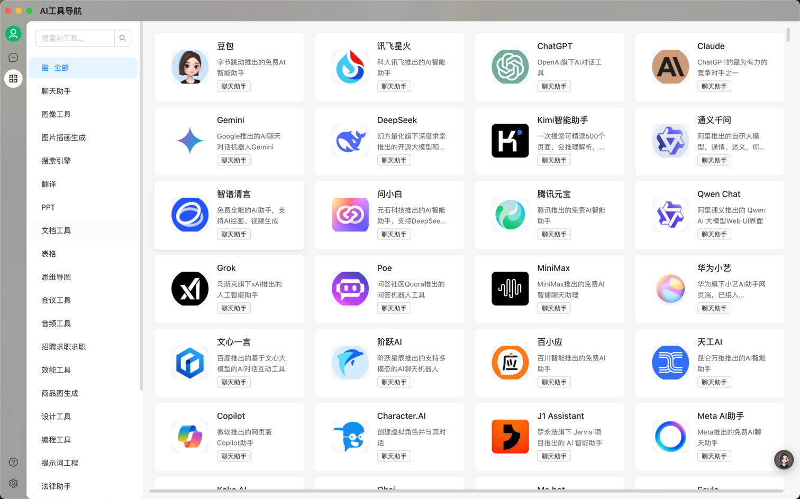

# 🚀 Awesome AI Tools [](https://awesome.re) [](https://github.com/Rvelamen/Awesome-AI-Tools)


> 一个持续更新的AI工具全景图，涵盖大语言模型（LLM）、Agent框架、开发工具等资源

> ⭐ 如果这份清单对你有帮助，欢迎在 GitHub 右上角点一个 **Star**，让更多人和 Agent 发现它。

---

## 📖 目录
- [🎯 项目目标](#-项目目标)
- [🗂️ 工具分类](#️-工具分类)
- [🧭 快速导航](#-快速导航)
- [👥 贡献指南](#-贡献指南)
- [📜 声明](#-声明)
- [🤝 License](#-license)

---

## 🎯 项目目标
提供**一站式检索清单**，帮助开发者/研究者：
- 🔍 快速定位适合的AI工具
- 📊 对比不同工具的特性与协议
- 🌱 跟踪AI领域最新动态

---

## 🗂️ 工具分类

### 1. 聊天助手
| 名称    | 类型 | 描述       | 链接             |
| ------- | ---- | -------- | ---------------- |
| 豆包 | web | 字节跳动推出的免费AI智能助手 | [官网](https://www.doubao.com/chat) |
| [Auferet](https://auferet.com) | AI game master that remembers your world: persistent memory for characters, places, and lore you upload; solo or multiplayer, 5e & Pathfinder 2e | — | — |
| 讯飞星火 | web | 科大讯飞推出的AI智能助手 | [官网](https://xinghuo.xfyun.cn/desk) |
| ChatGPT | web | OpenAI旗下AI对话工具 | [官网](https://chat.openai.com) |
| Claude | web | ChatGPT的最为有力的竞争对手之一 | [官网](https://claude.ai) |
| Gemini | web | Google推出的AI聊天对话机器人Gemini | [官网](https://gemini.google.com) |
| DeepSeek | web | 幻方量化旗下深度求索推出的开源大模型和聊天助手 | [官网](https://chat.deepseek.com/) |
| Kimi智能助手 | web | 一次搜索可精读500个页面，会推理解析，能深度思考的AI助手 | [官网](https://kimi.moonshot.cn/) |
| 通义千问 | web | 阿里推出的自研大模型，通情、达义，你的全能AI助手！ | [官网](https://tongyi.aliyun.com/qianwen) |
| 智谱清言 | web | 免费全能的AI助手，支持AI绘画、视频生成 | [官网](https://chatglm.cn) |
| 问小白 | web | 元石科技推出的AI智能助手，支持DeepSeek满血版 | [官网](https://wenxiaobai.paluai.com) |
| 腾讯元宝 | web | 腾讯推出的免费AI智能助手 | [官网](https://yuanbao.tencent.com) |
| Qwen Chat | web | 阿里通义推出的 Qwen AI 大模型Web UI界面 | [官网](https://chat.qwen.ai/) |
| Grok | web | 马斯克旗下xAI推出的人工智能助手 | [官网](https://x.ai/grok) |
| Poe | web | 问答社区Quora推出的问答机器人工具 | [官网](https://poe.com) |
| MiniMax | web | MiniMax推出的免费AI智能聊天助理 | [官网](https://chat.minimaxi.com) |
| 华为小艺 | web | 华为旗下小艺AI助手网页端，已接入DeepSeek-R1 | [官网](https://xiaoyi.huawei.com/chat) |
| 文心一言 | web | 百度推出的基于文心大模型的AI对话互动工具 | [官网](https://yiyan.baidu.com) |
| 阶跃AI | web | 阶跃星辰推出的支持多模态的AI聊天机器人 | [官网](https://yuewen.cn/chats/new) |
| 百小应 | web | 百川智能推出的免费AI助手 | [官网](https://ying.baichuan-ai.com/chat) |
| 天工AI | web | 昆仑万维推出的AI智能助手 | [官网](https://www.tiangong.cn) |
| Copilot | web | 微软推出的网页版Copilot助手 | [官网](https://copilot.microsoft.com/) |
| Character.AI | web | 创建虚拟角色并与其对话 | [官网](https://character.ai) |
| J1 Assistant | web | 罗永浩旗下 Jarvis 项目推出的 AI 智能助手 | [官网](https://matter.ai/) |
| Meta AI助手 | web | Meta推出的免费AI聊天助手 | [官网](https://www.meta.ai) |
| Koko AI | web | Seele公司推出的「AI+3D」情感陪伴产品 | [官网](https://www.seeles.ai) |
| Ohai | web | 月之暗面旗下推出的AI角色扮演虚拟陪伴应用 | [官网](https://beta.ohai.bot/discover) |
| Me.bot | web | 心识宇宙推出的个性化AI伴侣产品 | [官网](https://www.me.bot) |
| Saylo | web | AI驱动的故事角色扮演游戏应用，沉浸式的剧本互动体验 | [官网](https://www.sayloai.com) |
| 通义星尘 | web | 用AI定制属于你自己的IP角色 | [官网](https://tongyi.aliyun.com/xingchen) |
| CueMe | web | 夸克推出的AI智能对话助手，支持2万字长文写作 | [官网](https://cueme.cn) |
| 造梦次元 | web | AI互动内容平台，虚拟角色逗你开心 | [官网](https://ciyuan.ideaflow.pro) |
| Museland | web | 沉浸式AI角色扮演产品 | [官网](https://www.museland.ai) |
| 百度AI助手 | web | 百度推出的多场景AI智能体助手 | [官网](https://chat.baidu.com) |
| 商量SenseChat | web | 商汤科技推出的类ChatGPT的人工智能大语言模型 | [官网](https://chat.sensetime.com) |
| 小悟空 | web | 字节跳动推出的免费AI对话助手和个人助理 | [官网](https://wukong.com/tool) |
| 紫东太初 | web | 中科院与武智院推出的千亿参数全模态大模型和助手 | [官网](https://taichu-web.ia.ac.cn/#/welcome) |
| 小黄蕉 | web | 字节跳动旗下推出的AI虚拟交友聊天平台 | [官网](https://chatwiz.cn/h5/feely) |
| 冒泡鸭 | web | 阶跃星辰推出的AI聊天机器人和智能体平台 | [官网](https://maopaoya.com) |
| Cici | web | 豆包国际版，字节跳动面向海外市场推出的AI助手 | [官网](https://www.cici.com/browser-extension/landing/zh) |
| 百川大模型 | web | 百川智能推出的大模型助手，融合了意图理解、信息检索以及强化学习技术 | [官网](https://chat.baichuan-ai.com) |
| Le Chat | web | Mistral推出的AI对话聊天助手 | [官网](https://chat.mistral.ai) |
| 百度AI伙伴 | web | 百度最新上线的AI搜索对话工具 | [官网](https://chat.baidu.com/) |
| 超级助理 | web | 百度智能云发布的基于文心一言的AI原生应用和Copilot“超级助理” | [官网](https://cloud.baidu.com/product/infoflow.html) |
| 钉钉·个人版 | web | 钉钉推出的个人版办公应用程序，内置AI智能助手，可进行AI创作、AI对话、AI绘画 | [官网](https://workspace.dingtalk.com) |
| Wanderboat | web | 硅谷初创公司UTA AI推出的AI旅行助手 | [官网](https://wanderboat.ai) |
| MChat | web | 基于孟子GPT大模型的AI对话机器人 | [官网](https://www.langboat.com/portal/mengzi-gpt) |
| Luca面壁露卡 | web | 面壁智能推出的千亿多模态大模型免费智能对话助手 | [官网](https://luca-beta.modelbest.cn/) |
| 元象XChat | web | 元象XVERSE大模型驱动的AI聊天助手 | [官网](https://chat.xverse.cn/xchat/index.html) |
| ChitChop | web | 字节旗下面向海外用户推出的免费大模型产品和AI助手工具箱 | [官网](https://www.chitchop.com) |
| 魔搭GPT（ModelScopeGPT） | web | 阿里达摩院推出的大小模型协同的智能助手，具备作诗、绘画、视频生成、语音播放等多模态能力 | [官网](https://www.modelscope.cn/studios/iic/ModelScopeGPT) |
| HuggingChat | web | HuggingFace推出的在线聊天机器人，基于Open Assistant模型 | [官网](https://huggingface.co/chat/) |
| TigerBot | web | 虎博科技推出的AI对话聊天机器人，基于TigerBot开源大模型 | [官网](https://tigerbot.com) |
| Stable Chat | web | Stability AI 最新推出的免费聊天对话网站 | [官网](https://research.stability.ai/chat) |
| ColossalChat | web | Colossal-AI推出的免费开源版ChatGPT聊天机器人替代品 | [官网](https://chat.colossalai.org) |
| Jasper Chat | web | Jasper针对内容创作者出品的AI聊天工具 | [官网](https://www.jasper.ai/chat) |
| ChatSonic | web | WriteSonic出品的ChatGPT竞品 | [官网](https://chat-sonic.ai/#) |
| Replika | web | AI对话陪伴工具 | [官网](https://replika.ai/) |
| Kissable | web | AI companion with persistent memory, together photos, video generation, community scenario catalog, emotional voice, and unlimited messages | [官网](https://kissable.app) |
| Pi | web | DeepMind联创新公司推出的AI聊天机器人 | [官网](https://pi.ai/talk) |
| 360智脑 | web | 360搜索最新推出的AI对话聊天机器人 | [官网](https://ai.360.com) |
| 对话写作猫 | web | 秘塔写作猫推出的AI对话聊天工具 | [官网](https://xiezuocat.com) |
| 海螺AI | web | MiniMax推出的AI对话助理，已免费开放 | [官网](https://hailuoai.com) |
| StudyArena | web | 免费比较同一学习问题的三个匿名 AI 回答，投票后揭示模型名称 | [官网](https://studyarena.com) |
| 千问 | web | 全能AI助手，基于Qwen模型 | [官网](https://www.qianwen.com) |
| Z.ai | web | 智谱面向全球推出的AI模型体验平台 | [官网](https://z.ai/) |
| Duck.ai | web | DuckDuckGo 推出的免费 AI 聊天平台 | [官网](https://duck.ai/) |
| LongCat | web | 美团推出的自研大模型AI对话平台 | [官网](https://longcat.chat/) |
| 逗逗AI | web | AI游戏陪玩，支持原神、黑神话、LOL！ | [官网](https://doudou.paluai.com/web_aitool) |
| 知达AI | web | 专为教育全场景打造的AI智能助教 | [官网](https://www.zida.school/) |
| Lorka AI | web | 多模型 AI 聚合对话平台 | [官网](https://www.lorka.ai/) |
| 百灵大模型 | web | 蚂蚁集团推出的 Ling-1T 大模型对话体验平台 | [官网](https://ling.tbox.cn/chat) |
| Dola | web | 豆包国际版，字节跳动面向海外市场推出的AI助手 | [官网](https://www.dola.com/) |

---
### 2. 图像工具
| 名称    | 类型 | 描述       | 链接             |
| ------- | ---- | -------- | ---------------- |
| Stable Chat | web | Stability AI 最新推出的免费聊天对话网站 | [官网](https://research.stability.ai/chat) |
| 绘蛙 | web | AI电商营销工具，免费生成商品图和种草文案 | [官网](https://ihuiwa.paluai.com) |
| 稿定AI | web | 一站式设计工具集，免费AI绘图、图片转AI绘画、AI抠图消除 | [官网](https://www.gaoding.com) |
| 笔魂AI | web | 设计工具，支持AI抠图、消除、无损放大 | [官网](https://ibihun.com) |
| ImageChanger | web | 浏览器端AI图片编辑器，提供38个背景、人物、物体、修复和创意转换工作流 | [官网](https://aiimagechanger.app/) |
| 吐司AI | web | AI绘画模型社区和在线生图平台 | [官网](https://tusiart.com) |
| 美间AI抠图 | web | 美间AI推出的免费智能抠图工具 | [官网](https://www.meijian.com/mj-box/ai-pic-matting-intro) |
| 即梦 | web | 抖音旗下免费AI图片创作工具 | [官网](https://jimeng.jianying.com/ai-tool/home) |
| 阿贝智能 | web | 一站式AI绘本创作平台，副业变现必备 | [官网](https://abeiai.com) |
| Midjourney | web | AI图像和插画生成工具 | [官网](https://www.midjourney.com/home) |
| 炉米Lumi | web | 字节跳动推出的AIGC图像创作平台 | [官网](https://artistrylab.net) |
| Seedream AI Studio | web | 字节跳动出品多模型AI图像生成平台，搭载Seedream 5.0/4.5/4.0，AI图像竞技场排名第一，支持10张参考图一键生成视频 | [官网](https://seedream4.video/) |
| Civitai | web | 免费的AI图像绘画作品和模型分享平台和社区 | [官网](https://civitai.com/) |
| 堆友AI反应堆 | web | 阿里旗下堆友推出的多风格AI绘画生成器 | [官网](https://d.design) |
| 通义万相 | web | 阿里最新推出的AI绘画创作模型 | [官网](https://tongyi.aliyun.com/wanxiang) |
| 秒画 | web | 商汤科技推出的免费AI作画和图片生成平台 | [官网](https://miaohua.sensetime.com/inspiration) |
| WHEE | web | 美图推出的AI图片和绘画创作生成平台 | [官网](https://www.whee.com/) |
| LiblibAI·哩布哩布AI | web | 国内领先的AI图像创作平台和模型分享社区 | [官网](https://www.liblib.art) |
| 美图AI文生图 | web | 美图推出的AI文本生成图片的工具 | [官网](https://design.meitu.com/aigc/text-to-image) |
| 奇域AI | web | 中式审美国风AI绘画创作平台 | [官网](https://www.qiyuai.net) |
| 可灵AI | web | 快手推出的AI图像和视频创作平台 | [官网](https://klingai.kuaishou.com) |
| AI改图神器 | web | AI万能图片在线编辑器 | [官网](https://img.logosc.cn) |
| Krea AI | web | 实时AI图像、视频生成和编辑平台 | [官网](https://www.krea.ai) |
| Rao Edits | web | 浏览器端AI图像生成和参考图编辑工具，可用于社交视觉、产品图和创意工作流 | [官网](https://raoedits.top/) |
| YingTu | web | 浏览器端 AI 图像与视频路由测试平台，支持提示词、参考图、尺寸与下载结果对比 | [官网](https://yingtu.ai/en) |
| Photoroom | web | 在线AI图片编辑工具 | [官网](https://www.photoroom.com/zh) |
| HairWow | web | AI发型试戴和护发建议工具，支持预览发型、发色、刘海、层次和胡须造型 | [官网](https://www.gohairwow.com) |
| Ribbet.ai | web | 免费的多功能AI图片处理工具箱 | [官网](https://ribbet.ai/) |
| 万相营造 | web | 阿里旗下推出的多模态AI创意生成平台 | [官网](https://agi.taobao.com) |
| 悟空图像PhotoSir | web | 新一代专业图像处理软件，更智能、更高效、更好用 | [官网](https://www.photosir.com) |
| 360智图 | web | 360推出的AI作图平台，支持智能抠图、智能消除、智能放大、智能配图 | [官网](https://chacha.so.com/home) |
| 像素蛋糕 | web | 像甜科技推出的AI图像后期软件 | [官网](https://www.pixcakeai.com) |
| remove.bg | web | 强大的AI图片背景移除工具 | [官网](https://www.remove.bg/zh) |
| 如果相机 | web | 仅需1张照片，快速生成AI写真照片 | [官网](https://ifshot.com) |
| ARC | web | 腾讯旗下ARC实验室推出的免费AI图片处理工具 | [官网](https://arc.tencent.com/zh/ai-demos/) |
| Cutout.Pro | web | AI在线处理图片 | [官网](https://www.cutout.pro/) |
| MagicStudio | web | 高颜值AI图像处理工具 | [官网](https://magicstudio.com/zh) |
| Booltool | web | 在线AI图像工具箱 | [官网](https://booltool.boolv.tech/home) |
| Faceswapper | web | AI在线换脸工具 | [官网](https://faceswapper.ai) |
| ClipDrop | web | Stability.ai推出的AI图片处理系列工具 | [官网](https://clipdrop.co/) |
| Vmake AI | web | AI在线图像和视频编辑平台，专为电商、设计提供服务 | [官网](https://vmake.ai) |
| Leonardo.ai | web | 免费的AI绘画和图像生成工具和社区 | [官网](https://app.leonardo.ai/auth/login) |
| DeepSwapper | web | 免费的在线AI换脸工具，支持图片、视频多种格式 | [官网](https://www.deepswapper.com) |
| Kacha AI | web | 专业的AI写真工具，媲美专业摄影 | [官网](https://www.kacha.ai/zh) |
| PicTech AI | web | 免费的在线图片翻译工具，支持一键抠图 | [官网](https://www.pictech.cc) |
| Hotpot.ai | web | AI图片图像处理和生成工具 | [官网](https://hotpot.ai) |
| IconGen | web | 免费的icon图标AI生成器 | [官网](https://www.icongen.io) |
| 言之画 | web | AI图像内容创作平台，由出门问问推出 | [官网](https://paint.mobvoi.com) |
| 百度智能云一念 | web | 基于百度文心大模型的多模态内容创作平台 | [官网](https://yinian.cloud.baidu.com/creativity/main/workbench) |
| 艾绘 | web | 一键创作故事、绘画、配音，轻松创建高质量的绘本故事 | [官网](https://www.aiyou.art) |
| Graviti Diffus | web | 开箱即用的 Stable Diffusion WebUI 在线图像生成服务 | [官网](https://www.diffus.graviti.com) |
| 触手AI绘画 | web | 免费专业的AI绘画/模型/分享平台 | [官网](https://acgnai.art) |
| 文心一格 | web | AI艺术和创意辅助平台 | [官网](https://yige.baidu.com/) |
| 造梦日记 | web | AI一下，妙笔生画 | [官网](https://zmrj.art) |
| Canva AI图像生成 | web | 在线设计工具Canva推出的AI图像生成工具 | [官网](https://www.canva.com/ai-assistant/) |
| 超能画布 | web | 百度网盘推出的AI创意图像写真创作平台 | [官网](https://photo.baidu.com/photasy/home) |
| Adobe Firefly | web | Adobe最新推出的AI图片生成工具 | [官网](https://www.adobe.com/products/firefly.html) |
| 简单AI | web | 搜狐最新推出的AI图片生成平台 | [官网](https://ai.sohu.com/search) |
| 摩笔马良 | web | 摩尔线程推出的AI图像绘画创作平台 | [官网](https://maliang.mthreads.com) |
| Exactly.ai | web | 专业的AI绘画和艺术创作平台 | [官网](https://exactly.ai) |
| 画宇宙 | web | 人工智能AI作画网站 | [官网](https://creator.nolibox.com) |
| 6pen Art | web | 面包多团队推出的从文本描述生成绘画艺术作品 | [官网](https://6pen.art) |
| 创客贴AI画匠 | web | 创客贴推出的AI艺术画生成工具 | [官网](https://aiart.chuangkit.com/landingpage) |
| Visual Electric | web | 专业的高质量AI图像创作工具 | [官网](https://visualelectric.com/) |
| 360智绘 | web | 360推出的AI图片和绘画生成工具 | [官网](https://aigc.360.com) |
| 网易AI创意工坊 | web | 网易云课堂推出的AI作画平台，在线使用Stable Diffusion出图 | [官网](https://ke.study.163.com/artWorks/painting) |
| Imagine with Meta | web | Meta最新推出的在线AI图像生成器 | [官网](https://www.meta.com/ja-jp/help/artificial-intelligence) |
| Freepik AI Image Generator | web | Freepik最新推出的AI图片生成工具 | [官网](https://www.freepik.com/ai/image-generator) |
| Stockimg AI | web | AI生成各种类型的图像和插画 | [官网](https://stockimg.ai/) |
| Stable Doodle | web | StabilityAI最新推出的将手绘草图转换成精美图像的工具 | [官网](https://clipdrop.co/stable-doodle) |
| 175FUN | web | 免费AI绘画社区，国货之光 | [官网](https://175.fun) |
| 行者AI美术 | web | AI图片生成和美术创作工具箱 | [官网](https://xingzheai.cn/#create) |
| Skybox AI | web | AI生成和合成360°全景图像插画 | [官网](https://skybox.blockadelabs.com) |
| Facet | web | AI图片修图和优化工具 | [官网](https://facet.ai/) |
| Relight | web | ClipDrop推出的AI图像打光工具 | [官网](https://clipdrop.co/relight) |
| Upscayl | web | 免费开源的AI图片无损放大工具 | [官网](https://www.upscayl.org/) |
| RunningHub | web | 基于云端ComfyUI的AI图像与视频创作平台 | [官网](https://www.runninghub.cn/) |
| 呜哩 | web | 阿里推出的AIGC创意生产力平台 | [官网](https://wuli.art/) |
| insMind | web | 稿定面向全球市场推出的AI图片编辑工具 | [官网](https://www.insmind.com/) |
| 图改改 | web | 免费 AI 在线图片文字编辑工具，对话式AI编辑 | [官网](https://tugaigai.com/) |
| Epixa | web | 一站式 AI 图像创作聚合平台 | [官网](https://epixa.cn/) |
| AlphaVow | web | 一站式 AI 批量图像处理工具 | [官网](https://alphavow.com/) |
| ChatArt | web | 一站式 AI 创作工具，聚合国内外主流 AI 模型 | [官网](https://www.chatartpro.com/tw/) |
| Krene | web | 深耕游戏/影视美术创作领域的 AIGC 创作平台 | [官网](https://www.krene.com/) |
| 米粿AI | web | 懂画师的渐进式分层绘画助手，主攻日系二次元绘画 | [官网](https://miguo.ai) |
| 咖图AI | web | AI图像设计平台，搭载NanoBanana Pro模型 | [官网](https://www.katuai.cn/) |
| 视觉工厂 | web | AI创作工具，支持AI生图和视频生成服务 | [官网](https://d.aijuh.com/) |
| 秒绘AI | web | 一键生成爆款图文，免费发布小红书 | [官网](https://miaohuiai.cc/) |
| 讯飞绘文 | web | AI批量原创，多平台矩阵号管理 | [官网](https://turbodesk.xfyun.cn/) |
| 蛙蛙写作 | web | AI小说和内容创作工具 | [官网](https://wawawriter.com/app/) |
| 妙呀 | web | 阿里潮玩AI平台，一站式潮玩创作 | [官网](https://www.miaoyaai.cn/activityDetail?activityId=431&sqm=miaoya.aibot.ls.pc++) |
| 秒哒 | web | 无代码AI应用开发平台，一句话做应用 | [官网](https://www.miaoda.cn/) |
| 秒悟Meoo | web | 阿里推出的首个对话式AI开发工具 | [官网](https://click.meoo.com/m/20000000664) |
| updream | web | 专业级一站式 AI 视频创作平台 | [官网](https://www.updream.cn/) |
| LibTV | web | 专业AI视频创作平台，最便宜的 Seedance 2.5 ！ | [官网](https://www.liblib.tv/) |

---
### 3. 图片插画生成
| 名称    | 类型 | 描述       | 链接             |
| ------- | ---- | -------- | ---------------- |
| Stable Chat | web | Stability AI 最新推出的免费聊天对话网站 | [官网](https://research.stability.ai/chat) |
| 包图网AI素材库 | web | 包图网提供的特色图库服务 | [官网](https://ibaotu.com/tupian/shuziyishu.html) |
| 吐司AI | web | AI绘画模型社区和在线生图平台 | [官网](https://tusiart.com) |
| 美间AI抠图 | web | 美间AI推出的免费智能抠图工具 | [官网](https://www.meijian.com/mj-box/ai-pic-matting-intro) |
| 即梦 | web | 抖音旗下免费AI图片创作工具 | [官网](https://jimeng.jianying.com/ai-tool/home) |
| Midjourney | web | AI图像和插画生成工具 | [官网](https://www.midjourney.com/home) |
| Civitai | web | 免费的AI图像绘画作品和模型分享平台和社区 | [官网](https://civitai.com/) |
| 堆友AI反应堆 | web | 阿里旗下堆友推出的多风格AI绘画生成器 | [官网](https://d.design) |
| 通义万相 | web | 阿里最新推出的AI绘画创作模型 | [官网](https://tongyi.aliyun.com/wanxiang) |
| 秒画 | web | 商汤科技推出的免费AI作画和图片生成平台 | [官网](https://miaohua.sensetime.com/inspiration) |
| WHEE | web | 美图推出的AI图片和绘画创作生成平台 | [官网](https://www.whee.com/) |
| LiblibAI·哩布哩布AI | web | 国内领先的AI图像创作平台和模型分享社区 | [官网](https://www.liblib.art) |
| 美图AI文生图 | web | 美图推出的AI文本生成图片的工具 | [官网](https://design.meitu.com/aigc/text-to-image) |
| 奇域AI | web | 中式审美国风AI绘画创作平台 | [官网](https://www.qiyuai.net) |
| remove.bg | web | 强大的AI图片背景移除工具 | [官网](https://www.remove.bg/zh) |
| 触手AI绘画 | web | 免费专业的AI绘画/模型/分享平台 | [官网](https://acgnai.art) |
| 文心一格 | web | AI艺术和创意辅助平台 | [官网](https://yige.baidu.com/) |
| 造梦日记 | web | AI一下，妙笔生画 | [官网](https://zmrj.art) |
| Canva AI图像生成 | web | 在线设计工具Canva推出的AI图像生成工具 | [官网](https://www.canva.com/ai-assistant/) |
| 超能画布 | web | 百度网盘推出的AI创意图像写真创作平台 | [官网](https://photo.baidu.com/photasy/home) |
| Adobe Firefly | web | Adobe最新推出的AI图片生成工具 | [官网](https://www.adobe.com/products/firefly.html) |
| 简单AI | web | 搜狐最新推出的AI图片生成平台 | [官网](https://ai.sohu.com/search) |
| 摩笔马良 | web | 摩尔线程推出的AI图像绘画创作平台 | [官网](https://maliang.mthreads.com) |
| Exactly.ai | web | 专业的AI绘画和艺术创作平台 | [官网](https://exactly.ai) |
| 画宇宙 | web | 人工智能AI作画网站 | [官网](https://creator.nolibox.com) |
| 6pen Art | web | 面包多团队推出的从文本描述生成绘画艺术作品 | [官网](https://6pen.art) |
| 创客贴AI画匠 | web | 创客贴推出的AI艺术画生成工具 | [官网](https://aiart.chuangkit.com/landingpage) |
| Visual Electric | web | 专业的高质量AI图像创作工具 | [官网](https://visualelectric.com/) |
| 360智绘 | web | 360推出的AI图片和绘画生成工具 | [官网](https://aigc.360.com) |
| 网易AI创意工坊 | web | 网易云课堂推出的AI作画平台，在线使用Stable Diffusion出图 | [官网](https://ke.study.163.com/artWorks/painting) |
| Imagine with Meta | web | Meta最新推出的在线AI图像生成器 | [官网](https://www.meta.com/ja-jp/help/artificial-intelligence) |
| Freepik AI Image Generator | web | Freepik最新推出的AI图片生成工具 | [官网](https://www.freepik.com/ai/image-generator) |
| Stockimg AI | web | AI生成各种类型的图像和插画 | [官网](https://stockimg.ai/) |
| Stable Doodle | web | StabilityAI最新推出的将手绘草图转换成精美图像的工具 | [官网](https://clipdrop.co/stable-doodle) |
| 175FUN | web | 免费AI绘画社区，国货之光 | [官网](https://175.fun) |
| 行者AI美术 | web | AI图片生成和美术创作工具箱 | [官网](https://xingzheai.cn/#create) |
| Skybox AI | web | AI生成和合成360°全景图像插画 | [官网](https://skybox.blockadelabs.com) |
| 千鹿AI | web | AI设计助手，每日可免费生成300张图像 | [官网](https://qianlu.cc) |
| 星流AI | web | LiblibAI推出的一站式AI图像生成平台 | [官网](https://www.xingliu.art) |
| 悠船 | web | Midjourney官方推出的中文版AI图像生成工具 | [官网](https://www.youchuan.cn) |
| 神采 | web | 让创意照进现实， AI生成创意插画 | [官网](https://www.ishencai.com) |
| 天工巧绘SkyPaint | web | 免费的AI插画绘制工具，由昆仑万维与奇点智源合作推出 | [官网](https://sky-paint.singularity-ai.com/index.html#/) |
| FlagStudio | web | 智源研究院推出的AI文本图像绘画生成工具 | [官网](https://flagstudio.baai.ac.cn/) |
| NightCafe | web | AI艺术插画在线生成 | [官网](https://nightcafe.studio/collections) |
| niji・journey | web | 魔法般的二次元绘画生成 | [官网](https://nijijourney.com) |
| Deep Dream Generator | web | AI创建生成梦幻般的插画图片，刻画你的梦中场景 | [官网](https://deepdreamgenerator.com/) |
| 无限画 | web | 千库网推出的AI图片插画生成工具 | [官网](https://588ku.com/ai/wuxianhua/Home) |
| BlueWillow | web | 免费的AI图像艺术画生成工具 | [官网](https://www.bluewillow.ai/) |
| Waifu Labs | web | 免费在线AI生成二次元动漫头像 | [官网](https://waifulabs.com/) |
| dreamlike.art | web | 免费在线插画生成工具 | [官网](https://dreamlike.art/) |
| Artbreeder | web | 创建令人惊叹的插画和艺术 | [官网](https://www.artbreeder.com/) |
| Tiamat | web | 国内团队推出的AI艺术画生成工具 | [官网](https://www.tiamat.world) |
| Vega AI | web | 在线免费AI插画创作平台，支持文生图，图生图，条件生图等多种绘画模式 | [官网](https://vegaai.net/) |
| Craiyon | web | 免费在线文本到图像生成 | [官网](https://deepgram.com/ai-apps/craiyon) |
| 万兴爱画 | web | 万兴科技推出的AI生成高品质艺术画工具 | [官网](https://aigc.wondershare.cn/) |
| Photosonic | web | Writesonic推出的AI艺术插画生成工具 | [官网](https://photosonic.pro/) |
| Astria | web | 可定制的人工智能图像生成 | [官网](https://astria.us.com/) |
| getimg.ai | web | 在线AI图像和插画创作工具 | [官网](https://getimg.ai/) |
| DreamUp | web | DeviantArt推出的AI插画生成工具 | [官网](https://www.dreamup.com) |
| Scribble Diffusion | web | 将草图转变为精美的插画 | [官网](https://scribblediffusion.net/) |
| Lexica | web | 基于Stable Diffusion的在线插画生成 | [官网](https://lexica.art/) |
| Picsart AI | web | Picsart推出的AI图片生成器 | [官网](https://picsart.com/ai-image-generator/) |
| neural.love | web | AI艺术图片生成 | [官网](https://completeaitraining.com/ai-tools/neural-love/) |
| starryai | web | AI艺术图片生成 | [官网](https://faq.starryai.com) |
| Artssy | web | AI图像生成 | [官网](https://www.artsy.net/) |
| Playform | web | 专业的高质量AI艺术画生成平台 | [官网](https://www.playform.io/) |
| Photo Booth by Magic Studio | web | AI创建个人资料图片 | [官网](https://cn.bing.com/images/search?q=photo+booth+by+magic+studio&qpvt=Photo+Booth+by+Magic+Studio&FORM=IGRE) |
| Supermeme | web | AI MEME梗图生成器 | [官网](https://supermeme.ai/) |
| Fotor | web | Fotor推出的在线AI图片生成工具 | [官网](https://www.fotor.com/features/ai-image-generator/) |
| Dream.ai | web | WOMBO推出的AI艺术画生成工具 | [官网](https://help.dream.ai/hc/en-us) |
| 无界AI | web | AI生成艺术插画和二次元人物 | [官网](https://www.wujieai.com) |
| 站酷梦笔 | web | 国内知名设计社区站酷推出的人工智能插画生成工具 | [官网](https://www.zcool.com.cn/ailab) |
| 改图鸭AI图片生成 | web | 改图鸭AI图片生成 | [官网](https://www.gaituya.com/aiimg/) |
| Prodia | web | AI艺术画生成工具 | [官网](https://prodia.com/) |
| Lucidpic | web | AI生成高质量人像照片 | [官网](https://lucidpic.com/ai-stock-photo-generator) |
| Bing Image Creator | web | 微软必应推出的基于DALL·E的AI图像生成工具 | [官网](https://www.bing.com/images/create) |
| MakeManga | web | MakeManga 是 AI 漫画创作平台，能将文字故事快速转化为精美漫画。 | [官网](https://www.makemanga.ai/) |
| 妙话AI | web | 妙话AI是专为普通用户与内容创作者设计的创意图片生成工具。 | [官网](https://imiaohua.com/) |

---
### 4. 搜索引擎
| 名称    | 类型 | 描述       | 链接             |
| ------- | ---- | -------- | ---------------- |
| 夸克AI | app | 集AI搜索、网盘、文档、创作等功能于一体的应用 | [官网](https://b.quark.cn/apps/qkhomepage_twofoufeb/routes/model) |
| 心流 | web | 阿里旗下推出的AI搜索助手 | [官网](https://iflow.cn) |
| 秘塔AI搜索 | web | 最好用的AI搜索工具，没有广告，直达结果 | [官网](https://metaso.cn) |
| Perplexity | web | 强大的对话式搜索引擎 | [官网](https://www.perplexity.ai) |
| SearchGPT | web | OpenAI最新推出的搜索引擎，内测开放 | [官网](https://chatgpt.com/) |
| Flowith | web | 节点交互式AI搜索和对话工具 | [官网](https://flowith.net/blank) |
| Genspark | web | 基于智能体的搜索引擎 | [官网](https://www.genspark.ai) |
| Devv | web | 面向程序员的新一代搜索引擎 | [官网](https://devv.ai/zh) |
| 知乎直答 | web | 知乎推出的搜索引擎，直达问题答案 | [官网](https://zhida.zhihu.com) |
| 纳米搜索 | web | 360公司推出的AI搜索应用，一切皆可生成视频 | [官网](https://www.n.cn) |
| 百度AI探索版 | web | 百度推出的深度搜索引擎 | [官网](https://chat.baidu.com/search) |
| Felo | web | 免费AI智能搜索引擎，支持社交联网搜索和多语种问答结果 | [官网](https://felo.ai/search) |
| AMiner | web | 智谱AI推出的大模型学术平台 | [官网](https://www.aminer.cn/) |
| 天工AI搜索 | web | 昆仑万维最新推出的结合大模型的搜索引擎 | [官网](https://tiangong.cn) |
| 清言插件 | plugin | 智谱推出的浏览器AI插件，支持AutoGLM、站内高级检索 | [官网](https://new-front.chatglm.cn/webagent/landing/index.html) |
| Exa AI | web | 专门为AI模型设计的搜索引擎平台 | [官网](https://dashboard.exa.ai/playground) |
| Reddo | web | 全球产品信息搜索引擎，能语义化搜索任何公开的产品与公司 | [官网](https://www.reddo.cloud/search_home) |
| 博查AI搜索 | web | 支持多模型的搜索引擎 | [官网](https://bochaai.com/) |
| 链企AI | web | 链企智能推出的AI商业搜索工具 | [官网](https://www.lianqiai.cn) |
| 问问小宇宙 | web | 小宇宙推出的AI搜索产品 | [官网](https://ask.xiaoyuzhoufm.com) |
| Dexa AI | web | AI播客搜索工具 | [官网](https://dexa.ai) |
| 开搜AI | web | 面向大众的免费AI问答搜索引擎 | [官网](https://kaisouai.com/) |
| Adot | web | 一个由AI驱动的 Web3 搜索引擎 | [官网](https://www.adot.tech) |
| XAnswer | web | 支持生成思维导图的免费AI搜索工具 | [官网](https://www.xanswer.com) |
| AlphaSense | web | 专为金融专业人士设计的AI搜索工具 | [官网](https://www.alpha-sense.com) |
| Globe Explorer | web | 结构化AI知识搜索引擎 | [官网](https://explorer.globe.engineer) |
| Reportify | web | AI投资研究问答搜索引擎 | [官网](https://reportify.cc) |
| Phind | web | 专为开发者设计的搜索引擎 | [官网](https://www.phind.com) |
| iAsk AI | web | 快速准确的搜索引擎 | [官网](https://iask.ai) |
| Consensus | web | AI科研学术搜索引擎 | [官网](https://consensus.app) |
| Komo Search | web | 简洁直观的搜索引擎 | [官网](https://komo.ai) |
| Searcholic | web | AI驱动的电子书和文档搜索引擎 | [官网](https://searcholic.com) |
| Andi | web | 对话式人工智能搜索引擎 | [官网](https://andisearch.com) |
| Songtell | web | AI驱动的音乐百科搜索引擎 | [官网](https://www.songtell.com) |
| ThinkAny | web | 新时代的搜索引擎 | [官网](https://thinkany.ai/zh) |
| Miku | web | 快速精准的搜索引擎 | [官网](https://www.hellomiku.com) |
| Qdrant | web | 开源的向量数据库和向量相似性搜索引擎 | [官网](https://qdrant.tech) |
| 玻尔 | web | 新一代科研知识库与AI学术搜索平台 | [官网](https://www.bohrium.com/) |
| 蜜崽检索 | web | AI 学术检索与研究辅助工具 | [官网](https://s.mizai.cn/) |
| WisPaper | web | 复旦团队推出的 AI 学术搜索工具 | [官网](https://www.wispaper.ai/) |
| CuspAI | web | 剑桥大学推出的材料学专业AI搜索工具 | [官网](https://www.cusp.ai/) |
| MaxAEO | web | AI 搜索可见度监测与优化工具 | [官网](https://maxaeo.cn/) |
| SheepGeo | web | 国内首个AI GEO（生成式引擎优化）分析平台 | [官网](https://sheepgeo.com/) |
| 博简智慧专利 | web | AI专利查新检索与撰写平台 | [官网](https://pagentia.com/) |
| 360AI搜索 | web | 360推出的新一代AI搜索引擎 | [官网](https://so.360.com/) |
| Glean | web | 专为职场人设计的AI搜索引擎 | [官网](https://www.glean.com/) |

---
### 5. 翻译
| 名称    | 类型 | 描述       | 链接             |
| ------- | ---- | -------- | ---------------- |
| 沉浸式翻译 | plugin | 双语对照的网页翻译插件，完全免费 口碑炸裂！ | [官网](https://immersivetranslate.com/zh-Hans) |
| 会译 | web | 沉浸对照式翻译，支持100+语言 | [官网](https://huiyiai.net/) |
| 腾讯交互翻译 | web | 腾讯推出的多语言翻译工具 | [官网](https://transmart.qq.com) |
| DeepTranslate | plugin | 免费的AI双语翻译器，支持142+种语言 | [官网](https://deeptranslate.ai/zh-CN) |
| Google翻译 | web | Google免费提供的上百种语言智能翻译工具 | [官网](https://translate.google.com/) |
| 必应翻译 | web | 微软必应推出的翻译工具 | [官网](https://www.bing.com/translator/) |
| DeepL翻译 | web | 准确的人工智能翻译工具 | [官网](https://www.deepl.com/translator) |
| Toby | web | AI实时语音翻译工具，专为视频通话设计 | [官网](https://www.trytoby.com) |
| 火山翻译 | web | 字节跳动推出的智能翻译工具 | [官网](https://translate.volcengine.com/) |
| 百度翻译 | web | 200种语言互译、沟通全世界！ | [官网](https://fanyi.baidu.com/) |
| 阿里翻译 | web | 阿里巴巴达摩院推出的多领域多语种的在线机器翻译 | [官网](https://translate.alibaba.com) |
| 搜狗翻译 | web | 你的贴身智能翻译专家 | [官网](https://fanyi.sogou.com/text) |
| 腾讯翻译君 | web | 你免费的随身翻译 | [官网](https://fanyi.qq.com/) |
| 象寄翻译 | web | AI图片和视频翻译神器，支持多种语言的翻译 | [官网](https://www.xiangjifanyi.com) |
| 网易见外 | web | 网易推出的AI智能翻译平台，支持音视频、文档、图片、字幕等翻译 | [官网](https://sight.youdao.com) |
| 讯飞智能翻译 | web | 科大讯飞推出的人工智能翻译平台 | [官网](https://fanyi.xfyun.cn) |
| 彩云小译 | web | 兼具中日英同声传译、文档翻译和网页翻译的智能翻译工具 | [官网](https://fanyi.caiyunapp.com/#/) |
| 百度AI同传助手 | app | 中英文音视频同传字幕工具 | [官网](https://fanyi.baidu.com/appdownload/download.html?tab=helper&fr=pcproduct) |
| 讯飞同传 | web | 科大讯飞推出的专业AI同声传译平台 | [官网](https://tongchuan.iflyrec.com/) |
| 堆友AI图片翻译 | web | AI图片翻译工具，自动翻译图片文字内容 | [官网](https://d.design/toolbox/translate) |
| Doclingo | web | 专业的AI文档翻译工具，保留原始排版 | [官网](https://doclingo.cn/) |
| 精挑翻译 | web | 免费 AI 翻译插件，双语网页对照翻译 | [官网](https://selecttranslate.com/) |
| Belin Doc | web | 免费无限制的 AI 文档翻译工具 | [官网](https://belindoc.com/) |
| Transor沉浸式翻译 | web | AI翻译工具，提供多场景实时翻译服务 | [官网](https://transor.ai/) |
| 灵夕翻译 | web | AI智能文档翻译工具，保持原始排版 | [官网](https://lingxifanyi.com/) |
| 金山快译 | web | 金山WPS推出的在线翻译平台 | [官网](https://kuaiyi.wps.cn/txt-translate) |

---
### 6. PPT
| 名称    | 类型 | 描述       | 链接             |
| ------- | ---- | -------- | ---------------- |
| AiPPT | web | AI快速生成高质量PPT | [官网](https://www.aippt.cn) |
| 咔片PPT | web | AI PPT制作工具，设计美化全流程自动化 | [官网](https://www.cappt.cc) |
| 笔格AIPPT | web | 高效的AI PPT生成工具 | [官网](https://www.bigppt.cn) |
| 文多多AiPPT | web | AI一键生成PPT，支持AI配图和智能资料整合 | [官网](https://docmee.cn) |
| Gamma App | web | AI幻灯片演示生成工具 | [官网](https://gamma.app/) |
| 清言PPT | web | 智谱清言联合AiPPT推出的PPT生成智能体 | [官网](https://chatglm.cn/main/alltoolsdetail) |
| iSlide AIPPT | web | AI一键设计精美PPT，只需一句标题 | [官网](https://www.islide.cc) |
| 稿定PPT | web | 稿定推出的PPT模板资源库 | [官网](https://www.gaoding.com) |
| 笔灵AIPPT | web | 一键生成PPT和千字演讲稿 | [官网](https://ibiling.cn/ppt-zone) |
| 讯飞智文 | web | 科大讯飞推出的免费AI PPT生成工具 | [官网](https://zhiwen.xfyun.cn) |
| 万兴智演 | web | 万兴科技推出的AI PPT和演示制作软件 | [官网](https://zhiyan.wondershare.cn) |
| Napkin | web | 将文本内容快速转换成演示图像的AI办公工具 | [官网](https://www.napkin.ai) |
| VisDoc | web | AI文生图表工具，支持生成柱状图、折线图、饼图等 | [官网](https://www.visdoc.cn) |
| 美图AI PPT | web | 美图秀秀推出的免费在线AI生成PPT设计工具 | [官网](https://www.designkit.com/ppt) |
| 歌者AI | web | 彩漩PPT推出的AI PPT生成工具 | [官网](https://gezhe.caixuan.cc) |
| ChatBA | web | AI幻灯片生成工具 | [官网](https://www.chatba.com/) |
| Tome | web | AI创作叙事性幻灯片 | [官网](https://tome.app/) |
| Decktopus AI | web | AI驱动的的在线演示文稿生成器 | [官网](https://www.decktopus.com/) |
| Powerpresent AI | web | AI创建精美的演示稿 | [官网](https://powerpresent.ai/) |
| 希沃白板 | web | 专为互动教学设计的AI课件生成器 | [官网](https://easinote.seewo.com) |
| 秒出PPT | web | 一键生成PPT，智能辅助编辑 | [官网](https://10sppt.com/pptx) |
| GAIPPT | web | AI智能美化PPT工具，上传PPT一键美化 | [官网](https://www.gaippt.com) |
| beautiful.ai | web | AI创建展示幻灯片 | [官网](https://www.beautiful.ai/) |
| 麦当秀MindShow | web | AI在线PPT制作工具，支持Markdown等多种格式 | [官网](https://www.mindshow.vip/workstation) |
| ChatPPT | web | AI一键对话生成PPT，智能排版美化 | [官网](https://www.chat-ppt.com/) |
| 博思AIPPT | web | 博思云创推出的在线AI生成PPT工具 | [官网](https://pptgo.cn) |
| 轻竹办公 | web | 在线智能生成和设计PPT的AI工具 | [官网](https://qzoffice.com) |
| Chronicle | web | AI高颜值演示文稿创建 | [官网](https://chroniclehq.com/) |
| Presentations.AI | web | 演示文档版的ChatGPT | [官网](https://www.presentations.ai/) |
| SlidesAI | web | AI快速创建演示幻灯片 | [官网](https://www.slidesai.io/) |
| auxi | web | 功能强大的PowerPoint AI插件 | [官网](https://www.auxi.ai/) |
| AI灵感PPT | web | 免费高效的AIPPT生成工具 | [官网](https://www.lgppt.cn) |
| MindShow | web | 国内独立开发者开发的输入内容自动生成演示工具 | [官网](https://www.mindshow.fun) |
| Loomy | web | 桌面端 AI 智能体，每天免费5000积分！ | [官网](https://loomy.xunfei.cn/) |
| 二狗PPT | web | 去 AI 味中式职场 PPT 生成工具 | [官网](https://www.2dogppt.com/) |
| Pi智能PPT | web | 一键生成PPT，复制精美模板 | [官网](https://pi.deepvinci.tech/idea) |
| Gamma | web | AI幻灯片演示生成工具 | [官网](https://try.gamma.app/dlp8wf0pq5r8) |
| AiPPT插件 | web | AiPPT推出的AI PPT制作工具（插件版） | [官网](https://www.aippt.cn/plugin) |
| Swishy | web | AI 动态设计与动画生成平台 | [官网](https://www.swishy.ai/) |
| ChartGen | web | AI图表生成工具，快速生成专业图表 | [官网](https://chartgen.ai/zh-CN) |
| Diagrimo | web | Tenorshare AI推出的AI图表生成工具 | [官网](https://www.tenorshare.ai/zh-tw/diagrimo.html) |
| PicDoc | web | AI文本转图表工具，一键生成多种视觉图表 | [官网](https://www.picdoc.cn/) |
| Kimi PPT助手 | web | Kimi全新自研的PPT助手，一键生成PPT | [官网](https://www.kimi.com/slides) |
| 夸克PPT | web | 夸克团队推出的AI PPT生成工具 | [官网](https://ppt.quark.cn/) |
| 飞象老师 | web | 猿辅导推出的国内首个AI教学和备课工具 | [官网](https://www.feixianglaoshi.com/) |
| 一点PPT | web | 一句话生成专业PPT，AI自动排版配图 | [官网](https://www.1dppt.com/) |
| NarraLand | web | AI智能演示内容创作平台 | [官网](https://www.narraland.com) |
| 课灵 PPT | web | AI免费生成PPT课件 | [官网](https://www.classppt.cn/) |

---
### 7. 文档工具
| 名称    | 类型 | 描述       | 链接             |
| ------- | ---- | -------- | ---------------- |
| 百度文库AI助手 | web | 基于文心一言的一站式智能文档助手 | [官网](https://wenku.baidu.com/ndlaunch/browse/chat) |
| 万知 | web | 零一万物推出的一站式AI文档阅读和PPT创作工作台 | [官网](https://www.wanzhi01.com) |
| 包阅AI | web | 高效的AI智能阅读助手 | [官网](https://baoyueai.com/channel) |
| txyz | web | AI文献阅读和学术研究辅助平台 | [官网](https://www.txyz.ai) |
| Doc2X | web | AI文档识别、转换与翻译工具 | [官网](https://noedgeai.com) |
| Acrobat AI Assistant | web | Adobe推出的Acrobat PDF文档AI助手 | [官网](https://www.adobe.com/acrobat/generative-ai-pdf.html) |
| WPS AI | web | WPS推出的AI办公助手，已免费开放 | [官网](https://ai.wps.cn) |
| 腾讯文档智能助手 | web | 腾讯推出的AI文档生成和辅助工具 | [官网](https://docs.qq.com) |
| Cubox | web | 高效的AI阅读学习助手和信息收集管理工具 | [官网](https://cubox.pro) |
| Quivr | web | 开源的知识库搭建工具，构建你的第二大脑 | [官网](https://www.quivr.app) |
| Remio | web | 本地优先的AI记忆和知识库，支持文件、网页、录音、邮件、消息、图片和笔记的索引与语义检索 | [官网](https://remio.ai/) |
| WizGenerator Story Generator | web | 免费AI故事生成工具，可根据主题、类型、语气和篇幅生成故事草稿，无需注册 | [官网](https://wizgenerator.com/tools/story-generator/) |
| Coda AI | web | 在线协作平台Coda推出的AI写作和文档助手，类似于Notion AI | [官网](https://coda.io/product/ai) |
| 有道速读 | web | 网易有道推出的AI论文和文档阅读助手 | [官网](https://read.youdao.com) |
| 腾讯问卷 | web | 腾讯推出的AI生成调查问卷的免费工具 | [官网](https://wj.qq.com/ai/generate.html) |
| 通义智文 | web | 基于通义大模型的AI阅读助手，可智能阅读网页、论文、图书和文档 | [官网](https://tongyi.aliyun.com/zhiwen) |
| 字语智能 | web | 一站式智能Office内容创作平台 | [官网](https://getgetai.com) |
| 星火文档问答 | web | 基于讯飞星火大模型的AI文档和知识库问答助手 | [官网](https://chatdoc.xfyun.cn) |
| PMAI | web | 面向产品经理的AI助手 | [官网]( https://www.pm-ai.cn) |
| PDF.ai | web | AI PDF文档阅读工具，智能文档总结摘要 | [官网](https://pdf.ai) |
| 司马阅 | web | AI文档阅读分析工具 | [官网](https://smartread.cc) |
| 知我AI | web | 智能阅读机器人，AI总结文档、网页、视频、播客等 | [官网](https://knowme.xiaoduoai.com) |
| 星火科研助手 | web | 科大讯飞联合中科院推出的AI科研文献助手 | [官网](https://paper.iflytek.com) |
| 印象AI | web | 印象笔记推出的AI知识和信息管理功能 | [官网](https://www.yinxiang.com/about/yxai-yxbj/) |
| Craft AI Assistant | web | 在线文档工具Craft推出的AI文档和创作助手 | [官网](https://www.craft.do) |
| Humata | web | 基于GPT的AI文档分析、阅读和问答工具 | [官网](https://www.humata.ai/) |
| ChatDOC | web | 基于ChatGPT的文档阅读、提取、总结、摘要的工具 | [官网](http://chatdoc.com) |
| PandaGPT | web | AI文档要点总结工具 | [官网](https://www.pandagpt.io/) |
| Rossum.ai | web | 现代化的AI文档处理工具 | [官网](https://rossum.ai/) |
| Super AI | web | AI复杂文档自动识别处理转换 | [官网](https://super.ai/) |
| 小绿鲸 | web | AI英文文献阅读工具 | [官网](https://www.xljsci.com/) |
| Lantay | web | 面壁智能推出的文档处理智能工作台 | [官网](https://lantay.modelbest.cn/) |
| Wisfile | web | AI文件整理工具，支持批量归纳文件 | [官网](https://www.wisfile.ai/) |
| 文智Doc | web | AI 文档生成工具，一键生成初稿智能排版 | [官网](https://wenzhidoc.com) |
| OmniBox小黑 | web | 解析全网内容 秒变文本生产力 | [官网](https://www.omnibox.pro/) |
| 智写流程 | web | AI文档工具，捕捉网页操作自动生成图文教程 | [官网](https://www.igenflow.com/) |
| 匡优AI | web | AI出题工具，快速生成各类考试题目 | [官网](https://ai.kyou.ltd/pc) |

---
### 8. 表格
| 名称    | 类型 | 描述       | 链接             |
| ------- | ---- | -------- | ---------------- |
| 酷表ChatExcel | web | AI Excel 数据分析辅助工具 | [官网](https://www.chatexcel.com/#/home) |
| 办公小浣熊 | web | 商汤科技推出的AI办公助手 | [官网](https://www.xiaohuanxiong.com) |
| vika维格云 | web | 智能多维表格和数据生产力平台 | [官网](https://vika.cn) |
| 百度GBI | web | 百度推出的全球商业智能平台 | [官网](https://gbi.cloud.baidu.com) |
| Ajelix | web | 处理Excel和Google Sheets表格的AI工具 | [官网](https://ajelix.com/) |
| Sheet+ | web | Excel和Google Sheets表格AI处理工具 | [官网](https://sheetplus.ai/) |
| 轻云图 | web | 必优科技推出的AI一键生成可视化云图工具 | [官网](https://cloud.yoo-ai.com) |
| 北极九章 | web | 北极数据推出的AI数据分析平台 | [官网](https://datarc.cn) |
| Formula bot | web | AI将指令转换成Excel的函数公式 | [官网](https://excelformulabot.com) |
| FormX.ai | web | AI自动从表格和文档中提取数据 | [官网](https://www.formx.ai/) |
| Rows | web | 集成了AI功能的在线表格处理工具 | [官网](https://rows.com/) |
| Excelly-AI | web | 将文本转换成Excel或Google Sheets公式 | [官网](https://excelly-ai.io/index.html) |
| SheetGod | web | BoloForms推出的AI Excel公式生成工具 | [官网](https://www.boloforms.com/sheetgod/) |
| Excel Formularizer | web | AI将文本输入转换为Excel公式处理 | [官网](https://excelformularizer.com/) |
| ChatExcel | web | AI Excel表格处理与数据分析工具 | [官网](https://www.chatexcel.com/home) |
| marmos | web | 腾讯灯塔团队推出的AI原生数据分析平台 | [官网](https://marmos.qq.com/) |
| 数以轻舟Agent | web | 专注Excel数据处理的本地化AI智能体 | [官网](https://www.dify-ai.cn/excelagent/excelagent.html) |
| 察言观数AskTable | web | 企业级AI数据智能体平台 | [官网](https://www.asktable.com/) |
| Tomoro | web | 腾讯灯塔推出的AI原生大数据分析工具 | [官网](https://beacon.qq.com/tomoro/) |
| XCell | web | 智能数据分析平台，专注 Excel 与 CSV 数据处理 | [官网](https://xcell.boxindx.cn/) |
| Shortcut | web | AI Excel 超级智能体，处理复杂 Excel 任务 | [官网](https://www.tryshortcut.ai/) |
| 表答 | web | AI数据采集与数据分析智能体 | [官网](https://biaoda.me/) |
| ChatSPSS | web | AI 数据分析助手，零门槛在线使用 | [官网](https://chatspss.cn/) |
| 爱图表 | web | 镝数科技推出的AI数据可视化和分析工具 | [官网](https://aitubiao.com/) |
| ChartinAI | web | 一句话生成专业图表，AI自动搜集数据并可视化 | [官网](https://chartinai.com/) |

---
### 9. 思维导图
| 名称    | 类型 | 描述       | 链接             |
| ------- | ---- | -------- | ---------------- |
| TreeMind树图 | web | 新一代AI智能思维导图，一句话生成思维导图 | [官网](https://shutu.cn) |
| 博思白板 | web | 博思云创推出的AI多功能白板工具 | [官网](https://boardmix.cn/ai-whiteboard) |
| ProcessOn | web | 在线AI流程图和思维导图制作工具 | [官网](https://www.processon.com) |
| 自由画布 | web | 百度文库和百度网盘联合推出的AI万能白板 | [官网](https://wenku.baidu.com/pcactivity/freeBoard) |
| 亿图脑图 | web | 亿图脑图思维导图助手 | [官网](https://www.edrawsoft.cn/mindmaster) |
| 妙办画板 | web | 在线实时协作的画图工具，AI一键生成流程图 | [官网](https://imiaoban.com) |
| Mapify | web | Xmind推出的思维导图生成工具 | [官网](https://mapify.so/cn) |
| 小画桌 | web | 在线协作白板工具，内置AIGC功能 | [官网](https://www.xiaohuazhuo.com) |
| 印象图记 | web | 印象AI加持的在线思维导图工具 | [官网](https://www.yinxiang.com/product/evermind/) |
| 知犀AI | web | 知犀推出的思维导图生成工具 | [官网](https://www.swdt.com) |
| Xmind Copilot | web | Xmind 思维导图助手 | [官网](https://xmind.ai) |
| 妙办AI画图工具 | web | AI免费一键生成流程图、思维导图 | [官网](https://imiaoban.com/work/AIht) |
| GitMind思乎 | web | AI驱动的免费思维导图工具 | [官网](https://gitmind.cn) |
| 亿图图示AI | web | 专业的办公绘图软件，轻松绘制图表和图形 | [官网](https://www.edrawsoft.cn/edrawmax/ai) |
| Whimsical | web | Whimsical推出的思维导图工具 | [官网](https://whimsical.com/ai-mind-maps) |
| AmyMind | web | 开箱即用的在线思维导图工具 | [官网](https://amymind.com) |
| Taskade | web | 高颜值AI大纲和思维导图生成 | [官网](https://www.taskade.com/) |
| Miro AI | web | 在线白板协作工具推出的AI功能，Beta测试中 | [官网](https://miro.com/mind-map/) |
| Ayoa Ultimate | web | 思维导图和头脑风暴工具 | [官网](https://www.ayoa.com/ultimate/) |
| 畅图AI | web | AI图表生成工具，一键生成思维导图、流程图 | [官网](https://www.fluig.cn/) |
| 可赞AI | web | AI办公可视化工具，文字转图表 | [官网](https://kezign.cn/) |

---
### 10. 会议工具
| 名称    | 类型 | 描述       | 链接             |
| ------- | ---- | -------- | ---------------- |
| 听脑AI | web | 人工智能语音录音记录助手 | [官网](https://itingnao.com) |
| 简单听记 | web | 百度网盘推出的AI语音转文字工具 | [官网](https://pan.baidu.com/embed/listennote) |
| 通义听悟 | web | 阿里推出的AI会议转录工具，万语千言，心领神悟 | [官网](https://tingwu.aliyun.com) |
| 讯飞会议 | app | AI智能会议系统，实时字幕、实时翻译、自动生成会议记录 | [官网](https://meeting.iflyrec.com) |
| 飞书妙记 | web | 飞书智能会议纪要和快捷语音识别转文字 | [官网](https://www.feishu.cn/product/minutes) |
| Otter.ai | web | AI会议内容生成和实时转录 | [官网](https://otter.ai) |
| 腾讯会议AI小助手 | web | 腾讯会议推出的AI会议内容助理 | [官网](https://meeting.tencent.com/ai) |
| Zoom Workplace | web | Zoom推出的AI办公协作和交流沟通平台 | [官网](https://www.zoom.com/zh-cn/products/collaboration-tools/) |
| 麦耳会记 | web | 思必驰推出的AI会议助手，语音转文字、字幕同传、AI摘要 | [官网](https://work.duiopen.com) |
| Fireflies.ai | web | AI会议转录和会议纪要生成工具 | [官网](https://fireflies.ai/) |
| Noty.ai | web | ChatGPT驱动的AI会议转录工具 | [官网](https://noty.ai/) |
| Airgram | web | 自动会议笔记和总结的AI助手 | [官网](https://www.airgram.io) |
| Ai好记 | web | AI音视频转录与总结 | [官网](https://aihaoji.com/) |

---
### 11. 音频工具
| 名称    | 类型 | 描述       | 链接             |
| ------- | ---- | -------- | ---------------- |
| 听脑AI | web | 人工智能语音录音记录助手 | [官网](https://itingnao.com) |
| 简单听记 | web | 百度网盘推出的AI语音转文字工具 | [官网](https://pan.baidu.com/embed/listennote) |
| 通义听悟 | web | 阿里推出的AI会议转录工具，万语千言，心领神悟 | [官网](https://tingwu.aliyun.com) |
| 魔音工坊 | web | AI配音工具，轻松配出媲美真人的声音 | [官网](https://www.moyin.com) |
| 讯飞智作 | web | 科大讯飞推出的AI转语音和配音工具 | [官网](https://peiyin.xunfei.cn/?ftype=14) |
| Suno | web | 高质量的AI音乐创作平台 | [官网](https://www.suno.ai) |
| 海绵音乐 | web | 字节跳动推出的免费AI音乐创作和发现平台 | [官网](https://www.haimian.com) |
| 音疯 | web | 昆仑万维推出的AI音乐创作平台，一键生成原创歌曲 | [官网](https://www.yinfeng.cn/home) |
| 琅琅配音 | web | 智能文本转语音工具 | [官网](https://lang123.top) |
| Noiz AI | web | AI配音工具，支持文本转语音和声音克隆 | [官网](https://noiz.ai/landing) |
| MiniMax Audio | web | MiniMax推出的AI语音合成工具，支持声音克隆 | [官网](https://www.minimax.io/audio) |
| Mureka | web | 昆仑万维推出的 AI 音乐商用创作平台 | [官网](https://www.mureka.ai) |
| 天谱乐 | web | 唱鸭团队推出的首个多模态音乐生成大模型 | [官网](https://www.tianpuyue.cn) |
| 音剪 | web | 喜马拉雅推出的一站式AI音频创作平台 | [官网](https://audioeditor.ximalaya.com) |
| 讯飞听见 | web | 科大讯飞推出的在线AI语音转文字工具 | [官网](https://www.iflyrec.com/zhuanwenzi.html) |
| MemoAI | web | 免费的AI语音转文字工具 | [官网](https://memo.ac) |
| Reecho睿声 | web | 超拟真的中英文AI语音克隆/生成平台 | [官网](https://www.reecho.ai) |
| Udio | web | 免费的AI音乐创作工具，每月可生成1200首歌曲 | [官网](https://www.udio.com) |
| 网易天音 | web | 网易推出的一站式AI音乐创作工具 | [官网](https://tianyin.163.com/) |
| TME Studio | web | 腾讯音乐推出的智能音乐创作助手 | [官网](https://y.qq.com/tme_studio/index.html#/) |
| Lyrics Into Song AI | web | 在线AI音乐创作工具，输入歌词创建个性化歌曲 | [官网](https://lyricsintosong.ai/zh) |
| Stable Audio | web | Stability AI最新推出的音乐生成工具 | [官网](https://www.stableaudio.com) |
| TextToSpeech | web | 完全免费的AI文字转语音工具 | [官网](https://texttospeech.im/zh-CN) |
| TTSMaker | web | 马克配音（MakVoice）推出的免费AI文字转语音工具 | [官网](https://ttsmaker.cn) |
| LOVO AI | web | AI人声和文本转语音生成工具 | [官网](https://lovo.ai) |
| Uberduck | web | 开源的AI语音生成社区，5000多种不同的声音 | [官网](https://uberduck.ai) |
| ElevenLabs | web | AI文本转语音，支持包含中文在内的28种语言 | [官网](https://try.elevenlabs.io) |
| Sonauto | web | 免费的AI音乐生成和歌曲创作工具 | [官网](https://sonauto.ai) |
| 天工SkyMusic | web | 昆仑万维发布的国内首个AI音乐生成大模型 | [官网](https://www.tiangong.cn/music) |
| 大饼AI变声 | web | 免费专业的AI变声软件，一键实时语音变声 | [官网](https://dubbing.tech) |
| Supertone Shift | web | AI驱动的实时语音变换软件 | [官网](https://product.supertone.ai/shift) |
| Riffusion | web | AI生成不同风格的音乐，免费开源 | [官网](https://www.riffusion.com/) |
| Adobe Podcast | web | Adobe推出的在线AI音频录制和编辑工具 | [官网](https://podcast.adobe.com/) |
| 网易云音乐·X Studio | web | 网易云音乐与小冰智能联合推出的免费AI歌手音乐创作软件 | [官网](https://xstudio.music.163.com) |
| 刺鸟配音 | web | 刺鸟科技推出的专业AI配音工具 | [官网](https://www.icnpy.com) |
| Wondercraft | web | AI音频内容生成工具，可创建播客有声书等 | [官网](https://www.wondercraft.ai) |
| Fryderyk | web | AI音乐创作工具，集成了多种乐器声音 | [官网](https://fryderyk.ai) |
| Voicenotes | web | AI驱动的语音笔记工具 | [官网](https://voicenotes.com) |
| OptimizerAI | web | AI声音效果生成工具 | [官网](https://www.optimizerai.xyz) |
| ACE Studio | web | AI歌声合成工具，输入歌词与旋律即可生成宛如真人的歌声 | [官网](https://ace-studio.timedomain.cn) |
| 蓝藻AI | web | 云知声旗下的AI配音和声音克隆平台 | [官网](https://aigc.unisound.com) |
| Deepgram | web | 快速低成本的AI语音文本互转API平台 | [官网](https://deepgram.partnerlinks.io) |
| Audiobox | web | Meta推出的免费开源的AI语音和声音生成模型 | [官网](https://audiobox.metademolab.com) |
| RESEMBLE.AI | web | AI人声生成工具 | [官网](https://www.resemble.ai/) |
| IBM Watson文字转语音 | web | IBM Watson文字转语音 | [官网](https://www.ibm.com/cloud/watson-text-to-speech) |
| FakeYou | web | Deep Fake文本转语音 | [官网](https://fakeyou.com/) |
| BGM猫 | web | 灵动音科技推出的AI智能生成BGM音乐 | [官网](https://bgmcat.com/home) |
| 快转字幕 | web | AI语音视频转文字和字幕的工具 | [官网](https://www.kzzimu.com) |
| 悦音配音 | web | AI智能在线配音语音合成工具 | [官网](https://yueyin.zhipianbang.com) |
| 音虫 | web | 内置AI音乐编曲的音乐制作工具 | [官网](https://www.soundbug.com) |
| Mubert | web | AI BGM背景音乐生成工具 | [官网](https://mubert.com/) |
| beatoven.ai | web | 免版税AI音乐创建平台 | [官网](https://www.beatoven.ai/) |
| BeatBot | web | 输入文本提示快速生成歌曲和音乐 | [官网](https://beatbot.fm) |
| Audo Studio | web | AI音频清洗工具（噪音消除、声音平衡、音量调节） | [官网](https://audo.ai/) |
| NaturalReader | web | AI文本转语音工具 | [官网](https://www.naturalreaders.com/) |
| AssemblyAI | web | 转录和理解语音的AI模型 | [官网](https://www.assemblyai.com/) |
| LALAL.AI | web | AI人声乐器分离和提取 | [官网](https://www.lalal.ai/) |
| Krisp | web | AI噪音消除工具 | [官网](https://krisp.ai/) |
| Play.ht | web | 超真实在线AI语音生成 | [官网](https://play.ht/) |
| Murf AI | web | AI文本转语音生成工具 | [官网](https://murf.ai/) |
| Lemonaid | web | AI音乐生成工具 | [官网](https://www.lemonaide.ai) |
| Soundraw | web | AI音乐生成工具 | [官网](https://soundraw.io/) |
| Boomy | web | AI快速生成原创音乐的平台 | [官网](https://boomy.com/) |
| Typecast | web | 在线AI文字转语音生成工具 | [官网](https://typecast.ai/) |
| Veed AI Voice Generator | web | Veed推出的AI语音生成器 | [官网](https://www.veed.io/tools/text-to-speech-video/ai-voice-generator) |
| Clipchamp AI旁白生成器 | web | Clipchamp的文字转语音生成器 | [官网](https://clipchamp.com/zh-hans/features/ai-voice-over-generator/) |
| MetaVoice | web | AI实时变声工具 | [官网](https://themetavoice.xyz/) |
| Speechify | web | 超2000万人都在用的文字转语音朗读器 | [官网](https://speechify.com/zh-hans/) |
| Voicemaker | web | AI文本到语音生成工具 | [官网](https://voicemaker.in/) |
| Voice.ai | web | 实时AI变声工具 | [官网](https://voice.ai/) |
| Listnr | web | AI文本到语音生成器 | [官网](https://www.listnr.tech/) |
| Voicemod | web | AI变声工具 | [官网](https://www.voicemod.net/ai-voices/) |
| WellSaid Labs | web | AI文本转语音工具 | [官网](https://wellsaidlabs.com/) |
| Notta | web | AI在线将语音转换成文字 | [官网](https://www.notta.ai/en) |
| 逗哥配音 | web | 一站式AI配音工具，抖音爆款配音始发地 | [官网](https://www.douge.com/companyProfile) |
| 讯飞译制 | web | 科大讯飞推出的AI音视频本地化平台 | [官网](https://yizhi.iflyrec.com/?id=XFTJ932) |
| 音述AI | web | 全球首个AI音乐社区 | [官网](https://www.yinshu.me/) |
| Tunee | web | 首个对话式音乐创作AI智能体 | [官网](https://www.tunee.ai/) |
| Flow Music | web | Google Labs推出的AI音乐创作平台 | [官网](https://www.flowmusic.app/) |
| Vemus未音 | web | 腾讯音乐旗下首款一站式AI音乐创作工具 | [官网](https://y.qq.com/vemus/index.html) |
| MELO音乐 | web | AI 音乐生成平台，支持多模态创作能力 | [官网](https://www.51melo.com/) |
| MeloLab | web | 一站式 AI 音乐生成与编辑平台 | [官网](https://melolab.ai/) |
| 万象有声 | web | AI 一站式有声内容创作平台 | [官网](https://www.audimind.com/) |
| Nafy AI | web | 在线 AI 音乐生成器，支持扩展、替换、翻唱 | [官网](https://nafy.ai/) |
| UniScribe | web | AI 免费在线音视频转文字平台 | [官网](https://www.uniscribe.co/) |
| 轻析 LiteSight | web | AI 视频内容提取工具，自动转文字 | [官网](https://qx.utiliverse.site/) |
| TurboScribe | web | 专业 AI 音视频转文字工具 | [官网](https://turboscribe.ai/) |
| 多维视界 | web | 一站式AI音视频智能分析平台 | [官网](https://dwsj.cn/) |
| 音潮 | web | 全栈自研的AI音乐创作平台 | [官网](https://www.yinchaoyongxian.com/) |
| 音秘 | web | 百度推出的AI播客创作工具 | [官网](https://audiomyst.baidu.com/) |
| WellSaid | web | AI文本转语音工具 | [官网](https://www.wellsaid.io/) |
| Keevx声音克隆 | web | Keevx声音克隆是Keevx推出的AI声音克隆工具，能迅速生成与用户音色相似的声音副本。 | [官网](https://keevx.baidu.com/zh/feature/avatarVoice) |
| 千音漫语 | web | 千音漫语是北京熠声科技推出的智能声音创作助手，为用户提供高效、便捷的声音创作解决方案。 | [官网](https://qianyin123.com/?rmd=100080) |

---
### 12. 招聘求职求职
| 名称    | 类型 | 描述       | 链接             |
| ------- | ---- | -------- | ---------------- |
| 多面鹅 | web | 免费大厂面试模拟器，线上面试答案提词器 | [官网](https://offergoose.cn) |
| Mercor | web | 招聘求职求职平台 | [官网](https://mercor.com) |
| Offerin | web | AI面试笔试助手，精准识别面试问题秒级生成答案 | [官网](https://www.offerin.cn) |
| 智面星 | app | AI面试辅助工具，提供全流程的面试辅助 | [官网](https://aiqtools.cn) |
| 白瓜面试 | web | 在线AI面试助手，快速生成面试问题的答案 | [官网](https://m.baigua.com) |
| 职徒简历 | web | 智能简历制作软件，基于GPT的简历优化和简历代写 | [官网](https://www.52cv.com) |
| 职得简历 | web | 在线AI简历生成工具 | [官网](https://www.zdjianli.cn) |
| 蓝字典AI求职 | web | AI求职工具，提供AI简历生成、AI模拟面试服务 | [官网](https://www.lanzidian.com) |
| 神笔简历 | web | AI简历云平台，专为求职者提供一站式求职服务 | [官网](https://jianli.jiuyeqiao.cn/#/index/index) |
| YOO简历 | web | 必优科技推出的AI简历生成工具 | [官网](https://www.yoojober.com) |
| UP简历 | web | AI聊天搞定简历 | [官网](https://upcv.tech/) |
| 超级简历 | web | 3分钟生成简历超千万人使用 | [官网](https://www.wondercv.com/) |
| 求职方舟 | web | AI求职工具，智能识别自动填简历 | [官网](https://www.qiuzhifangzhou.com/) |
| 面多多 | web | 沉浸式AI模拟面试平台 | [官网](https://ai.mianshiya.com/) |
| 牛面 | web | AI面试工具，专为互联网技术人员打造 | [官网](https://niumianoffer.com/) |
| 面团AI | web | AI面试助手，更高效拿到Offer | [官网](https://miantuan.knowfuture.com.cn/) |
| AskCc | web | AI面试助手，上传个人知识库回答更贴本人经历 | [官网](https://askcc.com.cn/) |
| 不繁简历 | web | AI 原生简历编辑器，专业简历制作平台 | [官网](https://bufancv.com/) |
| Jobright | web | AI 求职平台，提供一站式自动化服务 | [官网](https://jobright.ai/) |
| xMatrix | web | 超矩AI协作力人才招聘智能体 | [官网](https://www.xmatrix.tech/#/) |
| 智简简历 | web | 免费AI在线简历制作工具，可视化编辑 | [官网](https://aijianli.cn) |
| 笔面通 | web | 最牛AI面试神器，大厂Offer拿到手软 | [官网](https://bimiantong.com/) |
| AI面试帮 | web | AI面试辅助、笔试辅助工具，实时AI提示，offer轻松拿！ | [官网](https://aimianshibang.com/) |
| 理聘AI | web | 更懂硕博的AI求职神器 | [官网](https://ai.lipind.com/chat) |
| 51mee | web | 浅度求索推出的AI招聘管理工具 | [官网](https://www.51mee.com/) |
| LovTalent | web | AI 原生求职智能体平台 | [官网](https://lovtalent.com/) |
| TelehireAI面试 | web | 最轻量级的全领域AI面试官 | [官网](https://www.telehire.ai/) |
| DINQ | web | AI人才发现与分析平台，精准识别AI精英 | [官网](https://dinq.io/) |
| Gank Interview | web | 专为笔试和面试设计的AI面试助手 | [官网](https://www.gankinterview.cn/) |
| 面试猫 | web | 面试猫是AI面试辅助工具，基于实时语音识别和大语言模型，为求职者提供面试过程中的即时回答建议，帮助应对面试中的各种问题。 | [官网](https://www.offermore.cc/) |
| ResumeAI | web | AI简历生成与ATS简历检测工具 | [官网](https://withresumeai.com/) |

---
### 13. 效能工具
| 名称    | 类型 | 描述       | 链接             |
| ------- | ---- | -------- | ---------------- |
| 飞书多维表格 | web | 表格形态的 AI 工作流搭建工具 | [官网](https://www.feishu.cn/paid/ai-register) |
| Manus | web | Monica团队推出的全球首款通用型 AI Agent | [官网](https://manus.im) |
| IdeaHunter | web | 基于公开需求信号发现并验证应用与微型 SaaS 创业想法 | [官网](https://ideahunter.today) |
| AnswerLens | web | 审计 B2B SaaS 官网公开证据，检查定价、证明、文档、对比、信任、schema 和 llms.txt 缺口 | [官网](https://app.sfdj.net/) |
| AISO Tools | web | 检测 ChatGPT、Perplexity 等 AI 助手是否会推荐你的产品，并给出影响被引用的差距 | [官网](https://aisotools.com) |
| TinyWow | web | 免费在线AI工具箱 | [官网](https://tinywow.com/) |
| ima.copilot | web | 腾讯推出的AI智能工作台产品，基于混元大模型 | [官网](https://ima.qq.com) |
| 飞书知识问答 | web | 飞书智能办公推出的AI知识库工具 | [官网](https://ask.feishu.cn/topic) |
| Monica | web | 全能AI助手，提供聊天、搜索、写作、翻译等多功能服务 | [官网](https://monica.cn) |
| WPS灵犀 | web | WPS推出的AI办公助手，支持PPT生成、AI写作 | [官网](https://lingxi.wps.cn) |
| Glif | web | 无代码的AI小工具构建平台 | [官网](https://glif.app) |
| 奇觅 | web | 美图推出的游戏广告AI制作与投放平台 | [官网](https://qimi.com) |
| 云一朵 | web | 百度网盘最新推出的智能助理 | [官网](https://pan.baidu.com/aipan/welcome) |
| 苏打办公 | web | 360公司推出的一站式AI办公工具 | [官网](https://bangong.360.cn) |
| Hoarder | web | 开源的基于AI的书签和个人知识库管理工具 | [官网](https://hoarder.app) |
| 通义晓蜜 | web | 阿里推出的企业智能服务解决方案 | [官网](https://tongyi.aliyun.com/xiaomi) |
| 奇妙问 | web | 企业AI数字员工生成平台 | [官网](https://aiask365.com) |
| NotebookLM | web | 谷歌推出的AI笔记应用，5分钟生成一段对话播客 | [官网](https://notebooklm.google) |
| 影刀AI Power | web | 面向企业的无代码AI开发和集成平台 | [官网](https://www.yingdao.com/ai-power) |
| 通答AI | web | 企业AI数字员工生成平台 | [官网](https://www.tongdaai.com) |
| 司马诸葛 | web | 企业级AI数字员工平台 | [官网](https://smartchoose.cn) |
| 靠谱AI | web | 无代码AI机器人创建平台 | [官网](https://www.kaopuai.com) |
| Einstein Copilot | web | Salesforce推出的CRM系统AI对话助手 | [官网](https://www.salesforce.com/einsteincopilot) |
| Zapier AI | web | Zapier推出的AI自动化集成功能 | [官网](https://zapier.com/ai) |
| 怪兽AI知识库 | web | 企业知识库大模型 + 智能AI问答机器人 | [官网](https://www.guaishouai.net) |
| 熊猫办公 | web | AI办公服务平台，提供PPT模板、Excel模板、Word模板等资源 | [官网](https://www.tukuppt.com) |
| 小易AI | web | 易企秀推出的AI办公工具 | [官网](https://ai.eqxiu.com) |
| Merlin | web | 基于ChatGPT的Chrome浏览器扩展，浏览任意网页时利用GPT | [官网](https://merlin.foyer.work/) |
| Raycast AI | web | Raycast推出的Mac AI助手，智能写作、编程、回答问题等 | [官网](https://www.raycast.com/ai) |
| Timely | web | AI时间管理跟踪软件 | [官网](https://timelyapp.com/) |
| 飞书智能伙伴 | web | 字节旗下飞书平台推出的AI办公助手 | [官网](https://www.feishu.cn/product/ai_companion) |
| 钉钉斜杠“/” | web | 钉钉最新集成了通义千问大模型的AI办公助手 | [官网](https://page.dingtalk.com/wow/dingtalk/default/dingtalk/I0HfYX4QStBIpLgxnZQe) |
| Ponder AI | web | AI知识管理和思维导图工具 | [官网](https://ponder.ing/) |
| 我来wolai | web | AI云端协作平台与个人笔记工具 | [官网](https://www.wolai.com/) |
| Typeless | web | AI语音输入工具，智能上下文润色 | [官网](https://www.typeless.com/) |
| ChatTOC | web | 将 AI 对话内容转成导航目录的浏览器插件 | [官网](https://chattoc.aichris.cc/) |
| Loom | web | AI 屏幕录制与视频分享工具 | [官网](https://www.loom.com/) |
| Kuse | web | “ChatGPT + 白板 + Notion”的结合体 | [官网](https://app.kuse.ai/) |
| 你好星识 | web | 新一代AI智能文本工作空间 | [官网](https://histella.cn/) |
| Briefly | web | 长视频精华提炼，自动追踪频道中文推送 | [官网](https://briefly.video/) |
| EasyClaw | web | 开源的 OpenClaw 一键安装工具 | [官网](https://www.easyclaw.app/) |
| 猫头鹰AI网页订阅 | web | 一句话搞定任意网页的内容监控 | [官网](https://mtywatch.com?c=lksadjknxzc812ad) |
| 秒言AI语音输入法 | web | AI语音输入工具，极速响应、精准识别 | [官网](https://miaoyan.cn/) |
| 找我呀 | web | 本地AI知识助手，可完全离线运行的文件语义搜索和智能问答工具 | [官网](http://www.findme.net.cn) |
| MagicArena | web | 字节推出的视觉生成模型对战平台 | [官网](https://aigcarena.com/) |
| MMLU | web | 大规模多任务语言理解基准 | [官网](https://paperswithcode.com/sota/multi-task-language-understanding-on-mmlu) |
| Open LLM Leaderboard | web | Hugging Face推出的开源大模型排行榜单 | [官网](https://huggingface.co/spaces/HuggingFaceH4/open_llm_leaderboard) |
| C-Eval | web | 一个全面的中文基础模型评估套件 | [官网](https://cevalbenchmark.com/index_zh.html#home_zh) |
| FlagEval | web | 智源研究院推出的FlagEval（天秤）大模型评测平台 | [官网](https://flageval.baai.ac.cn/#/trending) |
| SuperCLUE | web | 中文通用大模型综合性测评基准 | [官网](https://www.cluebenchmarks.com/static/superclue.html) |
| AGI-Eval | web | AI大模型评测社区 | [官网](https://agi-eval.cn/mvp/home?sourcePage=ai-bot.cn) |
| OpenCompass | web | 上海人工智能实验室推出的大模型开放评测体系 | [官网](https://opencompass.org.cn/leaderboard-llm) |
| CMMLU | web | 一个综合性的大模型中文评估基准 | [官网](https://github.com/haonan-li/CMMLU) |
| MMBench | web | 全方位的多模态大模型能力评测体系 | [官网](https://mmbench.opencompass.org.cn/) |
| HELM | web | 斯坦福大学推出的大模型评测体系 | [官网](https://crfm.stanford.edu/helm/latest/) |
| LMArena | web | AI模型评估平台 | [官网](https://lmarena.ai/) |
| LLMEval3 | web | 由复旦大学NLP实验室推出的大模型评测基准 | [官网](http://llmeval.com/index) |
| H2O EvalGPT | web | H2O.ai推出的基于Elo评级方法的大模型评估系统 | [官网](https://evalgpt.ai) |
| PubMedQA | web | 生物医学研究问答数据集和模型得分排行榜 | [官网](https://pubmedqa.github.io/) |
| CakeGrowth | web | 首个专注 AI 应用的一站式联盟营销平台 | [官网](https://cakegrowth.cn) |
| 模兜 | web | AI数据众包与专家服务平台 | [官网](https://modoudance.com/) |
| Linktree | web | 链接聚合工具，支持多链接整合至单一页面 | [官网](https://linktr.ee/) |
| Bitly | web | 链接管理平台与 URL 短链接服务 | [官网](https://bitly.com/) |
| PartnerStack | web | 领先的合作伙伴生态系统平台 | [官网](https://partnerstack.com/) |
| impact.com | web | AI 原生合作伙伴关系管理平台 | [官网](https://impact.com/) |
| 微信公众平台 | web | 腾讯推出的官方内容创作与服务平台 | [官网](https://mp.weixin.qq.com/) |
| 头条号 | web | 字节跳动推出的内容创作平台 | [官网](https://mp.toutiao.com/) |
| 新榜 | web | 新媒体数据服务平台 | [官网](https://www.newrank.cn/) |
| 稀土掘金 | web | 领先的技术内容社区与开发者服务平台 | [官网](https://juejin.cn/) |
| 知乎 | web | 内容创作者的一站式创作服务与变现平台 | [官网](https://www.zhihu.com/creator) |
| CSDN | web | 专业的开发者社区 | [官网](https://www.csdn.net/) |
| 百家号 | web | 百度推出的内容创作平台，集创作、发布、变现于一体 | [官网](https://baijiahao.baidu.com/) |
| 小红书创作服务平台 | web | 一站式创作者服务工作平台 | [官网](https://creator.xiaohongshu.com/) |
| 小报童 | web | flomo 团队推出的付费内容服务平台 | [官网](https://xiaobot.net/home.html) |
| 知识星球 | web | 内容创作者的知识社群运营工具 | [官网](https://www.zsxq.com/) |
| 小鹅通 | web | 专注私域运营的一站式SaaS平台 | [官网](https://sem.xiaoe-tech.com/) |
| 凹凸工坊 | web | 凹凸工坊是专业的在线 AI 手写稿件生成工具，支持将Word文档一键转换为真实的手写稿图片。 | [官网](https://www.autohanding.com/) |

---
### 14. 商品图生成
| 名称    | 类型 | 描述       | 链接             |
| ------- | ---- | -------- | ---------------- |
| 绘蛙 | web | AI电商营销工具，免费生成商品图和种草文案 | [官网](https://ihuiwa.paluai.com) |
| Pic Copilot | web | 阿里国际推出的AI电商设计工具 | [官网](https://www.piccopilot.com/create) |
| 美间AI商拍 | web | AI电商设计工具，一键生成高质量商品图 | [官网](https://www.meijian.com/e-commerce) |
| 美图商拍 | web | 美图设计室推出的AI商拍工具 | [官网](https://www.designkit.com/product-shoot/?channel=100103) |
| 蜂鸟AI | web | 赶海科技推出的跨境电商AI营销工具 | [官网](https://fengniaoai.com) |
| PhotoStudio AI | web | 虹软旗下推出的AI商拍工具 | [官网](https://psai.cn) |
| Cliclic AI | web | 创客贴推出的AI商品图生成和编辑工具 | [官网](https://www.cliclic.ai) |
| LinkFox AI | web | AI电商设计工具，快速生成专业电商图 | [官网](https://ai.linkfox.com) |
| 创自由 | web | 快速设计商品图、广告图的AI作图工具 | [官网](https://chuangziyou.com) |
| 羚珑 | web | 京东推出的商品图智能设计小工具 | [官网](https://ling.jd.com/) |
| 灵动AI | web | 专业的AI商品图生成工具 | [官网](https://www.redoon.cn) |
| PhotoMagic | web | AI快速生成商拍图片 | [官网](https://www.photomagic.cn) |
| Pebblely | web | AI产品图精美背景添加 | [官网](https://pebblely.com/) |
| Mokker AI | web | AI产品图添加背景 | [官网](https://mokker.ai/) |
| 花生图像 | web | AI电商产品图生成和背景抠图工具 | [官网](https://www.hsphoto.cn) |
| 图生生 | web | 专为电商设计的AI商拍工具 | [官网](https://tushengsheng.com/home) |
| WeShop唯象 | web | 蘑菇街推出的AI商拍工具 | [官网](https://www.weshop.com) |
| PixGT | web | 跨境电商AI商拍工具，服装试穿、模特替换、配饰试戴 | [官网](https://www.pixgt.cn) |
| 堆友AI商品图 | web | 堆友AI推出AI商品图生成工具 | [官网](https://d.design/toolbox/ai-product-background) |
| 稿定AI商品图 | web | 稿定设计推出的AI商品图生成工具 | [官网](https://www.gaoding.com/utms/d0bf3af869c245eabb7f52bbcc85aa88) |
| 光子AI | web | 专为电商商家推出的AI商拍工具 | [官网](https://www.photonaiclub.com/sh/ZgN25IHnBJY) |
| 青虎AI | web | 电商AI视觉内容与智能运营一站式平台 | [官网](https://www.iqinghu.com/) |
| PixPix | web | 聚合全球顶级 AI 模型的跨境电商图视频创作平台 | [官网](https://www.pixpix.com/) |
| 泡泡AI | web | 专为服装与电商行业打造的AI图片创作与编辑平台 | [官网](https://paopaoai.art/) |
| 莓图AI | web | 电商详情图生成与爆款视觉风格复刻 | [官网](https://ai.iiit.cn/) |
| SkildArt | web | 一站式 AI 视觉创作平台，为商业营销而生 | [官网](https://www.skildart.cn/workbench) |
| 几何AI | web | 面向全品类电商的AI视觉生成平台 | [官网](https://jihegeo.com/) |
| GemHues | web | AI 商品视觉内容生成平台，覆盖图 + 视频全链路 | [官网](https://www.gemhues.com/) |
| 蕉点AI | web | 多品类AI电商商品图生成平台 | [官网](https://www.jiaodianai.com/) |
| 潮际好麦 | web | AI赋能电商视觉革命，一站式智能商拍平台 | [官网](https://marketing.k-fashionshop.com/) |
| 妙思 | web | 腾讯广告推出的一站式AI广告创意平台 | [官网](https://admuse.qq.com/) |
| Poify | web | Poify是快手推出的AI电商营销工具，帮助商家和创意工作者快速生成高质量的图片内容。 | [官网](https://poify.ai/) |
| 绘蛙AI | web | 绘蛙AI是国内领先的垂直深耕服饰领域的AIGC电商营销工具，专注于利用先进AIGC技术为电商卖家提供低成本、高质量的商拍图和种草文案。 | [官网](https://ihuiwa.paluai.com/aibot) |
| Pippit | web | Pippit是字节旗下 CapCut 推出的AI营销内容创作平台，专为电商、社交媒体运营和品牌推广设计。 | [官网](https://pippit.capcut.com/) |
| Lunalisa | web | AI创意工作台，13种图像模型+22种视频模型生成商品图、营销海报和白底listing图 | [官网](https://luna-lisa.art) |

---
### 15. 设计工具
| 名称    | 类型 | 描述       | 链接             |
| ------- | ---- | -------- | ---------------- |
| 美间AI | web | 免费设计工具助手，智能海报、提案和商品图生成 | [官网](https://www.meijian.com/e-commerce) |
| Recraft AI | web | 免费无限AI画板，生成高质量矢量艺术画、图标、3D图片和插画 | [官网](https://www.recraft.ai) |
| Pic Copilot | web | 阿里国际推出的AI电商设计工具 | [官网](https://www.piccopilot.com/create) |
| 创客贴AI | web | AI辅助的智能在线设计工具 | [官网](https://aiart.chuangkit.com/matrix) |
| 美图设计室 | web | AI图像创作和设计平台 | [官网](https://www.designkit.com/tools) |
| Figma AI | web | Figma推出的原生设计工具 | [官网](https://www.figma.com/ai) |
| 蚂上有创意 | web | 支付宝推出的设计工具，面向商家提供电商设计服务 | [官网](https://idesign.alipay.com) |
| 爱设计 | web | AI在线设计平台，提供多端在线拖拽设计工具 | [官网](https://www.isheji.com) |
| 魔力工作室 | web | Canva可画推出的一站式AI创作套件 | [官网](https://www.canva.cn/magic) |
| Microsoft Designer | web | 微软推出的在线设计海报和宣传图工具 | [官网](https://designer.microsoft.com/) |
| Onlook | web | 开源AI视觉编辑工具，设计修改自动同步代码 | [官网](https://onlook.com) |
| Looka | web | AI在线设计和生成logo | [官网](https://looka.com/) |
| 智绘设计 | web | 腾讯推出的智能设计平台，让内容更精彩 | [官网](https://taishan.qq.com/brand) |
| MasterGo AI | web | 国产产品设计工具MasterGo推出的智能UI设计助手 | [官网](https://mastergo.com/upcoming-ai/apply) |
| 墨刀AI | web | 墨刀推出的AI产品原型设计助手 | [官网](https://modao.cc/feature/ai.html) |
| 笔魂AI | web | 设计工具，支持AI抠图、消除、无损放大 | [官网](https://ibihun.com) |
| 居然设计家 | web | 居然之家联合阿里推出的AI家装设计平台 | [官网](https://www.shejijia.com) |
| LandscapioAI | web | AI 庭院/景观设计生成器，上传院子照片生成设计方案、成本估算和材料建议 | [官网](https://www.landscapioai.com/) |
| FigJam AI | web | Figma推出的AI白板协作设计工具 | [官网](https://www.figma.com/figjam/ai/) |
| 鹿班 | web | 阿里推出的智能设计商品图和海报的平台 | [官网](https://luban.aliyun.com) |
| Magic Design | web | 在线设计工具Canva推出的设计工具 | [官网](https://www.canva.com/magic-design/) |
| 简单设计 | web | 免费的在线设计、图片处理工具 | [官网](https://www.jiandan.link) |
| 135 AI排版 | web | 公众号AI图文排版和智能文案生成工具 | [官网](https://www.135editor.com/ai_editor) |
| 笔格设计 | web | 设计工具合集，包括文生图、智能消除等 | [官网](https://bigesj.com) |
| Logoai | web | AI LOGO创建设计平台，一站式品牌打造 | [官网](https://www.logoai.com) |
| 豆绘AI | web | AI绘图设计平台，一键生成720°VR全景图 | [官网](https://www.douhuiai.com) |
| 千图网 | web | 在线设计图片素材平台 | [官网](https://www.58pic.com/) |
| Pictographic | web | AI插图资源库和生成平台 | [官网](https://pictographic.io) |
| Fable Prism | web | AI动效设计和动画效果制作工具 | [官网](https://www.fable.app/prism) |
| Wegic | web | AI网页设计和建站开发工具 | [官网](https://wegic.ai) |
| 匠紫 | web | 一站式设计工具 | [官网](https://jiangziai.com) |
| Collov AI | web | AI室内家居设计生成平台 | [官网](https://collov.cn) |
| 包图网AI素材库 | web | 包图网提供的特色图库服务 | [官网](https://ibaotu.com/tupian/shuziyishu.html) |
| 易可图 | web | 免费的AI图片编辑和海报设计平台 | [官网](https://www.yiketu.com) |
| Creatie | web | AI驱动的UI和UX设计工具 | [官网](https://creatie.ai) |
| Kittl | web | AI驱动的平面图形设计工具 | [官网](https://www.kittl.com) |
| Dzine | web | 一站式AI图像编辑和设计工具 | [官网](https://www.dzine.ai) |
| Ilus AI | web | AI插画插图生成工具 | [官网](https://ilus.ai) |
| 酷家乐AI | web | 功能强大的AI家居设计软件 | [官网](https://www.kujiale.cn/activities/AI-kujiale) |
| Pixso AI | web | 国产在线设计工具Pixso的内置AI助手，支持AI文生图、AI对话、AI设计等 | [官网](https://pixso.cn) |
| Framer AI | web | Framer推出的AI网站自动设计、生成和上线 | [官网](https://www.framer.com/ai) |
| LogoliveryAI | web | 免费的AI Logo生成器，提供SVG矢量格式 | [官网](https://logolivery.ai) |
| Motiff 妙多 | web | 猿辅导旗下推出的AI界面设计工具 | [官网](https://motiff.com) |
| Pimento | web | 人工智能驱动的设计创意和视觉参考平台 | [官网](https://www.pimento.design) |
| Logo Diffusion | web | AI驱动的Logo和标志生成工具 | [官网](https://logodiffusion.com) |
| Realibox AI | web | AI免费将草图/模型生成3D渲染图 | [官网](https://www.realibox.com/product/ai) |
| Vectorizer.AI | web | AI一键将位图转换为矢量图片 | [官网](https://vectorizer.ai) |
| 模袋云AI | web | 建筑AI创作平台，专注于大型建筑、小型住宅、室内设计、景观的出图和AI模型训练 | [官网](https://www.modaiyun.com/mdy/ai) |
| Vizcom | web | AI渲染转化手绘图为产品设计图 | [官网](https://www.vizcom.ai/) |
| Dora AI | web | AI在线生成精美3D动画的网站 | [官网](https://www.dora.run/ai) |
| Designs.ai | web | AI设计工具 | [官网](https://designs.ai/) |
| Galileo AI | web | AI高保真原型设计 | [官网](https://www.usegalileo.ai/) |
| Spline AI | web | Spline推出的AI生成3D物体、动画、材质 | [官网](https://spline.design/ai) |
| 千图设计室AI海报 | web | 免费批量生成在线可编辑的AI海报工具 | [官网](https://hihaibao.com) |
| illostrationAI | web | AI插画生成，low poly、3D、矢量、logo、像素风、皮克斯等风格 | [官网](https://www.illostration.com/) |
| Uizard | web | AI网页、App和UI设计，快速生成应用和网站原型 | [官网](https://uizard.io/ai-design/) |
| Luma AI | web | AI 3D捕捉、建模和渲染 | [官网](https://lumalabs.ai/) |
| 图宇宙 | web | 高品质AI智能设计平台 | [官网](https://www.nolibox.com/introduction) |
| Fabrie AI | web | 在线白板协作平台Fabrie推出的AI设计助手，支持多种渲染模式 | [官网](https://kebuxi.datasink.sensorsdata.cn/r/dF) |
| Poly | web | AI生成3D材质 | [官网](https://withpoly.com/browse/textures) |
| Illustroke | web | AI SVG矢量插画生成工具 | [官网](https://illustroke.com/) |
| Eva Design System | web | 基于深度学习的色彩生成工具 | [官网](https://colors.eva.design/) |
| Color Wheel | web | AI灰度logo或插画上色工具 | [官网](https://brandmark.io/color-wheel/) |
| Huemint | web | AI调色生成工具 | [官网](https://huemint.com/) |
| ColorMagic | web | AI调色板生成工具 | [官网](https://www.obviously.ai/) |
| Logomaster.ai | web | AI Logo生成工具 | [官网](https://logomaster.ai/) |
| Magician | web | Figma插件，AI生成图标、图片和UX文案 | [官网](https://magician.design/) |
| Appicons AI | web | AI生成精美App图标 | [官网](https://appicons.ai/) |
| IconifyAI | web | AI App图标生成器 | [官网](https://www.iconifyai.com/) |
| Khroma | web | AI调色盘生成工具 | [官网](https://www.khroma.co/) |
| 即时AI | web | 即时设计推出的由文本描述生成可编辑的原型设计稿 | [官网](https://jsai.cc/ai/create) |
| Alpaca | web | 将生成式AI集成到Photoshop图像设计中 | [官网](https://www.getalpaca.io) |
| Holopix AI | web | 专为游戏、动漫、插画设计打造的AI设计平台 | [官网](https://holopix.cn/) |
| OJO | web | 全球首个 AI 设计 Agent 团队工作台 | [官网](https://ojo.art/) |
| Seede AI | web | 面向普通人的 AI 原生设计工具 | [官网](https://seede.ai/) |
| Stitch | web | Google Labs 推出的 AI 原生设计工具 | [官网](https://stitch.withgoogle.com/) |
| Miora | web | 腾讯推出的 AI 原生设计协作工具 | [官网](https://miora.design/) |
| Ardot | web | 腾讯推出的 AI 智能设计工具 | [官网](https://d.qq.com/) |
| Open Design | web | 开源本地优先的 AI 设计工作空间 | [官网](https://open-design.ai/) |
| Ribbi | web | 专为设计师打造的自进化创意 AI Agent | [官网](https://ribbi.ai/) |
| Tavafa塔维法 | web | PS+AI图片处理平台 | [官网](http://www.tavafa.com/) |
| Interiorize | web | 专注于空间改造的 AI 室内设计工具 | [官网](https://interiorize.ai/) |
| QuiverAI | web | AI矢量图形生成工具，输出可编辑的 SVG 代码 | [官网](https://quiver.ai) |
| GemDesign | web | AI原生高保真原型设计工具 | [官网](https://design.gemcoder.com/?ci=bot) |
| 七色米AI | web | AI 智能营销内容创作平台 | [官网](https://ai.qisemiyun.com/) |
| PagePop | web | 一站式全能AI内容创作和设计平台 | [官网](https://www.pagepop.cn/) |
| 小墨鹰编辑器 | web | 行业首创的AI公众号排版工具，30s搞定推文排版！ | [官网](https://www.xmyeditor.com/) |
| Calicat | web | ProcessOn团队推出的一站式产设研协作平台 | [官网](https://www.calicat.cn/) |
| UXbot | web | AI产品设计工具，一键生成UI与交互式原型 | [官网](https://www.uxbot.cn/) |
| 燕雀光年 | web | AI LOGO设计工具 | [官网](https://www.yanqueai.com) |
| 标小智LOGO生成器 | web | AI Logo设计平台，一键生成企业Logo | [官网](https://www.logosc.cn/) |
| AI设计神器 | web | 一站式创意图片设计编辑平台 | [官网](https://www.logosc.cn/design/) |
| Lovart | web | Lovart 是 LiblibAI 推出的全球首个设计 Agent，实现从概念到图像、视频、3D等的自动设计。 | [官网](https://www.lovart.art/) |

---
### 16. 编程工具
| 名称    | 类型 | 描述       | 链接             |
| ------- | ---- | -------- | ---------------- |
| Trae | plugin | 字节跳动推出的免费编程工具，基于Claude模型 | [官网](https://www.trae.com.cn/) |
| 通义灵码 | plugin | 阿里推出的免费编程工具，基于通义大模型 | [官网](https://click.aliyun.com) |
| 豆包MarsCode | app | 免费AI编程助手，DeepSeek满血版模型 | [官网](https://marscode.paluai.com/doubao) |
| 文心快码 | plugin | 百度推出的AI编程助手，基于文心大模型 | [官网](https://comate.baidu.com) |
| CodeWhisperer | web | 亚马逊推出的免费AI编程助手 | [官网](https://aws.amazon.com/codewhisperer/) |
| GitHub Copilot | web | GitHub推出的编程工具 | [官网](https://github.com/features/copilot) |
| Agent QA | app | 用自然语言编写、运行和排查网页及移动应用测试，提供 CLI、仪表板和 MCP 服务器 | [官网](https://github.com/vostride/agent-qa) |
| codex-profiles | web | 切换命名的 Codex CLI 配置，并在 macOS 上启动具有独立本地状态的 ChatGPT 桌面窗口 | [官网](https://github.com/Ducksss/codex-profiles) |
| Better Agent | app | 本地AI编程代理工作区，统一运行Claude、Codex和Gemini会话，支持并行分叉、任务委派与重启恢复 | [官网](https://github.com/ofekron/better-agent) |
| Orkas | app | 开源本地优先的多智能体桌面工作区，支持并行和串行协作 | [官网](https://orkas.ai/?source=gh_rvelamen) |
| 豆包AI编程 | web | 豆包推出的AI编程新功能 | [官网](https://www.doubao.com/chat/coding) |
| Firebase Studio | app | 谷歌推出的编程工具，一站式开发全栈应用 | [官网](https://firebase.studio) |
| Cursor | app | AI代码编辑器，快速进行编程和软件开发 | [官网](https://www.cursor.com) |
| Windsurf | app | Codeium公司推出的编程工具 | [官网](https://windsurf.com/editor) |
| Bolt.new | web | StackBlitz 推出的全栈AI代码工具，可以看作 Artfacts、V0 和 Replit 的结合体 | [官网](https://bolt.new) |
| Replit Agent | app | AI初创公司Replit推出的编程工具 | [官网](https://docs.replit.com/replitai/agent) |
| Lovable | web | 编程工具，用自然对话快速构建网站和Web应用 | [官网](https://lovable.dev) |
| Junie | plugin | JetBrains 推出的 AI 编程助手 | [官网](https://www.jetbrains.com/junie) |
| 代码小浣熊 | plugin | 商汤科技推出的免费AI编程助手 | [官网](https://www.xiaohuanxiong.com/code) |
| 腾讯云AI代码助手 | plugin | 腾讯推出的AI编程辅助工具 | [官网](https://cloud.tencent.com/product/acc) |
| Codeium | web | 免费的编程工具，智能生成和补全代码 | [官网](https://www.codeium.com/) |
| CodeGeeX | web | 智谱AI推出的免费AI编程助手 | [官网](https://codegeex.cn/) |
| MGX | web | 基于MetaGPT框架的编程工具 | [官网](https://mgx.dev) |
| Cody | app | Sourcegraph推出的免费编程工具 | [官网](https://sourcegraph.com/cody) |
| DevChat | plugin | 开源的支持多款大模型的AI编程助手 | [官网](https://www.devchat.ai/zh) |
| CodiumAI | web | 免费的AI代码测试和分析工具 | [官网](https://www.codium.ai/) |
| Genie | app | Cosine AI推出的AI编程助手 | [官网](https://cosine.sh/genie) |
| 码上飞 | web | AI软件开发平台，一句话自动生成端到端应用 | [官网](https://www.codeflying.net) |
| iFlyCode | web | 科大讯飞推出的智能编程助手 | [官网](https://iflycode.xfyun.cn) |
| Twinny | web | 专为 VS Code 设计的AI代码补全插件 | [官网](https://twinny.dev) |
| Project IDX | web | 谷歌推出的AI云端开发和代码编辑器 | [官网](https://idx.dev) |
| Sketch2Code | web | 微软AI Lab推出的将手绘草图转换成HTML代码工具 | [官网](https://sketch2code.azurewebsites.net/) |
| CodeFuse | web | 蚂蚁集团推出的AI代码编程助手 | [官网](https://codefuse.alipay.com) |
| Tabby | web | 免费开源的自托管AI编程助手 | [官网](https://tabby.tabbyml.com) |
| TeamoRouter | web | Claude Code/Codex LLM API 智能路由网关，一个Key接入所有主流模型，微信支付宝充值 | [官网](https://teamorouter.com?utm_source=github&utm_medium=issue&utm_campaign=round3&utm_content=awesome-ai-tools-cn) |
| LuckyAPI | web | 多模型 API 网关，一个 Key 接入 OpenAI、Anthropic、Google 和 xAI 兼容接口，并提供实时模型目录与定价 | [官网](https://luckyapi.online/zh-cn) |
| C知道 | web | CSDN推出的AI技术问答工具 | [官网](https://so.csdn.net/chat) |
| 驭码CodeRider | web | 极狐GitLab推出的AI编程与软件智能研发助手 | [官网](https://coderider.gitlab.cn) |
| Duo Chat | web | GitLab推出的AI编程助手 | [官网](https://about.gitlab.com/gitlab-duo) |
| CodeRabbit | web | AI驱动的代码审查平台 | [官网](https://coderabbit.ai) |
| Augment Code | web | AI编程辅助工具，专为大型代码库设计 | [官网](https://www.augmentcode.com) |
| Devin | web | 首个全自主的AI软件工程师智能体 | [官网](https://preview.devin.ai) |
| Plandex | web | 免费开源的基于终端的AI编程引擎 | [官网](https://plandex.ai) |
| Tree Ring Memory | web | 本地优先的AI智能体记忆生命周期层，提供Rust CLI/TUI、SQLite/FTS召回、审计、遗忘和整合 | [官网](https://terminallylazy.github.io/Tree-Ring-Memory/) |
| Fitten Code | web | 非十科技推出的免费AI代码助手 | [官网](https://code.fittentech.com) |
| BLACKBOX AI | web | 黑箱AI编程助理，快速代码生成 | [官网](https://www.useblackbox.io) |
| Solo | web | Mozilla推出的零编程无代码AI网站建设工具 | [官网](https://soloist.ai) |
| JetBrains AI | web | JetBrains推出的AI编程开发助手 | [官网](https://www.jetbrains.com/ai) |
| CodeArts Snap | web | 华为云推出的智能编程助手 | [官网](https://www.huaweicloud.com/product/codeartside/snap.html) |
| AskCodi | web | 你的个人AI编程助手 | [官网](https://www.askcodi.com/) |
| v0.dev | web | AI生成前端React/UI组件，由Vercel推出 | [官网](https://v0.dev) |
| Roblox GUI Maker | web | 输入提示词生成Roblox Studio GUI布局和Lua入门代码 | [官网](https://robloxguimaker.dev/) |
| Boxy | web | CodeSandbox推出的AI编程助手 | [官网](https://codesandbox.io/blog/meet-boxy-ai-coding-assistant) |
| Quest AI | web | AI将设计稿生成React代码，支持JavaScript和TypeScript | [官网](https://www.quest.ai) |
| 天工智码Skycode | web | AI智能编程助手，轻松生成各种代码 | [官网](https://sky-code.singularity-ai.com/index.html#/) |
| JamGPT | web | AI Debug调试助手 | [官网](https://jam.dev/jamgpt) |
| aiXcoder | web | 自然语言到代码的方法级代码生成，以及多行智能代码补全 | [官网](https://www.aixcoder.com) |
| AirOps | web | AI SQL语句生成和修改 | [官网](https://www.airops.com/) |
| Imgcook | web | 阿里推出的免费设计稿智能生成前端代码 | [官网](https://www.imgcook.com/) |
| Deco | web | 京东推出的设计稿一键生成多端代码工具 | [官网](https://ling-deco.jd.com/) |
| Ghostwriter | web | 知名在线编程IDE Replit推出的AI编程助手 | [官网](https://replit.com/site/ghostwriter) |
| Codiga | web | AI代码实时分析 | [官网](https://www.codiga.io/) |
| Locofy | web | AI无代码工具将Figma、Adobe XD和Sketch设计转换成前端代码 | [官网](https://www.locofy.ai/) |
| Fronty | web | AI智能将图片转换成HTML和CSS代码 | [官网](https://fronty.com/) |
| MarsX | web | AI无代码软件开发 | [官网](https://www.marsx.dev/) |
| Tabnine | web | AI代码自动补全编程助手 | [官网](https://www.tabnine.com/) |
| Mutable AI | web | 人工智能加速软件开发 | [官网](https://mutable.ai/) |
| Debuild | web | 低代码快速开发网页应用 | [官网](https://debuild.app/) |
| Warp | web | 21世纪的终端工具（内置AI命令搜索） | [官网](https://www.warp.dev/) |
| Fig | web | 下一代命令行工具（内置AI终端命令自动补全） | [官网](https://fig.io/) |
| CodeSnippets | web | AI代码生成、补全、分析、重构和调试 | [官网](https://codesnippets.ai/) |
| Hocoos | web | 无代码AI智能在线快速创建网站 | [官网](https://hocoos.com/) |
| HTTPie AI | web | AI API开发工具 | [官网](https://httpie.io/ai) |
| AI Code Reviewer | web | AI代码检查 | [官网](https://ai-code-reviewer.com/) |
| Visual Studio IntelliCode | web | Visual Studio AI辅助开发 | [官网](https://visualstudio.microsoft.com/zh-hans/services/intellicode/) |
| HeyCLI | web | 自然语言转义为CLI命令 | [官网](https://www.heycli.com/) |
| 讯飞星辰MaaS | web | 一站式AI大模型体验、调用、部署、精调平台 | [官网](https://maas.xfyun.cn/modelSquare?ch=maas-lm-G9n9) |
| BigModel | web | 智谱推出的企业级大模型开放平台（MaaS） | [官网](https://www.bigmodel.cn/activity/trial-card/TVNJ6FXR17) |
| 阿里云百炼 | web | 一站式大模型开发与应用构建平台 | [官网](https://bailian.console.aliyun.com/cn-beijing#/home) |
| 扣子-AI办公 | web | 工作交给扣子，创造不必等待 | [官网](https://www.coze.cn/overview) |
| 方舟 Coding Plan | web | 火山引擎推出的大模型 API 套餐订阅服务 | [官网](https://www.volcengine.com/activity/codingplan) |
| ZenMux | web | 全球首个带保险赔付机制的企业级大模型聚合平台 | [官网](https://zenmux.ai/invite/5MQIGW) |
| Google AI Studio | web | 免费体验和测试 Google 最新的 AI 模型 | [官网](https://aistudio.google.com/) |
| FastGPT | web | 免费AI工作流搭建工具 自动化提高效率 | [官网](https://cloud.fastgpt.cn/dashboard/templateMarket) |
| n8n | web | 开源的低代码AI工作流自动化工具 | [官网](https://n8n.io/) |
| 袋马 | web | 高德推出的 AI 应用生成平台 | [官网](https://www.daimax.cn/) |
| 千问云 | web | 阿里云推出的全新MaaS模型服务平台 | [官网](https://www.qianwenai.com/) |
| StreamLake | web | 快手推出的音视频及 AI 开放平台 | [官网](https://streamlake.com/) |
| 造化工坊 | web | 腾讯光子工作室推出的AI互动游戏创作平台 | [官网](https://zaohua.qq.com/) |
| Playabl | web | AI 原生游戏创作平台，用户生成游戏的 TikTok | [官网](https://playabl.ai/) |
| AstraFlow星图 | web | 开发者专属一站式AI开发平台 | [官网](https://astraflow.ucloud.cn/modelverse/playground) |
| OpenRouter | web | AI 模型 API 聚合平台，一个接口调用500多个模型 | [官网](https://openrouter.ai/) |
| SiliconFlow | web | 生成式AI计算基础设施平台 | [官网](https://cloud.siliconflow.cn/i/SjhsJgfH) |
| OfoxAI | web | 统一大模型 API 聚合网关 | [官网](https://ofox.io/) |
| QMuse | web | 蚂蚁集团推出的AI无代码应用生成平台 | [官网](https://www.qmusespace.com/home) |
| 麦芽AI | web | 多范式兼容，全流程 AI 项目开发 | [官网](https://www.myaifast.com/company/login?type=register) |
| Trickle AI | web | 一站式无代码 AI 开发平台 | [官网](https://trickle.so/) |
| WorldClaw | web | World Liberty Financial 团队推出的 AI 模型聚合平台 | [官网](https://worldclaw.ai/) |
| TokenDance | web | 观猹团队推出的一站式大模型 API 调用平台 | [官网](https://tokendance.space/) |
| MoMA | web | 中国移动推出的国内首个开放普惠大模型聚合平台 | [官网](https://ecloud.10086.cn/portal/product/MaaS) |
| 博查万象 | web | 博查多模态混合搜索和语义排序API开放平台 | [官网](https://open.bochaai.com/) |
| B.AI | web | 基于区块链构建的大模型API聚合平台 | [官网](https://b.ai/) |
| 灵光 | web | 蚂蚁推出的AI对话与应用生成平台 | [官网](https://www.lingguang.com/chat) |
| 万小智 | web | 阿里云推出的企业级 AI 建站平台 | [官网](https://wanxiaozhi.aliyun.com/) |
| 英博云AI算力 | web | 英博数科推出的GPU智算服务云平台 | [官网](https://www.ebcloud.com/) |
| 汇智Token工场 | web | 大模型API聚合与极速推理云平台 | [官网](https://www.agentsyun.com/marketing) |
| Aippy | web | 赤子城科技推出的 AI 游戏社区，被誉为”游戏版TikTok” | [官网](https://aippy.ai/) |
| 快马InsCode | web | 通过对话、设计图或文章链接生成工程项目代码 | [官网](https://www.inscode.net/) |
| Whacka | web | 移动端 AI 无代码应用开发工具 | [官网](https://whacka.app/) |
| gapp.so | web | AI 应用构建发布与托管平台，一键上线完整解决方案 | [官网](https://gapp.so/) |
| 数眼智能AI | web | 企业级AI数据与模型服务平台 | [官网](https://shuyanai.com/) |
| SophNet | web | DeepSeek API 推理速度最快的平台，没有之一 | [官网](https://www.sophnet.com/) |
| 方舟 Agent Plan | web | 火山引擎推出的业界首个 Agent 套餐 | [官网](https://www.volcengine.com/activity/agentplan) |
| 晨涧云 | web | AI算力平台，GPU算力租赁、开箱即用 | [官网](https://www.mornai.cn/) |
| LLaMA-Factory Online | web | 在线AI大模型微调平台，零代码、可视化操作 | [官网](https://www.llamafactory.online/register) |
| 大模型实验室 | web | 在线大模型训练微调及AI科研学习平台 | [官网](https://www.lab4ai.cn/register) |
| APIMart | web | 一站式 AI API 平台，多主流模型统一访问 | [官网](https://apimart.ai/) |
| DMXAPI | web | 一个Key用全球大模型 | [官网](https://dmxapi.cn/) |
| 小马算力 | web | AI模型API聚合平台，自由调用不同模型 | [官网](https://www.tokenpony.cn/5EN1y) |
| Refly | web | 全球首个开源 Vibe Workflow 平台 | [官网](https://refly.ai/) |
| 搭叩 | web | 心流AI旗下异步AI智能体开发平台 | [官网](https://dakou.iflow.cn/) |
| CREAO | web | 零代码AI应用开发平台，内置AI智能体 | [官网](https://creao.ai/) |
| 天壤小白 | web | 一站式AI应用开发平台 | [官网](https://www.tianrang.com/) |
| PPIO派欧云 | web | AI云端一体化解决方案服务平台 | [官网](https://ppio.cn/) |
| 蚂蚁百宝箱Tbox | web | 让AI应用的创作像呼吸一样简单 | [官网](https://tbox.alipay.com/) |
| WaveSpeedAI | web | AI图像和AI视频生成加速服务平台 | [官网](https://wavespeed.ai/) |
| 模力方舟 | web | AI应用共创平台，提供开发到部署一站式服务 | [官网](https://ai.gitee.com/) |
| LongCat开放平台 | web | 美团推出的大模型API服务平台 | [官网](https://longcat.chat/platform/) |
| X-All in one | web | 高性能、高性价比的 AI API 平台 | [官网](https://www.x-aio.com/) |
| 无问芯穹 | web | AI大模型服务平台，提供从算力、模型到应用一站式服务 | [官网](https://cloud.infini-ai.com/platform/ai) |
| 胜算云 | web | AI模型算力聚合平台，聚合全球100+大模型 | [官网](https://www.shengsuanyun.com/) |
| 智谱清流 | web | 智谱推出的企业级AI智能体开发平台 | [官网](https://bigmodel.cn/agent) |
| 文心智能体平台 | web | 百度推出的智能体构建平台 | [官网](https://agents.baidu.com/) |
| SkyAgents | web | 昆仑万维推出的 AI Agent 开发平台 | [官网](https://model-platform-skyagents.tiangong.cn/home/agent) |
| 言犀智能体平台 | web | 京东推出的一站式AI智能体开发平台 | [官网](https://yanxi.jd.com/) |
| 魔乐社区 | web | 中国电信天翼云推出的人工智能社区 | [官网](https://modelers.cn/) |
| BetterYeah AI | web | 企业AI应用和助手构建平台 | [官网](https://www.betteryeah.com/) |
| 飞桨PaddlePaddle | web | 开源深度学习平台 | [官网](https://www.paddlepaddle.org.cn) |
| 昇思MindSpore | web | 华为开源的自研AI深度学习框架 | [官网](https://www.mindspore.cn/) |
| PyTorch | web | 开源的机器学习库 | [官网](https://pytorch.org/) |
| Gumloop | web | AI零代码工作流平台，支持用户自定义工作流程 | [官网](https://www.gumloop.com/) |
| TensorFlow | web | Google推出的机器学习和人工智能开源库 | [官网](https://www.tensorflow.org/) |
| Apache MXNet | web | 免费开源的深度学习框架 | [官网](https://mxnet.apache.org) |
| Scikit-learn | web | Python机器学习库 | [官网](https://scikit-learn.org/) |
| MLX | web | 苹果推出的开源机器学习框架，专为Apple Silicon芯片设计 | [官网](https://ml-explore.github.io/mlx/build/html/index.html) |
| Label Studio | web | 免费开源的数据标注工具 | [官网](https://labelstud.io) |
| Chunkr | web | Lumina AI 推出的开源文档处理API | [官网](https://lumina.sh/) |
| Vercel AI SDK | web | Vercel开源的搭建AI聊天机器人的开发套件，支持React/Svelte/Vue等框架 | [官网](https://sdk.vercel.ai/docs) |
| Keras | web | Python版本的TensorFlow深度学习API | [官网](https://keras.io/) |
| Caffe | web | UC伯克利研究推出的深度学习框架 | [官网](https://caffe.berkeleyvision.org) |
| NumPy | web | Python科学计算必备的包 | [官网](https://numpy.org/) |
| DL4J | web | 开源的使用JVM部署和训练深度学习模型的套件 | [官网](https://deeplearning4j.konduit.ai/) |
| JAX | web | Google推出的用于变换数值函数的机器学习框架 | [官网](https://jax.readthedocs.io/en/latest) |
| NLTK | web | Python自然语言处理工具包 | [官网](https://www.nltk.org/) |
| LangChain | web | 开发由语言模型驱动的应用程序的框架 | [官网](https://docs.langchain.com/docs/) |
| Lightning AI | web | 快速训练、部署和开发人工智能产品的深度学习框架，由Pytorch Lightning团队推出 | [官网](https://lightning.ai/) |
| Leap | web | 将AI快速集成到你自己的应用中 | [官网](https://www.tryleap.ai/) |
| ChatDev | web | 面壁智能推出的AI智能体软件开发平台，使用自然语言即可创建软件 | [官网](https://chatdev.modelbest.cn/) |
| Anakin.ai | web | 一站式无代码AI应用构建平台 | [官网](https://anakin.ai/zh-cn) |
| Codex | web | OpenAI 推出的 AI 编程智能体 | [官网](https://openai.com/codex/) |
| Claude Code | web | Anthropic 推出的AI编程工具 | [官网](https://www.anthropic.com/claude-code) |
| Agent.Space | web | 面向 AI 编程 Agent 的云端工作空间 | [官网](https://agent.space/) |
| Qoder | web | 阿里巴巴推出的 AI Agentic 编程工具 | [官网](https://qoder.com/) |
| OpenCode | web | 开源 AI 编程工具 ， Claude Code 最佳平替 | [官网](https://opencode.ai/) |
| Kimi Code | web | Kimi 专为开发者推出的AI编程工具 | [官网](https://www.kimi.com/code) |
| Kilo Code | web | 开源的 AI 编程扩展插件 | [官网](https://kilo.ai/) |
| Google Antigravity | web | 谷歌推出的 AI IDE 编程智能体 | [官网](https://antigravity.google/) |
| Kiro | web | 亚马逊公司推出的 AI IDE | [官网](https://kiro.dev/) |
| Cline | web | 开源免费的 AI 编程智能体 | [官网](https://cline.bot/) |
| MiMo Code | web | 小米大模型团队开源的新一代 AI 编程助手 | [官网](https://mimo.xiaomi.com/mimocode) |
| YouWare | web | 一站式 AI 编程社区与开发平台 | [官网](https://www.youware.com/) |
| ZCode | web | 智谱推出的轻量级AI IDE编程工具 | [官网](https://zcode-ai.com/) |
| CodeBuddy IDE | web | 腾讯推出的全栈开发AI IDE | [官网](https://www.codebuddy.ai/) |
| CatPaw | web | 美团推出的 AI IDE 编程工具 | [官网](https://catpaw.meituan.com/) |
| AgnesCode | web | Agnes AI 推出的桌面端 AI 编程工作台 | [官网](https://agnes-ai.com/agnescode) |
| MonkeyCode | web | 长亭科技开源的 AI 编程助手与企业级开发平台 | [官网](https://monkeycode-ai.com/) |
| InfCode | web | 词元无限推出的企业级AI编程工具 | [官网](https://www.tokfinity.com/infcode) |
| CodeFlicker | web | 快手推出的AI原生IDE编程工具 | [官网](https://www.codeflicker.ai) |
| Warp Code | web | Warp推出的AI编程工具 | [官网](https://www.warp.dev/code) |
| Zread | web | 专为开发者设计的AI源码解读产品 | [官网](https://zread.ai/) |
| iFlow CLI | web | 心流AI推出的免费终端 AI 智能体 | [官网](https://cli.iflow.cn/) |
| Amp | web | Sourcegraph推出的免费AI编程工具 | [官网](https://sourcegraph.com/amp) |
| JoyCode | web | 京东云推出的新一代智能编程 AI IDE | [官网](https://joycode.jd.com/) |
| v0.app | web | Vercel推出的AI全栈应用构建工具 | [官网](https://v0.app/) |
| DeepSkill | web | Agent 技能发现与安装平台 | [官网](https://www.meyo.life/skill) |
| CC Switch | web | 开源的跨平台 AI 编程配置管理工具 | [官网](https://ccswitch.io/) |
| vue-skills | web | Vue 核心团队推出的 AI Agent 技能库 | [官网](https://github.com/vuejs-ai/skills) |
| Red Skill | web | 小红书推出的 AI Skill 分发平台 | [官网](https://creator.xiaohongshu.com/login) |
| AgentMore | web | 智谱清言推出的 AI 智能体协作平台 | [官网](https://agentmore.chatglm.cn/partners/add) |
| 微信读书Skill | web | 微信读书官方推出的 AI 助手扩展能力 | [官网](https://weread.qq.com/r/weread-skills) |
| ljg-skills | web | "Prompt之神"李继刚开源的 AI 技能集 | [官网](https://github.com/lijigang/ljg-skills) |
| Claude-Mem | web | 为Claude Code等AI编程助手提供持久化记忆能力的开源插件 | [官网](https://github.com/thedotmack/claude-mem) |
| Web Access | web | 开发者一泽 Eze开源的 Agent Skill，思考如何上网 | [官网](https://web-access.eze.is/) |
| Superpowers | web | Jesse Vincent开源的 Agentic 技能框架与软件开发方法插件 | [官网](https://github.com/obra/superpowers) |
| agent-browser | web | Vercel Labs 开源的浏览器自动化工具 | [官网](https://agent-browser.dev/) |
| 腾讯校园招聘 Skill | web | 腾讯招聘官方推出的校招 AI 助手 | [官网](https://www.codebuddy.cn/work) |
| Skills For Real Engineers | web | Matt Pocock推出的 AI Agent 技能库 | [官网](https://github.com/mattpocock/skills) |
| Taste Skill | web | 开源的 Agent 技能文件库，支持升级 AI 构建的界面质量 | [官网](https://www.tasteskill.dev/) |
| Impeccable | web | 开源 AI 前端设计技能包 SKill，解决千篇一律的AI审美 | [官网](https://impeccable.style/) |
| UI/UX Pro Max | web | 开源 AI 设计 Skill，专为 AI 编码助手设计 | [官网](https://uupm.cc/) |
| 卡兹克.skill | web | 数字生命卡兹克开源的 AI Skills 合集 | [官网](https://github.com/KKKKhazix/khazix-skills) |
| frontend-design | web | Anthropic推出的前端设计Skill | [官网](https://github.com/anthropics/skills/tree/main/skills/frontend-design) |
| book-to-skill | web | 开源的结构化 AI 资料转换技能库 | [官网](https://github.com/virgiliojr94/book-to-skill) |
| 女娲.skill | web | 独立开发者花叔开源的 SKill 项目 | [官网](https://nv-wa-skill.lol/zh) |
| Azure skills | web | 微软官方推出的自动化工具集合 | [官网](https://github.com/microsoft/azure-skills) |
| SenseNova-Skills | web | 商汤科技开源的模块化 AI 办公技能库 | [官网](https://github.com/OpenSenseNova/SenseNova-Skills) |
| Clacky AI | web | Clacky AI是面向开发者的云端开发环境（CDE），致力于打造L3级别的Agentic AI编程助手。 | [官网](https://clacky.ai/) |

---
| CoderPlan | web | 统一 LLM API 网关，OpenAI 兼容协议，支持 Claude/GPT/Gemini/DeepSeek，按量付费约官方 0.7 折 | [官网](https://coderplan.ai) |

### 17. 提示词工程
| 名称    | 类型 | 描述       | 链接             |
| ------- | ---- | -------- | ---------------- |
| 提示工程指南 | web | 提示工程指南（Prompt Engine... | [官网](https://www.promptingguide.ai/zh) |
| PromptPerfect | web | PromptPerfect 是一款专业好... | [官网](https://promptperfect.jinaai.cn) |
| FlowGPT | web |  | [官网](https://flowgpt.com/) |
| Stable Diffusion Prompt Book | web |  | [官网](https://openart.ai/promptbook) |
| PromptHero | web |  | [官网](https://prompthero.com/) |
| ClickPrompt | web |  | [官网](https://www.clickprompt.org/zh-CN/) |
| AI Prompt Generator | web | AI Prompt Generator是什么 A... | [官网](https://www.aipromptgenerator.net/zh) |
| AI Short | web | AI Short是什么 AI Short是一... | [官网](https://www.aishort.top/) |
| LangGPT | web | LangGPT是什么 LangGPT是一种... | [官网](https://github.com/langgptai/LangGPT) |
| Generrated | web | 当你第一次开始使用DALL•E 2... | [官网](https://generrated.com/) |
| PublicPrompts | web | PublicPrompts是什么 PublicP... | [官网](https://publicprompts.art/) |
| Snack Prompt | web | 输入正确的提示词，可以让Cha... | [官网](https://snackprompt.com/) |
| AIPRM | web |  | [官网](https://www.aiprm.com/) |
| 绘AI | web | 绘AI致力于探索和创造一种全... | [官网](https://www.ai016.com/) |
| MJ Prompt Tool | web |  | [官网](https://prompt.noonshot.com/) |
| Visual Prompt Builder | web |  | [官网](https://tools.saxifrage.xyz/prompt) |
| ChatGPT Prompt Genius | web |  | [官网](https://github.com/benf2004/ChatGPT-Prompt-Genius) |
| PromptBase | web |  | [官网](https://promptbase.com) |
| PromptVine | web |  | [官网](https://promptvine.com/) |
| Awesome ChatGPT Prompts | web |  | [官网](https://prompts.chat/) |
| Learning Prompt | web |  | [官网](https://learningprompt.wiki/) |
| ChatGPT Shortcut | web | ChatGPT Shortcut是国内开发... | [官网](https://www.aishort.top/) |
| 词魂 | web | 词魂是一个AIGC精品提示词库... | [官网](https://icihun.com) |
| PromptPilot | web | 火山方舟推出的AI提示词解决方案平台 | [官网](https://promptpilot.volcengine.com/) |
| 幂简AI提示词商城 | web | AI提示词交易与管理平台，支持定制 | [官网](https://prompts.explinks.com/) |
| Google AI提示词库 | web | 谷歌推出的AI提示词库 | [官网](https://cloud.google.com/vertex-ai/generative-ai/docs/prompt-gallery) |
| MeiGen | web | 免费 AI Prompt 社区与一键生成平台 | [官网](https://www.meigen.ai/) |
| LocalBanana | web | 专注于AI图像Prompt收集与结构化的平台 | [官网](https://www.localbanana.io/) |
| AI Prompt Genius | web | AI提示词库创建和管理工具 | [官网](https://www.aipromptgenius.app/) |
| AI Prompt Library | web | 免费的AI 提示词资源平台 | [官网](https://moxby.com/ai-prompt-library) |

---
### 18. 法律助手
| 名称    | 类型 | 描述       | 链接             |
| ------- | ---- | -------- | ---------------- |
| 元典智库 | web | 智能法律知识服务平台和搜索引擎 | [官网](https://www.chineselaw.com/tyjs/index) |
| 通义法睿 | web | 阿里推出的免费AI法律顾问助手 | [官网](https://tongyi.aliyun.com/farui) |
| 法行宝 | web | 百度推出的免费AI法律助手 | [官网](https://ailegal.baidu.com/) |
| ChatLaw | web | 北大开源的法律大模型和助手 | [官网](https://chatlaw.cloud/lawchat/) |
| 得理法搜 | web | AI法律智能检索系统 | [官网](https://www.delilegal.com/search) |
| 法智 | web | 同花顺推出的AI法律助手 | [官网](https://www.fazhi.law) |
| 海瑞智法 | web | 一站式AI法律咨询助手 | [官网](https://www.hairuilegal.com) |
| 合同嗖嗖 | web | 专业的AI法律合同生成工具 | [官网](https://contract.yoo-ai.com) |
| Lawbot脱敏猫 | web | 本地离线的 AI 法律文档脱敏工具 | [官网](https://www.lawbotai.cn/) |
| 吾律AI律师 | web | 首款能交付真实法律任务的AI律师智能体 | [官网](https://wulv.milvzn.com/) |
| iTerms | web | 法大大推出的的AI法律工具 | [官网](https://ai.iterms.com/) |
| Lexcat | web | 免费的法律检索、文书、脱敏 AI 助手 | [官网](https://www.lexcat.cn/) |
| MetaLaw | web | AI法律类案检索与分析助手 | [官网](https://meta.law/) |

---
### 19. 视频工具
| 名称    | 类型 | 描述       | 链接             |
| ------- | ---- | -------- | ---------------- |
| 可灵AI | web | 快手推出的AI图像和视频创作平台 | [官网](https://klingai.kuaishou.com) |
| Cutout.Pro | web | AI在线处理图片 | [官网](https://www.cutout.pro/) |
| 白日梦 | web | AI视频创作平台，最长可生成六分钟的视频 | [官网](https://aibrm.paluai.com/bairimeng) |
| 绘蛙AI视频 | web | 绘蛙推出的AI图生视频工具 | [官网](https://www.ihuiwa.com/workspace/ai-video/custom-action) |
| ImagineClip | web | AI 视频生成工具，可从提示词、图片和效果生成头像短片、风格化场景和社交视频 | [官网](https://imagineclip.com) |
| 讯飞绘镜 | web | 科大讯飞推出的AI短视频创作平台 | [官网](https://typemovie.art) |
| Vidu | web | 生数科技推出的AI视频生成大模型 | [官网](https://www.vidu.cn) |
| SoundView | web | AI视频本地化工具，支持视频配音和翻译 | [官网](https://soundviewai.com) |
| HeyGen | web | AI数字人视频创作平台 | [官网](https://heygen.com) |
| 有言 | web | 一站式AI视频创作和3D数字人生成平台 | [官网](https://www.youyan3d.com/platform) |
| 巨日禄 | web | 一站式AI动漫视频创作平台 | [官网](https://jurilu.paluai.com) |
| 即梦AI | web | 字节跳动推出的一站式AI创作平台 | [官网](http://dis.csqixiang.cn/unpo/jimeng_1.html) |
| 智谱清影 | web | 智谱推出的AI视频生成工具 | [官网](https://chatglm.cn/video?lang=zh) |
| 腾讯混元AI视频 | web | 腾讯推出的AI视频生成工具 | [官网](https://video.hunyuan.tencent.com) |
| KreadoAI | web | AI数字人视频营销创作平台 | [官网](https://www.kreadoai.com/zh) |
| JoyPix | web | AI数字人创作工具，支持声音克隆 | [官网](https://www.joypix.ai) |
| Runway | web | AI视频工具，绿幕抠除、视频生成、动态捕捉等功能 | [官网](https://runwayml.com) |
| PVID | web | 免费AI视频生成器，聚合Kling 3.0、Sora 2、Veo 3.1 | [官网](https://pvid.app/) |
| Pika | web | Pika Labs推出的AI视频生成和编辑工具 | [官网](https://pika.art/) |
| ImagineClip | web | AI视频生成工具，支持社交短片、头像视频和风格化场景创作 | [官网](https://imagineclip.com?ref=awesome-ai-tools) |
| Dream Machine | web | Luma AI推出的AI视频生成工具 | [官网](https://lumalabs.ai/dream-machine) |
| 通义万相AI视频 | web | 通义万相AI视频是阿里推出的... | [官网](https://tongyi.aliyun.com/wanxiang/wanxvideo) |
| Sora | web | OpenAI推出的AI视频生成模型 | [官网](https://openai.com/sora) |
| 秒创 | web | AIGC内容创作平台 | [官网](https://aigc.yizhentv.com) |
| 即创 | web | 抖音推出的一站式AI智能创作平台 | [官网](https://aic.oceanengine.com/) |
| Hedra | web | AI对口型视频生成工具 | [官网](https://www.hedra.com/) |
| Vozo | web | 多功能AI视频编辑工具 | [官网](https://www.vozo.ai/) |
| Viggle | web | AI生成可控的角色动态视频的工具 | [官网](https://viggle.ai/) |
| Tavus | web | AI数字人克隆和AI视频实时对话工具 | [官网](https://www.tavus.io) |
| 跃问视频 | web | 阶跃星辰推出的AI视频生成工具 | [官网](https://yuewen.cn/videos) |
| 元镜 | web | AI视频生成工具，支持多模态创意分镜创作服务 | [官网](https://yuanjing.zeelin.cn/) |
| SkyReels | web | 昆仑万维推出的AI短剧创作平台 | [官网](https://skyreels.ai/beta) |
| MOKI | web | 美图推出的AI视频短片创作平台 | [官网](https://www.moki.cn/) |
| 神笔马良 | web | 猫眼娱乐推出的AI影视创作生成工具 | [官网](https://shenbi.maoyan.com/) |
| Video Ocean | web | 潞晨科技推出的多功能AI视频生成平台 | [官网](https://video.luchentech.com/zh-CN) |
| Flow Studio | web | FlowGPT推出的AI长视频生成工具 | [官网](https://flowgpt.com/flow-studio) |
| Vizard | web | 将长视频转为社交短视频的AI工具 | [官网](https://vizard.ai/) |
| 寻光 | web | 阿里达摩院推出的全流程AI视频创作平台 | [官网](https://xunguang.com/) |
| Hotshot | web | AI视频生成工具，将文本转为3秒逼真视频 | [官网](https://hotshot.co/) |
| Viva | web | 免费的AI视频生成和图像创作平台 | [官网](https://vivago.ai/) |
| Humva | web | AI数字人生成工具，自定义创建专属数字人 | [官网](https://humva.ai) |
| D-ID | web | AI真人口播视频生成工具 | [官网](https://www.d-id.com/) |
| Stable Video | web | Stability AI推出的AI视频生成工具 | [官网](https://www.stablevideo.com/) |
| OneStory | web | 专业的AI故事生成助手 | [官网](https://onestory.art/) |
| Noisee AI | web | 月之暗面旗下推出的AI音乐视频MV生成工具 | [官网](https://noisee.ai/) |
| 腾讯智影 | web | 腾讯推出的AI智能创作工具 | [官网](https://zenvideo.qq.com/) |
| 万兴播爆 | web | AI数字人口播视频营销工具，海量素材一键套用 | [官网](https://virbo.wondershare.cn/) |
| Vimi | web | 商汤科技推出的可控人物视频生成AI模型 | [官网](https://www.sensetime.com/cn/product-detail) |
| Etna | web | 七火山科技推出的AI文生视频工具 | [官网](https://etna.7volcanoes.com/) |
| 艺映AI | web | AI视频创作工具，支持文生视频、图生视频及视频转漫画功能 | [官网](https://www.artink.art/) |
| LensGo | web | AI视频创作工具，支持视频转动漫，替换3D人物 | [官网](https://lensgo.ai/) |
| 必剪Studio | web | B站推出的免费AI数字分身定制和视频创作工具 | [官网](https://member.bilibili.com/york/bilibili-studio/) |
| 度加创作工具 | web | 百度官方出品的AIGC创作平台 | [官网](https://aigc.baidu.com) |
| WinkStudio | web | 美图推出的桌面端AI视频剪辑工具 | [官网](https://wink.meitu.com/) |
| VMagic | web | AI视频处理平台，提供视频风格转换、换脸、照片舞蹈等功能 | [官网](https://www.vmagic.app/zh) |
| 讯飞虚拟人 | web | 科大讯飞推出的全栈式AI虚拟人应用服务平台 | [官网](https://virtual-man.xfyun.cn/) |
| 飞影数字人 | web | AI数字人创作平台，支持免费定制数字人 | [官网](https://www.flyworks.live/) |
| Video Studio | web | 在线AI视频制作工具，零编辑技能制作专业视频内容 | [官网](https://www.vidustudio.net/zh) |
| Pixfun | web | 一站式动画故事AI视频生成平台 | [官网](https://app.pixfun.ai/home) |
| Decohere | web | AI视频生成平台，支持音频同步功能 | [官网](https://www.decohere.ai/) |
| YoYo | web | 鹿影科技推出的二次元动漫视频AI创作平台 | [官网](https://avolutionai.com/) |
| Opus Clip | web | AI视频切片工具，自动从长视频中提取精彩片段 | [官网](https://www.opus.pro/) |
| Filmora | web | 万兴科技推出的AI视频编辑工具 | [官网](https://filmora.wondershare.com/) |
| Descript | web | AI视频编辑工具，支持通过编辑文字来剪辑音视频内容 | [官网](https://www.descript.com/) |
| 曦灵 | web | 百度推出的AI数字人和视频创作平台 | [官网](https://xiling.cloud.baidu.com/) |
| 开拍 | web | 美图推出的AI口播视频制作工具 | [官网](https://kaipai.meitu.com/) |
| Duix | web | 硅基智能推出的AI数字人生成平台 | [官网](https://www.duix.ai/duix-app-landing-page/#/home) |
| 场辞 | web | 新片场推出的AI视频字幕制作工具 | [官网](https://trans.xinpianchang.com/) |
| 一起剪 | web | AI短视频创作平台，图文一键成片 | [官网](https://www.yiqijian.com/) |
| Spikes Studio | web | AI自动将长视频切片剪辑为短视频 | [官网](https://spikes.studio) |
| Google Vids | web | 谷歌推出的AI视频创作工具 | [官网](https://workspace.google.com/products/vids/) |
| DomoAI | web | 一键将照片和视频动漫化的AI工具 | [官网](https://domoai.app/) |
| Gatekeep | web | AI教学视频生成工具，可生成数学物理问题解释视频 | [官网](https://gatekeep.ai/) |
| Morph Studio | web | 高质量的AI文本到视频生成工具 | [官网](https://www.morphstudio.com/) |
| Haiper | web | AI视频生成和重绘工具，支持文本/图像转视频 | [官网](https://haiper.ai/) |
| Showrunner | web | AI动画视频剧集生成工具 | [官网](https://www.showrunner.xyz/) |
| 即构数智人 | web | 即构科技推出的AI数字人创作平台 | [官网](https://aigc.zego.im/#/MyHome) |
| 快剪辑 | web | 360旗下的AI视频剪辑工具，AI成片、AI数字人、智能添加字幕、去水印等 | [官网](https://www.kuaijianji.com/) |
| 蝉镜 | web | AI数字人视频生成平台 | [官网](https://www.chanjing.cc/) |
| 闪剪 | web | AI数字人短视频创作工具 | [官网](https://shanjian.tv/) |
| Wonder Studio | web | AI自动为CG角色制作动画、打光并将其合成到真人场景中 | [官网](https://wonderdynamics.com/) |
| Magicam | web | 实时的AI直播/视频换脸工具 | [官网](https://magicam.ai/) |
| LiveFaceSwap AI换脸 | web | 提供网页体验和Windows客户端的实时AI换脸工具，支持变装、风格重绘与虚拟摄像头输出 | [官网](https://livefaceswap.ai/zh) |
| LTX Studio | web | AI电影制作和视频短片生成平台 | [官网](https://ltx.studio/) |
| Clipfly | web | 一站式AI长视频制作和编辑平台 | [官网](https://www.clipfly.ai/) |
| Captions | web | AI驱动的视频剪辑和制作平台 | [官网](https://www.captions.ai/) |
| Capsule | web | AI驱动的在线视频剪辑工具，个人和小团队免费 | [官网](https://capsule.video/) |
| GoEnhance | web | AI视频风格转换和画质增强工具 | [官网](https://www.goenhance.ai/) |
| InVideo AI | web | 人工智能视频创作和剪辑工具 | [官网](https://invideo.io/) |
| Unscreen | web | AI智能视频背景移除工具 | [官网](https://www.unscreen.com/) |
| SEELE TV | web | 浏览器端AI视频创作工作室 | [官网](https://seele.tv/) |
| EbSynth | web | AI将真人视频转化为油画风动画 | [官网](https://ebsynth.com/) |
| Artflow | web | AI创建生成视频动画 | [官网](https://app.artflow.ai/) |
| Kaiber | web | 图片文字转视频的AI引擎 | [官网](https://www.kaiber.ai/superstudio/) |
| Typeframes | web | AI快速生成高质量的产品介绍视频 | [官网](https://www.typeframes.com/) |
| DreamFace | web | 让图片动起来的AI工具 | [官网](https://dreamfaceapp.com/) |
| Mootion | web | AI原生3D动画创作平台 | [官网](https://mootion.com/) |
| PixVerse | web | 爱诗科技推出的AI视频生成工具 | [官网](https://app.pixverse.ai/) |
| 来画 | web | 动画和数字人智能生成平台 | [官网](https://www.laihua.com/) |
| 奇妙元 | web | AI数字人视频生成平台，由出门问问推出 | [官网](https://weta365.com/conduct) |
| 绘影字幕 | web | 一键智能在线自动为视频加字幕 | [官网](https://huiyingzimu.com/) |
| Fliki | web | AI文字转视频并配音 | [官网](https://fliki.ai/) |
| Anylang.ai | web | AI视频翻译并保持音色和口型的同步 | [官网](https://anylang.ai/) |
| DeepBrain | web | AI口播视频生成工具 | [官网](https://www.aistudios.com/) |
| Synthesia | web | AI视频生成平台 | [官网](https://www.synthesia.io/) |
| Lumen5 | web | AI将博客文章转换成视频 | [官网](https://lumen5.com/) |
| videos.social | web | 博客/PDF/提示词转为可编辑无脸视频 | [官网](https://videos.social/?utm_source=rvelamen-awesome-ai-tools&utm_medium=directory&utm_campaign=listing-wave-d) |
| Rephrase.ai | web | AI文字到视频生成 | [官网](https://ahrefs.com/writing-tools/paraphrasing-tool) |
| 万彩微影 | web | AI智能自动生成动画短视频 | [官网](https://www.animiz.cn/microvideo/) |
| 录咖 | web | 一站式AI音视频总结和转录处理工具 | [官网](https://reccloud.cn/) |
| 怪兽AI数字人 | web | 人工智能数字人短视频创作和直播平台 | [官网](https://www.guaishouai.com/) |
| 团队快剪 | web | 闪剪智能专为团队带货打造的AI视频工具 | [官网](https://teamcut.shanjian.tv/) |
| 鬼手剪辑GhostCut | web | 多功能AI视频二创剪辑和翻译工具 | [官网](https://cn.jollytoday.com/) |
| 模力视频 | web | AI驱动的视频编辑平台 | [官网](https://www.mooliv.com/) |
| Gencraft | web | AI艺术画视频生成工具 | [官网](https://gencraft.com/) |
| Synthesys | web | AI虚拟人出镜讲解 | [官网](https://synthesys.io/) |
| Veed Video Background Remover | web | Veed推出的AI视频背景移除工具 | [官网](https://www.veed.io/zh-CN/tools/video-background-remover) |
| Hour One | web | 人工智能文字到视频生成 | [官网](https://hourone.ai/hour-one-2-0/) |
| BgRem | web | 无水印AI视频背景移除 | [官网](https://bgrem.deelvin.com/zh/remove_video_bg/?params=start) |
| Colourlab.ai | web | 好莱坞也在用的AI视频颜色分级工具 | [官网](https://colourlab.ai/) |
| Colossyan | web | AI虚拟人出镜视频生成 | [官网](https://www.colossyan.com/) |
| AVCLabs | web | AI自动移除视频背景 | [官网](https://app.avclabs.com/#/) |
| Elai.io | web | AI文本到视频生成工具 | [官网](https://elai.io/features/) |
| Pictory | web | AI视频制作工具 | [官网](https://pictory.ai/) |
| SteveAI | web | Animaker旗下AI在线视频制作工具 | [官网](https://www.steve.ai/) |
| Rask | web | AI视频本地化解决方案，支持超过130种语言 | [官网](https://www.rask.ai/) |
| 堆友AI视频 | web | 堆友推出的AI视频生成工具 | [官网](https://d.design/agent) |
| 蛙蛙漫剧 | web | AI小说-剧本-漫剧视频全链路生产 | [官网](https://wawawriter.com/app/video-create/) |
| AniShort | web | AI短剧协同创作平台，重构短剧生产流程 | [官网](https://app.anishort.cn/) |
| VibeKnow | web | 全球首个 AI 知识视频创作平台 | [官网](https://vibeknow.com/) |
| 立刻MV | web | 一站式 AI 音乐视频（MV）创作工具 | [官网](https://www.lickmv.com/) |
| ArtarchStudio | web | 一站式 AI 内容创作画布平台 | [官网](https://artarchstudio.cgaff.link/s/3mnz8v5no1) |
| 魔珐星云 | web | 具身智能3D数字人开放平台 | [官网](https://www.xingyun3d.com/) |
| Pollo AI | web | 一站式AI图像和视频创作平台 | [官网](https://fas.st/t/nFLHVC4T) |
| OnSolo | web | 腾讯推出的AI原生短剧创作平台 | [官网](https://onsolo.ai/) |
| 海艺剧场 | web | 一站式 AI 短剧与视频创作平台 | [官网](https://www.seavideo.tv/) |
| 立刻成片 | web | AI 短视频生成工具，先声音后画面 | [官网](https://lickv.com/) |
| MetaDig | web | 一站式 AI 视频专业创作平台 | [官网](https://waytometa.cn/) |
| Higgsfield | web | AI视频生成工具，支持专业运镜效果 | [官网](https://higgsfield.ai/) |
| TapNow | web | AI视觉内容创作平台，提供多种预设工作流 | [官网](https://www.tapnow.ai/) |
| 造剧 | web | 一站式 AI 短剧、AI 漫剧与 AI 视频制作平台 | [官网](https://zaoju.art/) |
| Pavo | web | Agnes AI 推出的AI短剧视频创作平台 | [官网](https://app.pavo-ai.work/) |
| RHTV | web | RunningHub 推出的原生 AI 无限画布创作工具 | [官网](https://rhtv.runninghub.cn/) |
| Renoise | web | AI 视频创作平台，一站式视频制作工作流 | [官网](https://renoise.ai/) |
| JoyAI | web | 京东自主研发的一站式AIGC创作平台 | [官网](https://joyai.com/?c=sdwvmytium) |
| 漫小芽 | web | 一站式 AI 漫剧创作平台 | [官网](https://www.manxiaoya.com/) |
| Preview | web | AI 视频制作平台，内置无限画布与Agent助手 | [官网](https://preview.io/) |
| 知漫剧 | web | 专注漫剧创作的一站式AI智能制作平台 | [官网](https://aw.jiaxunai.cn/) |
| Lumen Flow | web | 端到端 AI 漫剧自动生产线，AI 剧本一键成片 | [官网](https://lumenflow.net/register) |
| TapVid | web | AI 讲解视频生成工具，自动完成内容逻辑到视觉叙事 | [官网](https://tapvid.ai/) |
| Lumina | web | 字节跳动旗下 BytePlus 推出的一站式 AI 创意平台 | [官网](https://ai.byteplus.com/lumina/) |
| 纳逗Pro | web | 爱奇艺推出的专业级影视制作AI智能体平台 | [官网](https://nadoupro.iqiyi.com/) |
| TDream | web | 腾讯推出的AI互动内容创作平台 | [官网](https://tdream.qq.com/) |
| PopVid | web | 互动式AI视频平台，用户实时控制AI角色剧情 | [官网](https://popvid.ai/) |
| ReelFork | web | AI 原生互动视频与短剧创作平台 | [官网](https://www.reelfork.com/) |
| MVLAND | web | 美图旗下面向创作者的 AI 音乐视频创作平台 | [官网](https://mvland.cn/) |
| 天工短剧工作台 | web | 昆仑万维推出的一站式AI短剧创作平台 | [官网](https://www.skyproduction.cn/) |
| Digen AI | web | 一站式 AI 视频创作平台 | [官网](https://digen.ai/) |
| Flova | web | 全球首个一体化 AI 视频创作平台 | [官网](https://www.flova.ai/) |
| HighReach | web | AI 广告创意生成平台，全链路创意覆盖 | [官网](https://highreach.ai/) |
| 灵芽社区 | web | 腾讯推出的 AI 多模态创作者社区 | [官网](https://lingya.qq.com/) |
| YOCO智能制课 | web | AI PPT讲解视频生成创作工具 | [官网](https://www.yoco.me/) |
| OhYesAI | web | AI 音乐 MV 一体化创作智能体平台 | [官网](https://ohyesai.com/) |
| Oiiyao | web | AI视频本地化平台 | [官网](https://www.oiiyao.com/) |
| 交织 Weave | web | AI全能创作平台，一站式实现你的创意 | [官网](https://weave.32zi.com/) |
| 雾象 | web | 免费开源的AI动画生成工具 | [官网](https://fogsight.ai/) |
| Haimeta | web | AI 内容创意平台，全链路 AI 生产体验 | [官网](https://haimeta.com/) |
| 剧火AI | web | AI短剧创作者的一站式创作Agent | [官网](https://juhuo.cn/) |
| VibePaper | web | 短剧制作团队的AI协作工作台，节点式无限画布 | [官网](https://vibepaper-ai.com/) |
| Yoroll | web | LinearGame 推出的 AI 原生互动视频游戏平台 | [官网](https://app.yoroll.ai/) |
| Makefun | web | 无限制一站式 AI 视频生成平台 | [官网](https://makefun.ai/) |
| Zorq AI | web | 多模型聚合 AI 创意生成平台 | [官网](https://zorqai.com/) |
| Pexo | web | AI 视频创作Agent，个人 AI 视频伙伴 | [官网](https://pexo.ai/) |
| Topview | web | 为电商与营销场景推出的 AI 视频生成Agent | [官网](https://www.topview.ai/) |
| 万镜一刻 | web | 阿里云推出的AI视频创作平台 | [官网](https://www.yikeai.com/) |
| TagoMovie | web | 一站式 AI 漫剧与短剧创作平台 | [官网](https://tagomovie.bitaihub.com/) |
| 灵绘AI | web | 专业级 AI 短剧漫剧视频创作平台 | [官网](https://linghuiai.net/go/bXd92z) |
| Pixmax | web | AI真人短剧、漫剧一站式创作引擎 | [官网](https://www.pixmax.cn/) |
| Brainrot.mov | web | 专为创作者打造的AI视频创作平台 | [官网](https://brainrot.mov/) |
| 造次 | web | AI原创IP视频社区 | [官网](https://www.zaoci.tv/) |
| 花生AI | web | B站推出的AI视频创作工具 | [官网](https://www.huasheng.cn/) |
| MuseArt AI | web | 一站式 AI 图像和视频创作平台 | [官网](https://www.museartai.com/) |
| 献丑AI | web | 首个 AI 视频开源社区，支持一键Fork与共创 | [官网](https://xianchou.com/) |
| MochiAni | web | AI动画视频创作工具 | [官网](https://www.mochiani.com/) |
| AdsTurbo AI | web | AI视频广告生成平台，自动生成可直接投放的视频 | [官网](https://adsturbo.ai/) |
| NextCut AI | web | AI视频创作工具，集成无限画布 + workflow + 剪辑轨道 + 多Agent团队 | [官网](https://nextcut-ai.com/) |
| 云幕同声 | web | 专业AI视频翻译，短剧出海、跨境电商，效果超棒！ | [官网](https://www.yunmuts.com/) |
| 萌动AI | web | 全球首个二次元/动漫专用 AI 创作工具 | [官网](https://www.animon.com?vd=qFokWH) |
| KomikoAI | web | 一站式AI动漫内容创作平台 | [官网](https://komiko.app/) |
| Keevx | web | 开箱即用的AI数字人视频创作工具 | [官网](https://www.keevx.com/) |
| 内容特工队 | web | 全球首款移动端AI营销视频生成智能体 | [官网](https://www.reelsagent.com/) |
| 磁力开创 | web | 快手推出的AI创意生产平台 | [官网](https://kc.kuaishou.com/) |
| A2E | web | 一站式AI视频生成平台 | [官网](https://a2e.ai/) |
| HitPaw | web | 专注于AI视频、图像和音频处理工具 | [官网](https://www.hitpaw.com/) |
| SekoTalk | web | 商汤科技推出的AI对口型工具 | [官网](https://sekotalk.com/) |
| 通义灵眸 | web | 阿里通义推出的AI数字人生产平台 | [官网](https://avatar.console.aliyun.com/lingmou) |
| Boba | web | AI动漫视频创作工具 | [官网](https://www.boba.video/) |
| 光子AI视频 | web | 光子AI视频是光子AI推出的在线AI视频生成工具，可将图片快速转化为营销短视频。 | [官网](https://www.photonaiclub.com/workspace/imgToVideo) |
| 海螺视频 | web | 海螺视频是MiniMax公司推出的AI视频生成工具，能根据文本提示快速生成高质量的视频片段。 | [官网](https://hailuoai.com/video) |
| 妙播 | web | 妙播是腾讯广告推出的AI直播电商解决方案。 | [官网](https://admuse.qq.com/intelligent/live/page/index.html#/) |

---
### 20. 图片优化修复
| 名称    | 类型 | 描述       | 链接             |
| ------- | ---- | -------- | ---------------- |
| Facet | web | AI图片修图和优化工具 | [官网](https://facet.ai/) |
| Relight | web | ClipDrop推出的AI图像打光工具 | [官网](https://clipdrop.co/relight) |
| 吐司AI高清 | web | 吐司AI推出的图片变高清/修复工具 | [官网](https://tusiart.com/template/820721890405622530) |
| 美间AI无损放大 | web | 免费的AI图片放大、变清晰工具 | [官网](https://www.meijian.com/mj-box/ai-pic-zoom-intro) |
| 美图云修 | web | 美图秀秀推出的一站式AI智能修图软件 | [官网](https://yunxiu.meitu.com/) |
| Remini | web | AI智能将模糊照片变高清的图像修复工具 | [官网](https://remini.ai) |
| jpgHD | web | 人工智能老照片上色和修复 | [官网](https://jpghd.com/zh) |
| 像素蛋糕PixCake | web | 简单易用的AI图像精修工具 | [官网](https://www.pixcakeai.com) |
| 咻图AI | web | 面向影楼的摄影后期AI修图软件 | [官网](https://www.aixtsy.com) |
| restorePhotos.io | web | AI老照片修复 | [官网](https://www.restorephotos.io/) |
| PicMa Studio | web | AI一键批量增强、修复、彩色化你的照片 | [官网](https://picma.magictiger.ai/zh) |
| transpic | web | AI图像转绘插画创作平台 | [官网](https://transpic.cn) |
| Cutout.Pro老照片上色 | web | Cutout.Pro推出的黑白图片上色 | [官网](https://www.cutout.pro/zh-CN/photo-colorizer-black-and-white) |
| Palette | web | AI图片调色上色 | [官网](https://palette.fm/) |
| Playground AI | web | AI图片生成和修图 | [官网](https://playgroundai.com/) |
| ArtImageHub | web | AI老照片修复——去划痕、降噪、黑白上色，在线处理，免费预览，$4.99下载 | [官网](https://artimagehub.com) |
| 稿定AI变清晰 | web | 稿定设计推出的AI变清晰图像处理工具 | [官网](https://www.gaoding.com/utms/2a5760f7f0d74446b2c8ef68a34d5bfc) |
| imgAK | web | 一站式在线 AI 图像处理平台 | [官网](https://www.imgak.com/) |
| 立刻修相片 | web | AI 老照片修复工具 | [官网](https://likexiu.dubmic.com/) |
| 西米AI | web | AI图案提取工具，一站式服装印花解决方案 | [官网](https://ximixiang.com/home) |
| AirBrush | web | 专业级AI图像视频编辑工具 | [官网](https://airbrush.com/) |

---
### 21. 图片无损放大
| 名称    | 类型 | 描述       | 链接             |
| ------- | ---- | -------- | ---------------- |
| Upscayl | web | 免费开源的AI图片无损放大工具 | [官网](https://www.upscayl.org/) |
| GoProd | web | Icons8推出的智能图片背景移除和无损放大二合一Mac应用 | [官网](https://icons8.com/goprod) |
| 吐司AI高清 | web | 吐司AI推出的图片变高清/修复工具 | [官网](https://tusiart.com/template/820721890405622530) |
| 美间AI无损放大 | web | 免费的AI图片放大、变清晰工具 | [官网](https://www.meijian.com/mj-box/ai-pic-zoom-intro) |
| 美图无损放大 | web | 美图设计室推出的AI图片变清晰工具 | [官网](https://www.designkit.com/upscale) |
| BigJPG | web | 免费的在线图片无损放大工具 | [官网](https://bigjpg.com/) |
| Mejorar Imagen | web | AI图像放大增强工具，快速放大至10倍或12K分辨率 | [官网](https://mejorarimagen.org) |
| Magnific AI | web | 强大的AI图像放大工具，最高支持到10K分辨率 | [官网](https://magnific.ai) |
| Let’s Enhance | web | AI在线免费放大图片并保持图像质量 | [官网](https://letsenhance.io) |
| Icons8 Smart Upscaler | web | Icons8出品的AI图片无损放大工具 | [官网](https://icons8.com/upscaler) |
| ClipDrop Image Upscaler | web | ClipDrop出品的AI图片放大工具 | [官网](https://clipdrop.co/image-upscaler) |
| Img.Upscaler | web | 免费的AI图片放大工具 | [官网](https://imgupscaler.com/) |
| Fotor AI Image Upscaler | web | Fotor推出的AI图片放大工具 | [官网](https://www.fotor.com/image-upscaler/) |
| Zyro AI Image Upscaler | web | Zyro出品的人工智能图片放大工具 | [官网](https://zyro.com/tools/image-upscaler) |
| Media.io AI Image Upscaler | web | Media.io推出的AI图片放大工具 | [官网](https://www.media.io/image-upscaler.html) |
| Upscale.media | web | AI图片放大和分辨率修改 | [官网](https://www.upscale.media/zh) |
| Nero Image Upscaler | web | AI免费图片无损放大 | [官网](https://ai.nero.com/image-upscaler) |
| VanceAI Image Resizer | web | VanceAI推出的在线图片尺寸调整工具 | [官网](https://vanceai.com/image-resizer/) |
| PhotoAid Image Upscaler | web | PhotoAid出品的免费在线人工智能图片放大工具 | [官网](https://photoaid.com/en/tools/ai-image-enlarger) |
| Upscalepics | web | 在线图片放大工具 | [官网](https://upscalepics.com/) |
| Image Enlarger | web | AI无损放大图片 | [官网](https://magicstudio.com/zh/enlarger) |
| Pixelhunter | web | AI智能调整图片尺寸用于社交媒体平台发帖 | [官网](https://pixelhunter.io/) |
| 绘蛙AI高清 | web | 绘蛙推出的AI图像高清修复工具 | [官网](https://www.ihuiwa.com/workspace/partial-redraw?editType=enhance-image) |
| 光子AI高清 | web | 光子AI高清是光子AI推出的图像高清放大工具，能显著提升图片的分辨率，使模糊的照片或低清图像变得清晰，细节更加丰富。 | [官网](https://www.photonaiclub.com/workspace/imageProcess) |
| 堆友AI高清 | web | 堆友AI高清是堆友AI推出的AI图片无损放大工具，支持将用户上传的模糊图片进行高清放大处理。 | [官网](https://d.design/toolbox/hd) |

---
### 22. 背景消除
| 名称    | 类型 | 描述       | 链接             |
| ------- | ---- | -------- | ---------------- |
| 吐司AI抠图 | web | 吐司AI推出的智能抠图工具 | [官网](https://tusiart.com/template/807760005523577813) |
| 美图抠图 | web | 美图秀秀推出的AI智能抠图工具，一键移除背景 | [官网](https://cutout.designkit.com) |
| 稿定AI抠图 | web | AI自动去水印、消除背景工具 | [官网](https://www.gaoding.com) |
| Pic Copilot AI抠图 | web | Pic Copilot推出的AI抠图工具，支持批量抠图 | [官网](https://www.piccopilot.com/create) |
| 鲜艺AI抠图 | web | 免费AI抠图工具，支持离线安装使用 | [官网](https://kt.94xy.com) |
| Pixian.AI | web | 免费的AI图片背景抠除工具 | [官网](https://pixian.ai) |
| 顽兔抠图 | web | 阿里推出的一键去除商品图背景工具 | [官网](https://d.design/toolbox/cutout) |
| Icons8 Background Remover | web | Icons8出品的免费图片背景移除工具 | [官网](https://icons8.com/bgremover) |
| BgSub | web | 免费的保护隐私的AI图片背景去除工具 | [官网](https://bgsub.cn/) |
| ClipDrop Remove Background | web | ClipDrop出品的AI图片背景移除工具 | [官网](https://clipdrop.co/remove-background) |
| Erase.bg | web | 在线抠图和去除图片背景 | [官网](https://www.erase.bg/zh) |
| 千图设计室AI助手 | web | AI绘画抠图工具集 | [官网](https://hisheai.com) |
| Adobe Image Background Remover | web | Adobe Express的图片背景移除工具 | [官网](https://www.adobe.com/express/feature/image/remove-background) |
| Removal.AI | web | AI图片背景移除工具 | [官网](https://removal.ai/) |
| Background Eraser | web | AI自动删除图片背景 | [官网](https://magicstudio.com/zh/backgrounderaser) |
| Slazzer | web | 免费在线抠除图片背景 | [官网](https://www.slazzer.com/) |
| Cutout.Pro抠图 | web | AI批量抠图去背景 | [官网](https://www.cutout.pro/zh-cn/remove-background) |
| BGremover | web | Vance AI推出的图片背景移除工具 | [官网](https://bgremover.vanceai.com/) |
| Quicktools Background Remover | web | Picsart旗下的Quicktools推出的图片背景移除工具 | [官网](https://tools.picsart.com/image/background-remover/) |
| Zyro AI Background Remover | web | Zyro推出的AI图片背景移除工具 | [官网](https://zyro.com/tools/image-background-remover) |
| PhotoScissors | web | 免费自动图片背景去除 | [官网](https://photoscissors.com/) |
| 一键抠图 | web | 在线一键抠图换背景 | [官网](https://www.yijiankoutu.com/) |
| ClippingMagic | web | 魔术般地去除图片背景 | [官网](https://clippingmagic.com/) |
| 图可丽 | web | AI图片和视频抠图，一键抠图神器 | [官网](https://www.tukeli.net/) |
| Hotpot AI Background Remover | web | Hotpot.ai推出的图片背景移除工具 | [官网](https://hotpot.ai/remove-background) |
| Stylized | web | AI产品图背景替换 | [官网](https://www.stylized.ai/) |
| Booth.ai | web | 高质量AI产品展示效果图生成 | [官网](https://www.booth.ai/) |
| Pixelcut.ai | web | AI产品背景移除和替换 | [官网](https://www.pixelcut.ai/) |
| PicWish | web | AI图片编辑和背景移除 | [官网](https://picwish.com/) |
| PhotoRoom | web | 免费的AI图片背景移除和添加 | [官网](https://www.photoroom.com/zh) |
| GoProd | web | Icons8推出的智能图片背景移除和无损放大二合一Mac应用 | [官网](https://icons8.com/goprod) |
| 绘蛙AI抠图 | web | 绘蛙推出的AI智能抠图工具 | [官网](https://www.ihuiwa.com/workspace/partial-redraw?editType=smart-matting) |
| 光子AI抠图 | web | 光子AI推出的AI图片背景抠除工具 | [官网](https://www.photonaiclub.com/workspace/cutout) |

---
### 23. 图片物体擦除
| 名称    | 类型 | 描述       | 链接             |
| ------- | ---- | -------- | ---------------- |
| 绘蛙AI消除 | web | 免费AI修图工具，一键去除图片中多余元素 | [官网](https://www.ihuiwa.com/workspace/ai-image/partial-redraw?editType=eraser-pen) |
| 美间AI消除 | web | AI智能消除工具，轻松消除杂物、水印等 | [官网](https://www.meijian.com/mj-box/ai-eliminate-intro) |
| 美图AI消除 | web | 美图设计室推出的AI消除工具 | [官网](https://www.designkit.com/aieraser/?channel=100102) |
| 吐司AI消除 | web | 吐司AI推出的AI智能消除、去杂物工具 | [官网]( https://tusiart.com/template/820385276638620489) |
| Hama | web | 在线抹除图片中不想要的物体 | [官网](https://www.hama.app/zh) |
| IOPaint | web | 免费开源的AI图像擦除、修复和处理工具 | [官网](https://www.iopaint.com) |
| Bg Eraser | web | 图片物体抹除和清理 | [官网](https://bgeraser.com/) |
| SnapEdit | web | AI移除图片中的任何物体 | [官网](https://snapedit.app/) |
| Cleanup.pictures | web | 智能移除图片中的物体、文本、污迹、人物或任何不想要的东西 | [官网](https://cleanup.pictures/) |
| ClearCrowds | web | AI照片清理和图片编辑工具，可移除人群、物体、文字、眼镜眩光等画面干扰，并支持预设与提示词编辑 | [官网](https://www.clearcrowds.com) |
| Cutout.Pro Retouch | web | Cutout.Pro推出的AI图片物体涂抹去除工具 | [官网](https://www.cutout.pro/zh-CN/image-retouch-remove-unwanted-objects) |
| 蜜蜂剪辑 | web | AI去水印工具，支持图片和30+流行短视频平台 | [官网](https://beecut.cn/online-watermark-remover) |
| HitPaw Watermark Remover | web | AI图片和视频去水印工具 | [官网](https://www.hitpaw.com/remove-watermark.html) |
| Magic Eraser | web | AI移除图片中不想要的物体 | [官网](https://magicstudio.com/zh/magiceraser) |
| WatermarkRemover | web | AI智能删除照片中的水印 | [官网](https://www.watermarkremover.io/zh) |
| LiblibAI去水印 | web | LiblibAI推出的AI去水印工作流 | [官网](https://www.liblib.art/workflows) |
| 稿定AI消除 | web | AI图像杂物消除工具 | [官网](https://www.gaoding.com/utms/a98ffea27c9145089671bb8a06037423) |
| 堆友AI消除 | web | 堆友AI消除是堆友AI推出的在线图片杂物消除工具，能一键消除图片中的水印、图标、牛皮癣和文字等不需要的内容。 | [官网](https://d.design/toolbox/elimination) |
| 光子AI消除 | web | 光子AI消除是光子AI推出的AI修图局部擦除工具，主要用于智能去除图片中的多余元素。 | [官网](https://www.photonaiclub.com/workspace/partialremoval) |

---
### 24. 3D模型生成
| 名称    | 类型 | 描述       | 链接             |
| ------- | ---- | -------- | ---------------- |
| Tripo AI | web | AI 3D模型生成平台，支持文本、图像一键生成3D模型 | [官网](https://www.tripo3d.ai) |
| 腾讯混元3D | web | 腾讯推出的一站式3D内容生产AI创作平台 | [官网](https://3d.hunyuan.tencent.com) |
| Hitems | web | 数美万物推出的AI创意物品生成社区 | [官网](https://hitems.ai) |
| VoxCraft | web | AI生成3D模型的工具 | [官网](https://voxcraft.ai) |
| Meshy | web | AI快速从文本或图像生成3D模型 | [官网](https://www.meshy.ai) |
| Luphra | web | Prompt-to-matter：文本/草图转可编辑3D并制造实体产品 | [官网](https://www.luphra.com/) |
| 绘蛙AI转3D | web | 服装平铺图快速转换为3D立体展示图 | [官网](https://www.ihuiwa.com/workspace/ai-image/func/to-3d) |
| Neural4D | web | AI一站式3D模型生成平台 | [官网](https://www.neural4d.com/) |
| Marble | web | 李飞飞World Labs推出的3D世界生成平台 | [官网](https://marble.worldlabs.ai/) |
| Fast3D | web | AI 3D模型生成工具，文字或图片生成3D模型 | [官网](https://fast3d.io/) |
| Omma | web | Spline 推出的 AI 3D 内容智能创作平台 | [官网](https://omma.build/) |
| V2Fun | web | Vertex Lab 推出的全链路 AI 3D 内容创作平台 | [官网](https://v2fun.art/) |
| 造好物 | web | 全球首个一站式AI造物平台 | [官网](https://zaohaowu.com/) |
| Style3D | web | AI服装设计工具，将草图转为3D服装模型 | [官网](https://www.style3d.ai/) |
| LuxReal | web | 群核科技推出的AI 3D视频创作平台 | [官网](https://www.luxreal.ai/) |

### 25. 智能体
| 名称    | 类型 | 描述       | 链接             |
| ------- | ---- | -------- | ---------------- |
| 小云雀 | web | 小云雀 Seedance2.5 正式上线 | [官网](https://xyq.jianying.com/) |
| Seko | web | 首个创编一体的AI视频创作Agent | [官网](https://seko.sensetime.com/) |
| 爱派AiPy | web | 本地Manus、国内能用、内网能用，开源免费 | [官网](https://promo.aipyaipy.com/) |
| Atoms | web | 第一支自动构建真实业务的 AI 团队 | [官网](https://atoms.dev/) |
| WorkBuddy | web | 腾讯云推出的AI原生桌面智能体工作台 | [官网](https://www.codebuddy.cn/work/) |
| WaClaw | web | 阿里绘蛙团队推出的电商垂直 AI Agent | [官网](https://waclaw.ihuiwa.com/workspace?target=waclaw) |
| ArkClaw | web | 火山引擎推出的云端托管版OpenClaw服务 | [官网](https://www.volcengine.com/product/arkclaw) |
| 讯飞星辰Agent | web | 科大讯飞推出的AI智能体开发平台 | [官网](https://agent.xfyun.cn/home?ch=xcagent-aitool1) |
| 01Agent | web | AI图文创作智能体，支持生成、排版、编辑、发布 | [官网](https://01agent.net/) |
| TraeWork | web | 字节跳动推出的 AI 原生工作台 | [官网](https://www.trae.cn/sem/) |
| AutoClaw | web | 智谱推出的国内首个一键安装本地版OpenClaw | [官网](http://autoglm.zhipuai.cn/autoclaw/) |
| OpenClaw | web | 开源免费的个人 AI 助手 | [官网](https://clawd.bot/) |
| Tabbit | web | 美团光年之外推出的AI原生浏览器 | [官网](https://web.tabbit-ai.com/invite/F09B336F) |
| 切问学术 | web | FudanNLP团队推出的AI学术智能体 | [官网](https://qiewenpaper.com/app/search) |
| 豆包工作 | web | 字节跳动推出的 AI Agent 办公产品 | [官网](https://www.doubao.com/work) |
| QwenWork | web | 千问办公国际版，一站式AI生产力平台 | [官网](https://qwenwork.ai/) |
| QwenPaw | web | 阿里 AgentScope 团队开源的个人 AI 智能体工作台 | [官网](https://qwenpaw.agentscope.io/) |
| Floatboat | web | 专为”一人公司”打造的 AI Agent 原生工作空间 | [官网](https://floatboat.ai/) |
| 千问办公 | web | 阿里推出的一站式 AI Agent 办公工具 | [官网](https://qwenwork.cn/) |
| ByteCP | web | 曲尺AI推出的AI办公智能体 | [官网](https://www.quchiai.com/bytecp-desktop) |
| TipKay | web | AI内容创作运营平台，多 Agent 桌面 AI 客户端 | [官网](https://www.tipkay.com) |
| 纳米Work | web | 360旗下纳米团队推出的 AI 办公智能体 | [官网](https://work.n.cn/) |
| KroWork | web | 快手推出的桌面端通用 AI 智能体 | [官网](https://krowork.com/) |
| 觅游 | web | 美团推出的 AI 原生 Agent 社区 | [官网](https://www.meyo123.com/) |
| 虾345 | web | 面向AI Agent生态的综合型导航与信息聚合平台 | [官网](https://www.xia345.com/) |
| LobsterAI | web | 网易推出的全场景办公助手 Agent | [官网](https://lobsterai.youdao.com/#/index) |
| Nile | web | 面向 Agent 时代的 AI 原生电商分发平台 | [官网](https://nile.shop/) |
| Kevvee | web | 全球首个 AI 出海内容 GTM 策略 Agent | [官网](https://www.kevvee.com/#top) |
| Matrix | web | 超长时间自动化运行的主动式多 Agent 协作平台 | [官网](https://matrix.build/) |
| 腾讯Marvis | web | 腾讯应用宝团队推出的操作系统级 AI 助手 | [官网](https://marvis.qq.com/) |
| Hermes Agent | web | Nous Research 开源的自主 AI Agent 框架 | [官网](https://hermes-ai.net/) |
| happycapy | web | Trickle 团队推出的云端 AI Agent 计算机 | [官网](https://happycapy.ai/signup) |
| OiiOii | web | 全球首个专业动画创作Agent | [官网](https://www.oiioii.ai/) |
| DuMate | web | 百度推出的桌面端 AI 智能体 | [官网](https://www.dumate.cn/?track=aiwebsite_1) |
| 响指HaiSnap | web | 面向工作与学习场景的通用 AI Agent 平台 | [官网](https://haisnap.ai/zh) |
| 墨见 | web | 墨刀推出的 AI 伴生协作平台 | [官网](https://mojian.cn/) |
| 悟空 | web | 阿里推出的全球首个企业级AI原生工作平台 | [官网](https://www.dingtalk.com/wukong) |
| MiniMax Hub | web | MiniMax 推出的桌面端 AI 创意工作站 | [官网](https://hub.minimax.io/) |
| QClaw | web | 腾讯电脑管家团队基于 OpenClaw 打造的本地 AI 助手 | [官网](https://claw.guanjia.qq.com/) |
| ToDesk AI | web | 桌面端 AI 智能助手，支持微信远程操控 | [官网](https://www.todesk.com/) |
| Bloome | web | YouWare团队推出的 Agentic IM 平台 | [官网](https://bloome.im/) |
| Moxt | web | AI 原生工作空间 | [官网](https://moxt.ai/) |
| Mavis | web | MiniMax Agent 推出的多 Agent 协作模式 | [官网](https://agent.minimaxi.com/) |
| AgentPolis | web | 专为AI Agent打造的交易、社交、协作平台 | [官网](https://agent-polis.com) |
| MaxHermes | web | MiniMax推出的全球首个云端沙箱Hermes | [官网](https://agent.minimaxi.com/max-hermes) |
| Loopit | web | AI互动内容社区，被称为"可以玩的抖音" | [官网](https://loopit.com.cn/) |
| TuriX | web | 融合CUA（Computer Use Agent）的工业级通用 Agent 智能助手 | [官网](https://turix.ai/) |
| SingClaw | web | 一款会记忆的 AI 数据桌面助手 | [官网](https://www.singclaw.ai/) |
| Accio Work | web | 阿里推出的跨境电商自动化 AI Agent | [官网](https://www.accio.com/work) |
| AstronClaw | web | 科大讯飞推出的云端部署OpenClaw | [官网](https://agent.xfyun.cn/chat) |
| Panofy | web | 全球首个可训练 AI 智能体平台 | [官网](https://panofy.ai/) |
| nexu | web | 免费开源的 OpenClaw 桌面客户端 | [官网](https://nexu.io/) |
| 724Claw永动虾 | web | 开箱即用的桌面端 AI 助手，基于 OpenClaw | [官网](https://www.724claw.cn/) |
| EvoMap | web | 全球首个面向 AI 智能体的进化协作平台 | [官网](https://evomap.ai/) |
| ColaOS | web | 首个有灵魂的 AI Agent 操作系统 | [官网](https://colaos.ai/) |
| 库库AI | web | 全球首个全模态、全端通用AI智能体 | [官网](https://wenku.baidu.com/ndcore/browse/aiunion) |
| InStreet | web | 字节扣子推出的 AI Agent 专属中文社交网络 | [官网](https://instreet.coze.site/) |
| RedClaw | web | 百度推出的全球首款手机端 OpenClaw 应用 | [官网](https://operator.gc.com.cn/) |
| WinClaw | web | 威努特推出的桌面AI智能体平台 | [官网](http://winclaw.winicssec.com/) |
| SkillHub | web | 腾讯云专为中国用户推出的 Skill 极速安装工具 | [官网](https://skillhub.tencent.com/) |
| Leewow | web | 首个造物 AI Agent，图片或文本生成实物商品 | [官网](https://www.leewow.com/) |
| Mixboard | web | Google Labs 推出的 AI 无限画布工具 | [官网](https://mixboard.google.com/) |
| memU Bot | web | 7*24小时全天候运行的AI个人助手 | [官网](https://memu.bot/) |
| 元气AI Bot | web | 猎豹推出的电脑全能AI伙伴，国产OpenClaw | [官网](https://yuanqiai.net/) |
| WorkAny | web | 本地运行的开源AI桌面智能体 | [官网](https://workany.ai/) |
| Agnes AI | web | 专为办公场景设计的团队协作型AI Agent | [官网](https://agnes-ai.com/) |
| Seele AI | web | 全球首个端到端AI 3D游戏生成工具 | [官网](https://seelesai.go.link/kw8uW) |
| AnyGen | web | 字节跳动推出的AI办公智能体 | [官网](https://www.anygen.io/home) |
| Tbox | web | 蚂蚁集团旗下多智能体协同的通用 AI Agent | [官网](https://www.tbox.cn/) |
| 稿定AI社区 | web | 稿定推出的设计Agent和AI创意社区 | [官网](https://www.gaoding.art/utms/9f9e3162fb274b11810089a93ea547f1) |
| 椒图AI | web | 深度适配中文场景的AI修图智能体 | [官网](https://www.jiaotuai.cn/) |
| 遨虾 | web | 1688推出的跨境电商生意Agent | [官网](https://www.alphashop.cn/) |
| 亿话 | web | 数字人对话智能体创作平台 | [官网](https://yh.bdbdigital.com/platform) |
| Tago | web | 专注电商领域的全能AI运营智能体 | [官网](https://agent.bitaihub.com/) |
| FlowMuse AI | web | 专注于 AI 图像视频的无限画布 | [官网](https://flowmuse.ai/) |
| NeoDomain | web | AI创意内容生成智能体 | [官网](https://story.neodomain.cn/) |
| Opera Neon | web | Opera推出的全新AI Agent浏览器 | [官网](https://www.operaneon.com/) |
| TabTab | web | 首个全链路 Data Agent | [官网](https://tabtabai.com/) |
| 酷宣AI | web | 超级智能体，一站式AI内容创作 | [官网](https://kuxuanai.com/) |
| 月亮树AI选品 | web | 亚马逊AI选品智能体，亿级实时商品大数据 | [官网](https://www.moonstatistics.com/home) |
| 如此AI员工 | web | 国内首个全链路营销获客AI Agent | [官网](https://www.ruciapp.com/) |
| Teamo | web | 夕小瑶团队推出的多Agent协作AI智能体 | [官网](https://teamoteam.com/) |
| SciMaster | web | 上交大联合深势科技推出的通用科研Agent | [官网](https://scimaster.bohrium.com/) |
| Zeabur | web | 专为氛围编程设计的云部署AI 智能体 | [官网](https://zeabur.com/) |
| Skywork | web | Skywork 是昆仑万维推出的天工超级智能体（Skywork Super Agents），基于AI Agent架构和Deep Research技术，能一站式生 | [官网](https://github.com/SkyworkAI/DeepResearchAgent) |
| 智谱CoCo | web | 智谱CoCo是智谱AICO平台推出的首个企业级超级助手Agent，具备交付导向、记忆机制和无缝嵌入三大企业级特性。 | [官网](https://aiworker.aminer.cn/ai_worker/verification) |
| Fellou | web | Fellou 是AI初创公司 Fellou AI 推出的全球首个Agentic浏览器。 | [官网](https://fellou.ai/) |
| AutoGLM沉思 | web | AutoGLM沉思是智谱推出的首个免费、具备深度研究和操作能力的AI Agent，能模拟人类思维过程，处理复杂的开放式问题。 | [官网](https://autoglm-research.zhipuai.cn/) |
| rabbitOS intern | web | rabbitOS Intern 由 AI 初创公司 rabbit 推出的通用型AI智能体。 | [官网](https://hole.rabbit.tech) |
| Suna | web | Suna 是Kortix推出的全球首款通用型 AI Agent 开源项目，支持高效解决现实场景中的各类任务。 | [官网](https://www.suna.so/) |
| CRIC深度智联 | web | CRIC深度智联是克而瑞推出的中国首个房地产垂直领域的AI Agent。 | [官网](https://www.dichanai.com/) |
| Dia | web | Dia是Arc团队推出的AI原生浏览器，于2025年4月正式发布。 | [官网](https://www.diabrowser.com/) |
| Fairies | web | Fairies 是通用型 AI Agent 智能体，具备强大的多任务执行能力，可处理文件管理、代码生成、邮件发送等 1000 多种操作。 | [官网](https://fairies.ai/) |

---

### 26. 写作工具
| 名称    | 类型 | 描述       | 链接             |
| ------- | ---- | -------- | ---------------- |
| Laper | web | AI 原生剧本创作工具 | [官网](https://laper.ai/) |
| 稿定AI文案 | web | 小红书、公众号、短视频AI文案生成工具 | [官网](https://www.gaoding.com/utms/cd3cc3a1cb0149d3bfc4a71b5e157098) |
| 笔灵AI小说 | web | AI一键写全篇+爆文拆解，搞定大纲、素材，新手写作过稿神器！ | [官网](https://ibiling.cn/novel-workbench/) |
| 沁言学术 | web | AI科研写作平台，一站式文献管理 | [官网](https://app.qinyanai.com/) |
| 稿易AI论文 | web | AI论文写作助手，免费生成2000字大纲 | [官网](https://gaoyiai.com) |
| 千笔AI论文 | web | 全网首家论文无限改稿平台 | [官网](https://www.qianbixiezuo.com/?pic=g5DP) |
| 66AI论文 | web | 高质量、低查重、低AIGC率的AI论文写作工具 | [官网](https://www.66paper.cn/AI_A2E1C09) |
| 剧云 | web | 免费 AI 智能中文剧本创作平台 | [官网](https://www.jucloud.com/) |
| 维普科创助手 | web | 维普的一站式AI科研服务平台 | [官网](https://super.cqvip.com/) |
| 茅茅虫 | web | 一站式AI论文写作助手 | [官网](https://mymmc.cn/?fromId=954f8p78) |
| 笔目鱼 | web | 专业英文论文写作器 | [官网](https://www.bmysci.com/) |
| 光速写作 | web | AI写作、PPT生成工具，单篇最长15000字 | [官网](https://www.guangsuxie.com/static/college-write-web/home) |
| 小鱼AI写作 | web | 一站式AI写作平台，一键生成高质量原创内容 | [官网](https://www.xiaoyuxiezuo.com/AI_A2E1C09) |
| 万能小in | web | 3分钟4万字150+应用，只需标题，快速生成毕业论文 | [官网](https://xiaoin.com.cn/home/index) |
| 排版小星 | web | AI 智能排版工具，一键生成爆款图文 | [官网](https://paibanxiaoxing.com/) |
| 墨问 | web | 专为创作者设计的AI笔记工具 | [官网](https://mowen.cn/) |
| 新华妙笔 | web | 新华社推出的AI公文写作平台 | [官网](https://miaobi.xinhuaskl.com/) |
| 丹青妙笔 | web | 专为体制内打造的AI公文写作工具 | [官网](https://www.danqingmiaobi.com/) |
| FeelFish | web | 专为小说创作者打造的 AI 写作 PC 客户端软件 | [官网](https://www.feelfish.com/?fr=aibot) |
| Loomi | web | 创作版Claude Code，AI原生写作工具 | [官网](https://loomi.live/) |
| GetDraft | web | 得到推出的多AI专家协作AI写作工具 | [官网](https://getdraft.ai/) |
| 落笔AI写作 | web | 专注于小说网文创作的AI写作工具 | [官网](https://luobi.net/) |
| 创飞写作 | web | 新一代智能AIGC写作调度平台 | [官网](https://www.chuangfeiai.com/login) |
| 超级小说家 | web | 专为网文作家和短剧编剧打造的AI创作助手 | [官网](https://www.36ma.com/?fr=aibot) |
| 材料星AI | web | 专为秘书工作设计的AI写作工具 | [官网](https://cailiaoxing.com/) |
| 量子探险 | web | AI小说写作工具，长文本一键生成 | [官网](https://www.yfbudong.com/) |
| 社研通 | web | 专注于服务文科研究生的多模态AI学术写作工具 | [官网](https://www.sheyantong.cn/) |
| Rubriq | web | 免费试用，AI学术论文润色与翻译工具 | [官网](https://rubriq.cn/) |
| QuillBot | web | AI英/德语写作润色和改进工具 | [官网](https://try.quillbot.com/6eqrqpoysmlh) |
| Paperpal | web | 英文论文写作助手 | [官网](https://paperpal.cn/) |
| 创一AI | web | AI评剧本，轻松创作爆款剧本 | [官网](https://www.creatifyone.com/) |
| YouMind | web | 专注提升创作效率和信息整合的AI原生工具 | [官网](https://youmind.com/invite/84LX6W) |
| 讯飞文书 | web | 科大讯飞推出的AI公文写作助手 | [官网](https://gw.iflydocs.com/) |
| Muset | web | 为深度创作者提供的AI原生写作工具 | [官网](https://muset.ai/) |
| 华文笔杆 | web | 一站式AI公文写作工具 | [官网](https://docwrite.cn/doc/#/) |
| 千页小说AI | web | 一站式AI小说写作平台，从灵感到完稿 | [官网](https://www.qianyeai.com/) |
| 公文宝 | web | 体制工作者的AI公文写作专家 | [官网](https://www.gongwenbao666.com/) |
| 讯飞写作 | web | 科大讯飞推出的AI智能写作助手 | [官网](https://huixie.iflyrec.com/list) |
| PaperXie智能写作 | web | AI学术写作辅助工具，覆盖全流程服务 | [官网](https://www.paperxie.cn/) |
| FlowUs AI | web | 在线文档平台息流推出的AI创作助手，类似于Notion AI | [官网](https://flowus.cn/ai) |
| Rytr | web | AI内容生成和写作助手 | [官网](https://rytr.me/) |
| 迅捷AI写作 | web | 迅捷办公团队推出的AI写作工具 | [官网](https://www.aichat1234.com/app/?mode=aibot) |
| 橙篇 | web | 百度推出的AI长文理解和内容创作工具 | [官网](https://cp.baidu.com/) |
| 深言达意 | web | 免费的词句查询智能写作辅助工具，输入模糊描述即可查找词句 | [官网](https://www.shenyandayi.com/) |
| 彩云小梦 | web | 彩云科技推出的智能AI故事写作工具 | [官网](https://if.caiyunai.com/) |
| MidReal | web | AI互动式小说文本生成工具 | [官网](https://midreal.ai/) |
| 墨狐AI | web | 短篇小说AI写作助手，专为网文小说作者设计 | [官网](https://inkfox-ai.com/) |
| 掌桥科研AI论文 | web | 依托3亿+真实文献库的AI论文写作工具 | [官网](https://www.zhangqiaokeyan.com/ai/journalthesis.html) |
| 灵犀速写 | web | AI小说创作工具，支持AI写作工作流 | [官网](https://www.lingxisuxie.com/) |
| 库宝AI工作助手 | web | 千库网推出的多功能AI创作工具 | [官网](https://588tool.com/) |
| Grammarly | web | AI英语语法和拼写检查写作助手 | [官网](https://www.grammarly.com) |
| 文状元 | web | AI公文写作助手，提供大量范文库 | [官网](https://www.wenzhuangyuan.cn/workspace/writing-store) |
| 晓语台 | web | 智能AI写作工具，内置500+创作模板 | [官网](https://www.xiaoyutai.com/) |
| DeepL Write | web | DeepL推出的AI驱动的写作助手 | [官网](https://www.deepl.com/write) |
| 有道翻译·AI写作 | web | 网易有道推出的智能写作辅助工具，支持100多种语言 | [官网](https://fanyi.youdao.com/aiwrite) |
| Wordvice AI | web | Wordvice推出的免费AI写作助手 | [官网](https://wordvice.ai/cn) |
| AI新媒体文章 | web | 夸克推出的AI写作工具 | [官网](https://vt.quark.cn/blm/creator-773/index) |
| 宙语Cosmos | web | 专为中文写作设计的AI智能写作助手 | [官网](https://ailjyk.com/pc/creation/model) |
| 灵构AI笔记 | web | 在线安全的灵感收集、思路整理AI笔记工具 | [官网](https://88lingo.com/ai) |
| 有道写作 | web | 网易有道出品的智能英文写作修改和润色工具 | [官网](https://write.youdao.com/) |
| 文思助手 | web | 强大的AI写作智能体，支持生成专业报告和科研论文 | [官网](https://wensi.sodabot.cn/) |
| WriteWise | web | 喜马拉雅推出的免费网文和小说AI写作工具 | [官网](https://www.ximalaya.com/gatekeeper/write-wise-web) |
| 百度作家平台 | web | 百度免费AI小说写作工具 | [官网](https://zuojia.baidu.com) |
| 爱创作 | web | ZAKER新闻推出的AI写作工具 | [官网](https://ai.zaker.cn) |
| Verse | web | 印象笔记旗下团队推出的AI写作和文档工具 | [官网](https://verse.app.yinxiang.com/product/) |
| 万彩AI | web | 全能型AI内容和文案创作助手 | [官网](https://ai.kezhan365.com/inviteCode/FwJFxy) |
| WritingPal | web | 面向留学生的AI英文写作工具 | [官网](https://writingpal.ai/) |
| NovelAI | web | AI小说故事创作工具 | [官网](https://novelai.net/) |
| 奇妙文 | web | 出门问问推出的AI写作助理 | [官网](https://wen.mobvoi.com/) |
| 悉语 | web | 阿里旗下智能文案工具，一键生成电商营销文案 | [官网](https://chuangyi.taobao.com/pages/aiCopy) |
| 文涌Effidit | web | 腾讯AI Lab开发的智能创作助手 | [官网](https://effidit.qq.com) |
| 火龙果写作 | web | AI驱动的文字生产力工具 | [官网](https://www.mypitaya.com) |
| 树熊写作 | web | 树熊AI推出的AI智能写作工具 | [官网](https://ai.koalaoffice.com/ai/homePage) |
| 爱改写 | web | AI改写、纠错、润色辅助工具 | [官网](https://www.aigaixie.com) |
| HeyFriday | web | 国内团队推出的智能AI写作工具 | [官网](https://www.heyfriday.cn/home) |
| 易撰 | web | 新媒体AI内容创作助手 | [官网](https://www.yizhuan5.com/) |
| 智搜 | web | Giiso写作机器人，内容创作AI辅助工具 | [官网](https://www.giiso.com) |
| 创作王 | web | AI一键帮助你创作营销内容 | [官网](https://aiapp.cc/) |
| XPaper AI | web | 晓语台旗下的论文写作辅助指导平台 | [官网](https://www.130ai.com/) |
| 悟智写作 | web | 人工智能驱动的自动化写作平台 | [官网](https://www.wuz.com.cn/) |
| 讯飞智检 | web | 讯飞推出的智能写作SaaS工具，支持智能写作后的校对与合规审核 | [官网](https://zj.xfyun.cn/exam/text) |

---

### 27. 训练模型
| 名称    | 类型 | 描述       | 链接             |
| ------- | ---- | -------- | ---------------- |
| Nano Banana | web | 谷歌推出的图像生成与编辑模型 | [官网](https://deepmind.google/models/gemini-image/pro) |
| Cherry Studio | web | 开源全能 AI 客户端助手 | [官网](https://www.cherry-ai.com/) |
| Ollama | web | 本地运行Llama和其他大语言模型 | [官网](https://ollama.ai/) |
| 魔搭社区 | web | 阿里达摩院推出的AI模型社区，超过300+开源AI模型 | [官网](https://www.modelscope.cn/) |
| Seedance | web | 字节跳动 Seed 团队推出的多模态 AI 视频生成模型 | [官网](https://ai.volcengine.com/activity/seedance2) |
| 豆包大模型 | web | 字节跳动推出的AI大模型家族，包括视频生成、语音视觉、通用语言模型等 | [官网](https://ai.volcengine.com/model) |
| Dataify | web | 数据采集API、高质量数据集、代理资源服务一体化供应 | [官网](https://www.dataify.com/) |
| 无阶未来 | web | AI应用与弹性算网平台 | [官网](https://www.aivinla.com/register?code=85307444) |
| AutoGPT | web | 爆火的实现GPT-4完全自主的实验性开源项目，GitHub超10万星 | [官网](https://agpt.co/) |
| Jan | web | 本地运行大模型并进行AI对话的工具，免费开源 | [官网](https://jan.ai/) |
| AgentGPT | web | 在浏览器中组装、配置和部署自主人工智能的开源项目 | [官网](https://agentgpt.reworkd.ai/) |
| OpenBMB | web | 清华团队支持发起的大规模预训练语言模型库与相关工具 | [官网](https://www.openbmb.org/home) |
| Llama 3 | web | Meta最新开源推出的新一代大模型 | [官网](https://llama.meta.com/llama3/) |
| Gemma | web | 谷歌推出的新一代轻量级开放模型 | [官网](https://ai.google.dev/gemma?hl=zh-cn) |
| 腾讯混元大模型 | web | 腾讯研发的大语言模型，具备强大的中文创作能力，复杂语境下的逻辑推理能力，以及可靠的任务执行能力 | [官网](https://hunyuan.tencent.com/) |
| 书生大模型 | web | 上海人工智能实验室推出的系列AI模型 | [官网](https://intern-ai.org.cn/) |
| 文心大模型 | web | 百度推出的产业级知识增强大模型 | [官网](https://wenxin.baidu.com) |
| LLaMA | web | Meta（Facebook）推出的AI大语言模型 | [官网](https://github.com/facebookresearch/llama) |
| 悟道 | web | 智源“悟道”大模型，中国首个+世界最大人工智能大模型 | [官网](https://www.baai.ac.cn/portal/article/index/cid/49/id/518.html) |
| MiracleVision奇想智能 | web | 美图推出的AI视觉大模型，支持AI图像、设计和视频创作 | [官网](https://www.miraclevision.com/) |
| Gradio | web | 开源的搭建机器学习模型UI界面的Python库 | [官网](https://gradio.app) |
| DeepFloyd IF | web | StabilityAI旗下的DeepFloyd团队推出的图片生成模型 | [官网](https://deepfloyd.ai/deepfloyd-if) |
| Cohere | web | 构建AI产品的大语言模型平台 | [官网](https://cohere.com) |
| 序列猴子 | web | 出门问问推出的一款超大规模的语言模型 | [官网](https://openapi.mobvoi.com/index) |
| BLOOM | web | HuggingFace推出的大型语言模型（LLM） | [官网](https://huggingface.co/docs/transformers/model_doc/bloom) |
| 阿里巴巴M6 | web | 阿里巴巴达摩院推出的超大规模中文预训练模型(M6) | [官网](https://m6.aliyun.com/) |
| Lamini | web | 低门槛快速定制大语言模型的引擎 | [官网](https://lamini.ai) |
| StableLM | web | Stability AI推出的开源的类ChatGPT大语言模型 | [官网](https://github.com/Stability-AI/StableLM) |
| Gen-2 | web | Runway最新推出的AI视频生成模型 | [官网](https://research.runwayml.com/gen2) |
| DeepSpeed | web | 微软开源的低成本实现类似ChatGPT的模型训练 | [官网](https://www.deepspeed.ai) |
| PaLM 2 | web | Google的下一代大语言模型，超过3400亿参数 | [官网](https://ai.google/discover/palm2) |
| Segment Anything（SAM） | web | Meta最新推出的AI图像分割模型 | [官网](https://segment-anything.com) |
| HuggingFace | web | AI模型开发社区 | [官网](https://huggingface.co/) |
| Imagen | web | Google AI文字到图像生成模型 | [官网](https://imagen.research.google) |
| StableVicuna | web | 第一个通过RLHF训练的大规模开源聊天机器人 | [官网](https://chat.lmsys.org) |
| Watsonx.ai | web | IBM推出的企业级生成式人工智能和机器学习平台 | [官网](https://www.ibm.com/products/watsonx-ai) |
| Lobe | web | 简单免费的机器学习模型训练工具 | [官网](https://www.lobe.ai) |
| Scale AI | web | AI机器学习标注训练平台 | [官网](https://scale.com) |
| Replicate | web | 在线运行开源机器学习模型 | [官网](https://replicate.com) |
| Evidently AI | web | 开源的机器学习模型监测和测试工具 | [官网](https://www.evidentlyai.com) |
| MOSS | web | 复旦大学团队开发的对话式大型语言模型 | [官网](https://moss.fastnlp.top) |
| AI Ping | web | AI Ping是一站式大模型服务评测与模型API调用平台，通过持续监测和专业评测，AI Ping整合数十家供应商的数百个模型服务，如无问芯穹、SophNet、P | [官网](https://aiping.cn/) |

---

### 28. 内容检测
| 名称    | 类型 | 描述       | 链接             |
| ------- | ---- | -------- | ---------------- |
| SpeedAI | web | AI科研助手，AIGC检测、降重降AI率 | [官网](https://speedai.com/) |
| 小橡皮 | web | AI内容一键变人味，发布前风险检测 | [官网](https://xiangpiai.cn/workspace) |
| 稿易降AI率 | web | 专注学术写作降AI率的工具 | [官网](https://gaoyiai.com/paper_aigc) |
| 66降AI率 | web | 智能降AI率工具，适配知网最新检测 | [官网](https://aigc.66paper.cn/AI_A2E1C09) |
| 笔灵降AI率 | web | 降低AIGC痕迹工具，实时适配最新规则 | [官网](https://ibiling.cn/paper-pass) |
| Aibiye降AI率 | web | 专注降低AIGC的AI写作助手，精准定位问题段落 | [官网](https://www.aibiye.com/goods/jaigcl?code=ZrW9Dy) |
| 千笔降AI率 | web | 文本降AI率工具，适配知网、维普、万方检测系统 | [官网](https://www.qianbiaigc.com/?pic=g5DP) |
| 茅茅虫降AI率 | web | 论文降AI率工具，支持多格式文档 | [官网](https://www.mmc.cc/dashboard/aigc-down?fromId=954f8p78) |
| PaperFake降重降AI率 | web | 专业降重降AI，支持知网、维普、万方等主流平台 | [官网](https://paperfake.cn/aigc?q=aibot) |
| 言笔降AI率 | web | 在线降AIGC痕迹工具，适配知网、万方、维普 | [官网](https://www.yanbiai.com/tools/paper-pass?ly=aibot) |
| 学术猹 | web | 网易有道推出的降AI率工具 | [官网](https://xueshucha.youdao.com/) |
| XYZ SCIENCE | web | 学术论文AIGC检测与降AI工具 | [官网](https://www.xyzscience.com/) |
| 文枢三言 | web | 专注学术场景的 AI 论文降重降AI率助手 | [官网](https://wenshusanyan.com/writing/login) |
| 朱雀AI检测 | web | 腾讯推出的AI内容检测助手 | [官网](https://matrix.tencent.com/ai-detect/) |
| GPTZero | web | 超过百万人都在用的免费AI内容检测工具 | [官网](https://gptzero.me) |
| StudyCorgi ChatGPT Detector | web | 免费的检测论文是否由ChatGPT生成的工具 | [官网](https://studycorgi.com/free-writing-tools/chat-gpt-detector) |
| AISEO AI Content Detector | web | AISEO推出的AI内容检测器 | [官网](https://aiseo.ai/tools/ai-content-detector.html) |
| Proofig | web | AI检测科研图像是否造假抄袭 | [官网](https://www.proofig.com/) |
| Writecream AI Content Detector | web | Writecream推出的AI内容检测工具 | [官网](https://www.writecream.com/ai-content-detector) |
| Smodin AI Content Detector | web | 多语种AI内容检测工具 | [官网](https://smodin.io/ai-content-detector) |
| Sapling AI Content Detector | web | Sapling.ai推出的免费在线AI内容检测工具 | [官网](https://sapling.ai/utilities/ai-content-detector) |
| 睿信论文检测 | web | 中科睿鉴推出的一站式学术诚信检测系统 | [官网](https://rx.ruijianai.com/login) |
| 挖错网 | web | AI内容审核校对平台，一键检测内容自动纠错 | [官网](https://wacuowang.com) |
| 团象 | web | AI内容检测与优化平台 | [官网](https://xueshu.tuanxiang.com/) |
| AI Content Detector | web | Writer推出的AI内容检测工具 | [官网](https://writer.com/ai-content-detector) |
| Originality.AI | web | 原创度和AI内容检测 | [官网](https://originality.ai) |
| CopyLeaks | web | AI内容检测和分级 | [官网](https://copyleaks.com) |
| Winston AI | web | 强大的AI内容检测解决方案 | [官网](https://gowinston.ai) |

---

### 29. 学习网站
| 名称    | 类型 | 描述       | 链接             |
| ------- | ---- | -------- | ---------------- |
| AI大学堂 | web | 科大讯飞推出的在线AI学习平台 | [官网](https://www.aidaxue.com/?ch=daxue_collection_1) |
| 堆友AI学习 | web | 堆友AI推出的AI设计知识学习网站 | [官网](https://d.design/study) |
| AI分享圈 | web | 最好最全的AI免费资源分享网站 | [官网](https://aisharenet.com) |
| Day of AI | web | 麻省理工学院（MIT）推出的免费AI学习平台 | [官网](https://dayofai.org/) |
| fast.ai | web | 免费开源的深度学习和AI学习网站，让每个人都参与到AI！ | [官网](https://www.fast.ai) |
| 学吧导航 | web | 学习爱好者首选的学霸导航网站 | [官网](https://www.xue8nav.com/) |
| LearnBuddy | web | 腾讯推出的专家同行的AI自主学习平台 | [官网](https://learningbuddy.tencent.com/) |
| Lynote | web | 面向学生、研究者和职场人士的 AI 学习助手 | [官网](https://lynote.ai/zh) |
| Coursera | web | 知名MOOC平台，提供众多人工智能和机器学习课程 | [官网](https://www.coursera.org/collections/best-machine-learning-ai) |
| Elements of AI | web | 免费在线AI通识学习课程 | [官网](https://www.elementsofai.com/) |
| DeepLearning.AI | web | 深度学习和人工智能学习平台 | [官网](https://www.deeplearning.ai/) |
| 动手学深度学习 | web | 结合理论与实践的深度学习教材和课程 | [官网](https://zh.d2l.ai/) |
| MachineLearningMastery | web | 免费在线的机器学习平台，提供从基础到高级全面教程 | [官网](https://machinelearningmastery.com/) |
| Generative AI for Beginners | web | 微软推出的面向初学者的免费生成式人工智能课程 | [官网](https://microsoft.github.io/generative-ai-for-beginners/) |
| ML for Beginners | web | 微软推出的免费开源的机器学习课程，GitHub标星7万+ | [官网](https://microsoft.github.io/ML-For-Beginners/) |
| Kaggle | web | 机器学习和数据科学社区 | [官网](https://www.kaggle.com) |
| 神经网络入门 | web | Brilliant推出的Introduction to Neural Networks课程 | [官网](https://brilliant.org/courses/intro-neural-networks/) |
| Trancy | web | AI驱动的语言学习工具 | [官网](https://trancy.org/zh-cn) |
| Reading Coach | web | 微软推出的免费个性化AI阅读学习教练 | [官网](https://coach.microsoft.com/) |
| 飞桨AI Studio | web | 百度推出的AI学习与实训社区 | [官网](https://aistudio.baidu.com) |
| 腾讯扣叮 | web | 腾讯推出的青少年编程教育平台 | [官网](https://coding.qq.com/) |
| 阿里云AI学习路线 | web | 阿里云推出的人工智能学习路线（学+测） | [官网](https://developer.aliyun.com/learning/roadmap/ai) |
| Udacity AI学院 | web | Udacity推出的School of AI，从入门到高级 | [官网](https://www.udacity.com/school/artificial-intelligence) |
| Google AI | web | Google AI学习平台 | [官网](https://ai.google) |
| ShowMeAI知识社区 | web | 人工智能领域的资料库和学习社区 | [官网](https://www.showmeai.tech/) |
| OpenAI Academy | web | OpenAI Academy是OpenAI推出的免费AI学习平台，提供免费的AI课程帮助普通人掌握AI技能。 | [官网](https://academy.openai.com/) |

---

---

---

## 🧭 快速导航
```bash
# 克隆仓库（示例）
git clone https://github.com/Rvelamen/Awesome-AI-Tools.git
```

---

## 👥 贡献指南
欢迎通过以下方式参与共建：
1. 提交Pull Request添加新工具
2. 完善现有条目描述
3. 建议新的分类维度

**条目格式要求**：
```json
{
    "url": "",
    "title": "",
    "type": "",
    "description": "",
    "image": "",
    "category": [
    ],
    "id": ""	# uuid
}
```

---


## 📜 声明

以下站点列表来源于网络收集，若有侵权请提 [Issues](https://github.com/Rvelamen/Awesome-AI-Tools/issues) 处理。


---

## 🤝 License

MIT License | © 2025–2026
